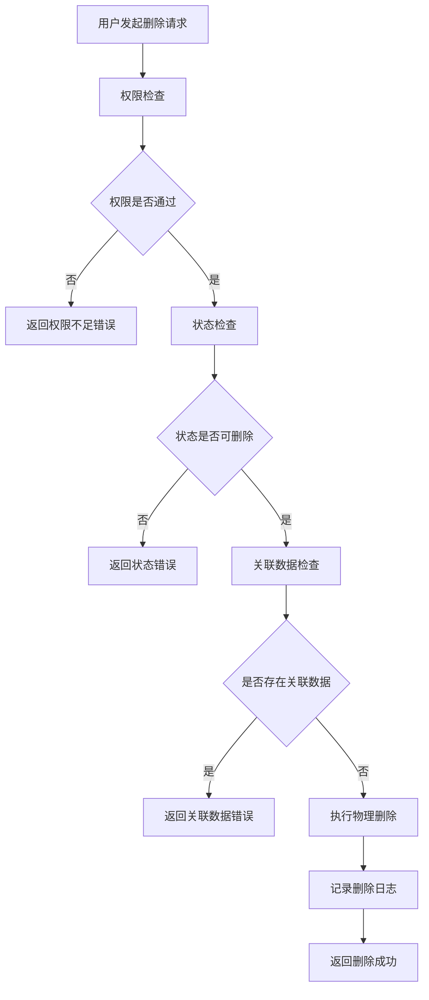
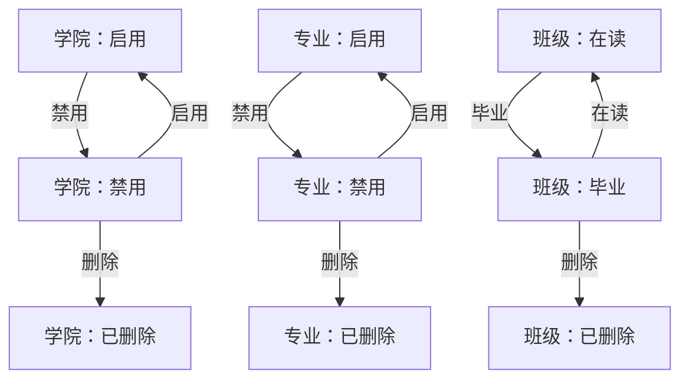

# 智慧校园服务系统需求规格说明书

## 文档信息

- **文档名称**：智慧校园服务系统需求规格说明书
- **文档版本**：v1.3.0
- **编制日期**：2026-04-22
- **文档状态**：正式发布
- **编制依据**：智慧校园服务SQL脚本（22张数据库表）

## 目录

1. [系统模块功能设计](#1-系统模块功能设计)
2. [复杂功能实现方案](#2-复杂功能实现方案)
3. [接口模块分离设计](#3-接口模块分离设计)
4. [AI模块设计与实现](#4-ai模块设计与实现)
5. [附录](#5-附录)

***

## 1. 系统模块功能设计

### 1.1 模块划分

基于SQL脚本中的22张数据库表，系统划分为以下13个功能模块：

| 模块名称   | 对应数据表                                        | 业务职责         |
| ------ | -------------------------------------------- | ------------ |
| 图书管理模块 | book\_category, book                         | 图书分类与图书信息管理  |
| 借阅管理模块 | borrow\_record                               | 图书借阅与归还处理    |
| 座位管理模块 | seat, seat\_reservation                      | 座位预约与签到管理    |
| 阅读报告模块 | reading\_report                              | 阅读数据统计与分析    |
| 组织架构模块 | college, major, class                        | 学院、专业、班级管理   |
| 用户管理模块 | student, teacher                             | 学生与教师账号管理    |
| 课程管理模块 | course, classroom, semester                  | 课程、教室、学期基础数据 |
| 排课管理模块 | course\_schedule                             | 课程排班与冲突检测    |
| 选课管理模块 | course\_selection, course\_selection\_period | 学生选课与退课      |
| 成绩管理模块 | score\_entry                                 | 成绩录入与统计分析    |
| 补考管理模块 | makeup\_exam                                 | 补考安排与管理      |
| 请假管理模块 | leave\_request, leave\_approval\_log         | 请假申请与审批      |
| 通知管理模块 | notice                                       | 通知公告发布与查询    |

### 1.2 模块详细功能点描述

#### 1.2.1 图书管理模块

##### 1. 功能描述

图书管理模块主要负责图书分类和图书信息的管理，包括新增、修改、删除图书分类和图书信息，以及更新图书状态。

##### 2. 涉及表

- book\_category（图书分类表）
- book（图书信息表）

##### 3. 操作

- 新增图书分类
- 修改图书分类
- 删除图书分类
- 查询图书分类列表
- 查询图书分类详情
- 新增图书
- 修改图书信息
- 删除图书
- 查询图书列表
- 查询图书详情
- 更新图书状态

##### 4. 数据传输对象（DTO）

```java
// 图书分类创建DTO
public class BookCategoryCreateDTO {
    private String categoryName;     // 分类名称，必填
}

// 图书分类更新DTO
public class BookCategoryUpdateDTO {
    private Integer id;             // 分类ID，必填
    private String categoryName;     // 分类名称，必填
}

// 图书分类响应DTO
public class BookCategoryResponseDTO {
    private Integer id;             // 分类ID
    private String categoryName;     // 分类名称
    private LocalDateTime createTime; // 创建时间
    private LocalDateTime updateTime; // 修改时间
}

// 图书创建DTO
public class BookCreateDTO {
    private String isbn;            // ISBN编号，必填
    private String title;           // 书名，必填
    private String author;          // 作者，必填
    private String publisher;       // 出版社，可选
    private LocalDate publishDate;  // 出版日期，可选
    private Integer categoryId;     // 分类ID，必填
    private Integer totalCopies;    // 总册数，必填
    private String coverImage;      // 封面图片URL，可选
    private String description;     // 简介，可选
}

// 图书更新DTO
public class BookUpdateDTO {
    private Long id;                // 图书ID，必填
    private String isbn;            // ISBN编号，可选
    private String title;           // 书名，可选
    private String author;          // 作者，可选
    private String publisher;       // 出版社，可选
    private LocalDate publishDate;  // 出版日期，可选
    private Integer categoryId;     // 分类ID，可选
    private Integer totalCopies;    // 总册数，可选
    private String status;          // 状态，可选
    private String coverImage;      // 封面图片URL，可选
    private String description;     // 简介，可选
}

// 图书响应DTO
public class BookResponseDTO {
    private Long id;                // 图书ID
    private String isbn;            // ISBN编号
    private String title;           // 书名
    private String author;          // 作者
    private String publisher;       // 出版社
    private LocalDate publishDate;  // 出版日期
    private Integer categoryId;     // 分类ID
    private String categoryName;    // 分类名称
    private Integer totalCopies;    // 总册数
    private Integer availableCopies; // 可借册数
    private String status;          // 状态
    private String coverImage;      // 封面图片URL
    private String description;     // 简介
}
```

##### 5. 视图对象（VO）

```java
// 图书分类列表VO
public class BookCategoryListVO {
    private Integer id;             // 分类ID
    private String categoryName;     // 分类名称
    private String createTime;      // 创建时间（格式化显示）
}

// 图书分类详情VO
public class BookCategoryDetailVO {
    private Integer id;             // 分类ID
    private String categoryName;     // 分类名称
    private String createTime;      // 创建时间（格式化显示）
    private String updateTime;      // 修改时间（格式化显示）
}

// 图书列表VO
public class BookListVO {
    private Long id;                // 图书ID
    private String isbn;            // ISBN编号
    private String title;           // 书名
    private String author;          // 作者
    private String categoryName;    // 分类名称
    private Integer availableCopies; // 可借册数
    private String status;          // 状态
}

// 图书详情VO
public class BookDetailVO {
    private Long id;                // 图书ID
    private String isbn;            // ISBN编号
    private String title;           // 书名
    private String author;          // 作者
    private String publisher;       // 出版社
    private LocalDate publishDate;  // 出版日期
    private String categoryName;    // 分类名称
    private Integer totalCopies;    // 总册数
    private Integer availableCopies; // 可借册数
    private String status;          // 状态
    private String coverImage;      // 封面图片URL
    private String description;     // 简介
    private String createTime;      // 创建时间（格式化显示）
    private String updateTime;      // 修改时间（格式化显示）
}
```

##### 6. 接口定义

- **新增图书分类**：POST /api/book-categories
  - 请求体：BookCategoryCreateDTO
  - 返回值：BookCategoryResponseDTO
- **修改图书分类**：PUT /api/book-categories/{id}
  - 请求体：BookCategoryUpdateDTO
  - 返回值：BookCategoryResponseDTO
- **删除图书分类**：DELETE /api/book-categories/{id}
  - 返回值：Boolean（成功/失败）
- **查询图书分类列表**：GET /api/book-categories
  - 参数：pageNum（页码）、pageSize（每页数量）、categoryName（分类名称，可选）
  - 返回值：Page<BookCategoryListVO>
- **查询图书分类详情**：GET /api/book-categories/{id}
  - 返回值：BookCategoryDetailVO
- **新增图书**：POST /api/books
  - 请求体：BookCreateDTO
  - 返回值：BookResponseDTO
- **修改图书**：PUT /api/books/{id}
  - 请求体：BookUpdateDTO
  - 返回值：BookResponseDTO
- **删除图书**：DELETE /api/books/{id}
  - 返回值：Boolean（成功/失败）
- **查询图书列表**：GET /api/books
  - 参数：pageNum（页码）、pageSize（每页数量）、isbn（ISBN，可选）、title（书名，可选）、author（作者，可选）、categoryId（分类ID，可选）、status（状态，可选）
  - 返回值：Page<BookListVO>
- **查询图书详情**：GET /api/books/{id}
  - 返回值：BookDetailVO

#### 1.2.2 借阅管理模块

##### 1. 功能描述

借阅管理模块主要负责图书的借阅和归还流程，包括创建借阅记录、更新借阅状态、处理逾期借阅等。

##### 2. 涉及表

- borrow\_record（借阅记录表）
- book（图书信息表）

##### 3. 操作

- 创建借阅记录
- 更新借阅记录（归还）
- 查询借阅记录列表
- 查询借阅记录详情
- 查询我的借阅记录
- 处理逾期借阅
- 统计借阅数据

##### 4. 数据传输对象（DTO）

```java
// 借阅创建DTO
public class BorrowCreateDTO {
    private Long userId;            // 借阅人ID，必填
    private Long bookId;            // 图书ID，必填
    private LocalDate dueDate;      // 应还日期，必填
}

// 借阅响应DTO
public class BorrowResponseDTO {
    private Long id;                // 借阅记录ID
    private Long userId;            // 借阅人ID
    private String userName;        // 借阅人姓名
    private Long bookId;            // 图书ID
    private String bookTitle;       // 图书标题
    private String bookIsbn;        // 图书ISBN
    private LocalDate borrowDate;   // 借书日期
    private LocalDate dueDate;      // 应还日期
    private LocalDate returnDate;   // 实际归还日期
    private String status;          // 状态
    private Integer overdueDays;    // 逾期天数
}
```

##### 5. 视图对象（VO）

```java
// 借阅记录列表VO
public class BorrowRecordListVO {
    private Long id;                // 借阅记录ID
    private String userName;        // 借阅人姓名
    private String bookTitle;       // 图书标题
    private LocalDate borrowDate;   // 借书日期
    private LocalDate dueDate;      // 应还日期
    private String status;          // 状态
    private Integer overdueDays;    // 逾期天数
}

// 借阅记录详情VO
public class BorrowRecordDetailVO {
    private Long id;                // 借阅记录ID
    private Long userId;            // 借阅人ID
    private String userName;        // 借阅人姓名
    private Long bookId;            // 图书ID
    private String bookTitle;       // 图书标题
    private String bookIsbn;        // 图书ISBN
    private LocalDate borrowDate;   // 借书日期
    private LocalDate dueDate;      // 应还日期
    private LocalDate returnDate;   // 实际归还日期
    private String status;          // 状态
    private Integer overdueDays;    // 逾期天数
    private String createTime;      // 创建时间（格式化显示）
    private String updateTime;      // 修改时间（格式化显示）
}
```

##### 6. 接口定义

- **创建借阅记录**：POST /api/borrow-records
  - 请求体：BorrowCreateDTO
  - 返回值：BorrowResponseDTO
- **归还图书**：POST /api/borrow-records/{id}/return
  - 返回值：Boolean（成功/失败）
- **查询借阅记录列表**：GET /api/borrow-records
  - 参数：pageNum（页码）、pageSize（每页数量）、userId（用户ID，可选）、bookId（图书ID，可选）、status（状态，可选）
  - 返回值：Page<BorrowRecordListVO>
- **查询借阅记录详情**：GET /api/borrow-records/{id}
  - 返回值：BorrowRecordDetailVO
- **查询我的借阅记录**：GET /api/borrow-records/my
  - 参数：pageNum（页码）、pageSize（每页数量）、status（状态，可选）
  - 返回值：Page<BorrowRecordListVO>
- **借阅统计**：GET /api/borrow-records/statistics
  - 参数：userId（用户ID，可选）、startDate（开始日期，可选）、endDate（结束日期，可选）
  - 返回值：借阅统计数据

#### 1.2.3 座位管理模块

##### 1. 功能描述

座位管理模块主要负责图书馆座位的管理和预约，包括座位信息管理、座位预约、签到签退、暂离管理等。

##### 2. 涉及表

- seat（座位信息表）
- seat\_reservation（座位预约表）

##### 3. 操作

- 新增座位
- 修改座位信息
- 删除座位
- 查询座位列表
- 查询座位详情
- 预约座位
- 取消预约
- 签到
- 签退
- 暂离
- 查询预约列表
- 查询我的预约

##### 4. 数据传输对象（DTO）

```java
// 座位创建DTO
public class SeatCreateDTO {
    private Long roomId;            // 阅览室ID，必填
    private String seatNumber;      // 座位编号，必填
}

// 座位更新DTO
public class SeatUpdateDTO {
    private Long id;                // 座位ID，必填
    private String status;          // 状态，可选
}

// 座位响应DTO
public class SeatResponseDTO {
    private Long id;                // 座位ID
    private Long roomId;            // 阅览室ID
    private String seatNumber;      // 座位编号
    private String status;          // 状态
}

// 座位预约创建DTO
public class SeatReservationCreateDTO {
    private Long seatId;            // 座位ID，必填
    private LocalDate date;         // 预约日期，必填
    private LocalTime startTime;    // 开始时间，必填
    private LocalTime endTime;      // 结束时间，必填
}

// 座位预约响应DTO
public class SeatReservationResponseDTO {
    private Long id;                // 预约ID
    private Long userId;            // 预约人ID
    private String userName;        // 预约人姓名
    private Long seatId;            // 座位ID
    private String seatNumber;      // 座位编号
    private Long roomId;            // 阅览室ID
    private String roomName;        // 阅览室名称
    private LocalDate date;         // 预约日期
    private LocalTime startTime;    // 开始时间
    private LocalTime endTime;      // 结束时间
    private LocalDateTime leaveTime; // 签退/暂离时间
    private String status;          // 状态
}
```

##### 5. 视图对象（VO）

```java
// 座位列表VO
public class SeatListVO {
    private Long id;                // 座位ID
    private Long roomId;            // 阅览室ID
    private String seatNumber;      // 座位编号
    private String status;          // 状态
}

// 座位详情VO
public class SeatDetailVO {
    private Long id;                // 座位ID
    private Long roomId;            // 阅览室ID
    private String seatNumber;      // 座位编号
    private String status;          // 状态
    private String createTime;      // 创建时间（格式化显示）
    private String updateTime;      // 修改时间（格式化显示）
}

// 座位预约列表VO
public class SeatReservationListVO {
    private Long id;                // 预约ID
    private String userName;        // 预约人姓名
    private String seatNumber;      // 座位编号
    private LocalDate date;         // 预约日期
    private LocalTime startTime;    // 开始时间
    private LocalTime endTime;      // 结束时间
    private String status;          // 状态
}

// 座位预约详情VO
public class SeatReservationDetailVO {
    private Long id;                // 预约ID
    private Long userId;            // 预约人ID
    private String userName;        // 预约人姓名
    private Long seatId;            // 座位ID
    private String seatNumber;      // 座位编号
    private Long roomId;            // 阅览室ID
    private String roomName;        // 阅览室名称
    private LocalDate date;         // 预约日期
    private LocalTime startTime;    // 开始时间
    private LocalTime endTime;      // 结束时间
    private LocalDateTime leaveTime; // 签退/暂离时间
    private String status;          // 状态
    private String createTime;      // 创建时间（格式化显示）
    private String updateTime;      // 修改时间（格式化显示）
}
```

##### 6. 接口定义

- **新增座位**：POST /api/seats
  - 请求体：SeatCreateDTO
  - 返回值：SeatResponseDTO
- **修改座位**：PUT /api/seats/{id}
  - 请求体：SeatUpdateDTO
  - 返回值：SeatResponseDTO
- **删除座位**：DELETE /api/seats/{id}
  - 返回值：Boolean（成功/失败）
- **查询座位列表**：GET /api/seats
  - 参数：pageNum（页码）、pageSize（每页数量）、roomId（阅览室ID，可选）、status（状态，可选）
  - 返回值：Page<SeatListVO>
- **查询座位详情**：GET /api/seats/{id}
  - 返回值：SeatDetailVO
- **预约座位**：POST /api/seat-reservations
  - 请求体：SeatReservationCreateDTO
  - 返回值：SeatReservationResponseDTO
- **取消预约**：DELETE /api/seat-reservations/{id}
  - 返回值：Boolean（成功/失败）
- **签到**：POST /api/seat-reservations/{id}/check-in
  - 返回值：Boolean（成功/失败）
- **签退**：POST /api/seat-reservations/{id}/check-out
  - 返回值：Boolean（成功/失败）
- **暂离**：POST /api/seat-reservations/{id}/leave
  - 返回值：Boolean（成功/失败）
- **查询预约列表**：GET /api/seat-reservations
  - 参数：pageNum（页码）、pageSize（每页数量）、userId（用户ID，可选）、seatId（座位ID，可选）、date（日期，可选）、status（状态，可选）
  - 返回值：Page<SeatReservationListVO>
- **查询我的预约**：GET /api/seat-reservations/my
  - 参数：pageNum（页码）、pageSize（每页数量）、date（日期，可选）、status（状态，可选）
  - 返回值：Page<SeatReservationListVO>

#### 1.2.4 阅读报告模块

##### 1. 功能描述

阅读报告模块主要负责分析学生的阅读行为，生成阅读报告，提供阅读建议。

##### 2. 涉及表

- reading\_report（阅读报告表）
- borrow\_record（借阅记录表）

##### 3. 操作

- 生成阅读报告
- 查询阅读报告列表
- 查询我的阅读报告

##### 4. 数据传输对象（DTO）

```java
// 阅读报告创建DTO
public class ReadingReportCreateDTO {
    private Long userId;            // 用户ID，必填
    private String semester;        // 学期，必填
}

// 阅读报告响应DTO
public class ReadingReportResponseDTO {
    private Long id;                // 报告ID
    private Long userId;            // 用户ID
    private String userName;        // 用户姓名
    private String semester;        // 学期
    private Integer totalBorrow;    // 总借阅量
    private String favCategory;     // 偏好分类
    private String analysisText;    // AI生成的分析文本
    private LocalDateTime createTime; // 生成时间
}
```

##### 5. 视图对象（VO）

```java
// 阅读报告列表VO
public class ReadingReportListVO {
    private Long id;                // 报告ID
    private String userName;        // 用户姓名
    private String semester;        // 学期
    private Integer totalBorrow;    // 总借阅量
    private String favCategory;     // 偏好分类
    private String createTime;      // 生成时间（格式化显示）
}

// 阅读报告详情VO
public class ReadingReportDetailVO {
    private Long id;                // 报告ID
    private Long userId;            // 用户ID
    private String userName;        // 用户姓名
    private String semester;        // 学期
    private Integer totalBorrow;    // 总借阅量
    private String favCategory;     // 偏好分类
    private String analysisText;    // AI生成的分析文本
    private String createTime;      // 生成时间（格式化显示）
}
```

##### 6. 接口定义

- **生成阅读报告**：POST /api/reading-reports
  - 请求体：ReadingReportCreateDTO
  - 返回值：ReadingReportResponseDTO
- **查询阅读报告列表**：GET /api/reading-reports
  - 参数：pageNum（页码）、pageSize（每页数量）、userId（用户ID，可选）、semester（学期，可选）
  - 返回值：Page<ReadingReportListVO>
- **查询我的阅读报告**：GET /api/reading-reports/my
  - 参数：semester（学期，可选）
  - 返回值：ReadingReportDetailVO

#### 1.2.5 组织架构模块

##### 1. 功能描述

组织架构模块主要负责学校的组织架构管理，包括学院、专业和班级的管理。

##### 2. 涉及表

- college（学院表）
- major（专业表）
- class（班级表）

##### 3. 操作

- 新增学院
- 修改学院信息
- 删除学院（物理删除）
- 查询学院列表
- 查询学院详情
- 新增专业
- 修改专业信息
- 删除专业（物理删除）
- 查询专业列表
- 查询专业详情
- 新增班级
- 修改班级信息
- 删除班级（物理删除）
- 查询班级列表
- 查询班级详情

##### 4. 数据传输对象（DTO）

```java
// 学院创建DTO
public class CollegeCreateDTO {
    private String collegeCode;     // 学院代码，必填
    private String collegeName;     // 学院名称，必填
    private String dean;            // 院长，可选
    private String contactPhone;    // 联系电话，可选
}

// 学院更新DTO
public class CollegeUpdateDTO {
    private Long id;                // 学院ID，必填
    private String collegeName;     // 学院名称，可选
    private String dean;            // 院长，可选
    private String contactPhone;    // 联系电话，可选
    private String status;          // 状态，可选
}

// 学院响应DTO
public class CollegeResponseDTO {
    private Long id;                // 学院ID
    private String collegeCode;     // 学院代码
    private String collegeName;     // 学院名称
    private String dean;            // 院长
    private String contactPhone;    // 联系电话
    private String status;          // 状态
    private LocalDateTime createTime; // 创建时间
    private LocalDateTime updateTime; // 修改时间
}

// 专业创建DTO
public class MajorCreateDTO {
    private Long collegeId;         // 所属学院ID，必填
    private String majorCode;       // 专业代码，必填
    private String majorName;       // 专业名称，必填
    private Integer studyYears;     // 学制年限，必填
}

// 专业更新DTO
public class MajorUpdateDTO {
    private Long id;                // 专业ID，必填
    private String majorName;       // 专业名称，可选
    private Integer studyYears;     // 学制年限，可选
    private String status;          // 状态，可选
}

// 专业响应DTO
public class MajorResponseDTO {
    private Long id;                // 专业ID
    private Long collegeId;         // 所属学院ID
    private String collegeName;     // 学院名称
    private String majorCode;       // 专业代码
    private String majorName;       // 专业名称
    private Integer studyYears;     // 学制年限
    private String status;          // 状态
    private LocalDateTime createTime; // 创建时间
    private LocalDateTime updateTime; // 修改时间
}

// 班级创建DTO
public class ClassCreateDTO {
    private Long majorId;           // 所属专业ID，必填
    private String className;       // 班级名称，必填
    private Long headTeacherId;     // 班主任ID，可选
}

// 班级更新DTO
public class ClassUpdateDTO {
    private Long id;                // 班级ID，必填
    private String className;       // 班级名称，可选
    private Long headTeacherId;     // 班主任ID，可选
    private String status;          // 状态，可选
}

// 班级响应DTO
public class ClassResponseDTO {
    private Long id;                // 班级ID
    private Long majorId;           // 所属专业ID
    private String majorName;       // 专业名称
    private String className;       // 班级名称
    private Long headTeacherId;     // 班主任ID
    private String headTeacherName; // 班主任姓名
    private String status;          // 状态
    private LocalDateTime createTime; // 创建时间
    private LocalDateTime updateTime; // 修改时间
}
```

##### 5. 视图对象（VO）

```java
// 学院列表VO
public class CollegeListVO {
    private Long id;                // 学院ID
    private String collegeCode;     // 学院代码
    private String collegeName;     // 学院名称
    private String status;          // 状态
    private String createTime;      // 创建时间（格式化显示）
}

// 学院详情VO
public class CollegeDetailVO {
    private Long id;                // 学院ID
    private String collegeCode;     // 学院代码
    private String collegeName;     // 学院名称
    private String dean;            // 院长
    private String contactPhone;    // 联系电话
    private String status;          // 状态
    private String createTime;      // 创建时间（格式化显示）
    private String updateTime;      // 修改时间（格式化显示）
}

// 专业列表VO
public class MajorListVO {
    private Long id;                // 专业ID
    private String collegeName;     // 学院名称
    private String majorCode;       // 专业代码
    private String majorName;       // 专业名称
    private Integer studyYears;     // 学制年限
    private String status;          // 状态
    private String createTime;      // 创建时间（格式化显示）
}

// 专业详情VO
public class MajorDetailVO {
    private Long id;                // 专业ID
    private Long collegeId;         // 所属学院ID
    private String collegeName;     // 学院名称
    private String majorCode;       // 专业代码
    private String majorName;       // 专业名称
    private Integer studyYears;     // 学制年限
    private String status;          // 状态
    private String createTime;      // 创建时间（格式化显示）
    private String updateTime;      // 修改时间（格式化显示）
}

// 班级列表VO
public class ClassListVO {
    private Long id;                // 班级ID
    private String majorName;       // 专业名称
    private String className;       // 班级名称
    private String headTeacherName; // 班主任姓名
    private String status;          // 状态
    private String createTime;      // 创建时间（格式化显示）
}

// 班级详情VO
public class ClassDetailVO {
    private Long id;                // 班级ID
    private Long majorId;           // 所属专业ID
    private String majorName;       // 专业名称
    private String className;       // 班级名称
    private Long headTeacherId;     // 班主任ID
    private String headTeacherName; // 班主任姓名
    private String status;          // 状态
    private String createTime;      // 创建时间（格式化显示）
    private String updateTime;      // 修改时间（格式化显示）
}
```

##### 6. 接口定义

- **新增学院**：POST /api/colleges
  - 请求体：CollegeCreateDTO
  - 返回值：CollegeResponseDTO
- **修改学院**：PUT /api/colleges/{id}
  - 请求体：CollegeUpdateDTO
  - 返回值：CollegeResponseDTO
- **删除学院**：DELETE /api/colleges/{id}
  - 返回值：Boolean（成功/失败）
- **查询学院列表**：GET /api/colleges
  - 参数：pageNum（页码）、pageSize（每页数量）、collegeName（学院名称，可选）、status（状态，可选）
  - 返回值：PageInfo<CollegeListVO>
- **查询学院详情**：GET /api/colleges/{id}
  - 返回值：CollegeDetailVO
- **新增专业**：POST /api/majors
  - 请求体：MajorCreateDTO
  - 返回值：MajorResponseDTO
- **修改专业**：PUT /api/majors/{id}
  - 请求体：MajorUpdateDTO
  - 返回值：MajorResponseDTO
- **删除专业**：DELETE /api/majors/{id}
  - 返回值：Boolean（成功/失败）
- **查询专业列表**：GET /api/majors
  - 参数：pageNum（页码）、pageSize（每页数量）、collegeId（学院ID，可选）、majorName（专业名称，可选）、status（状态，可选）
  - 返回值：PageInfo<MajorListVO>
- **查询专业详情**：GET /api/majors/{id}
  - 返回值：MajorDetailVO
- **新增班级**：POST /api/classes
  - 请求体：ClassCreateDTO
  - 返回值：ClassResponseDTO
- **修改班级**：PUT /api/classes/{id}
  - 请求体：ClassUpdateDTO
  - 返回值：ClassResponseDTO
- **删除班级**：DELETE /api/classes/{id}
  - 返回值：Boolean（成功/失败）
- **查询班级列表**：GET /api/classes
  - 参数：pageNum（页码）、pageSize（每页数量）、majorId（专业ID，可选）、className（班级名称，可选）、status（状态，可选）
  - 返回值：PageInfo<ClassListVO>
- **查询班级详情**：GET /api/classes/{id}
  - 返回值：ClassDetailVO

##### 7. 技术实现细节

1. **ID获取方式**：使用 `SELECT LAST_INSERT_ID()` 获取新插入记录的ID，避免使用 `useGeneratedKeys` 导致的 setter 方法缺失问题。
2. **时间字段处理**：
   - 数据库中存储为 `DATETIME` 类型
   - VO 中使用 `String` 类型接收格式化后的时间字符串
   - DTO 中使用 `LocalDateTime` 类型
   - 转换逻辑：
   ```java
   try {
       responseDTO.setCreateTime(LocalDateTime.parse(collegeDetailVO.getCreateTime()));
       responseDTO.setUpdateTime(LocalDateTime.parse(collegeDetailVO.getUpdateTime()));
   } catch (Exception e) {
       // 处理异常
   }
   ```
3. **分页实现**：使用 PageHelper 实现分页查询
   ```java
   PageHelper.startPage(pageNum, pageSize);
   List<CollegeListVO> collegeList = collegeMapper.getCollegeList(collegeName, status);
   return PageInfo.of(collegeList);
   ```
4. **Swagger UI 配置**：在生产环境中建议禁用 Swagger UI
   ```yaml
   springdoc:
     swagger-ui:
       enabled: false
   ```

##### 8. 状态字段定义

| 模块 | 状态字段 | 取值范围 | 默认值 | 业务含义 |
| ---- | ------- | ------- | ------ | ------- |
| 学院 | status | 启用、禁用 | 启用 | 学院的运行状态 |
| 专业 | status | 启用、禁用 | 启用 | 专业的运行状态 |
| 班级 | status | 在读、毕业 | 在读 | 班级的学习状态 |
| 学生 | status | 在读、休学、退学、毕业 | 在读 | 学生的学籍状态 |
| 学生 | accountStatus | 正常、锁定 | 正常 | 学生账号的状态 |
| 教师 | status | 在职、离职 | 在职 | 教师的工作状态 |
| 教师 | accountStatus | 正常、锁定 | 正常 | 教师账号的状态 |
| 图书 | status | 可借、借出、损坏、丢失 | 可借 | 图书的流通状态 |
| 座位 | status | 可用、占用、损坏 | 可用 | 座位的使用状态 |
| 座位预约 | status | 预约中、已签到、已签退、已取消、已过期 | 预约中 | 座位预约的状态 |
| 借阅记录 | status | 借阅中、已归还、逾期 | 借阅中 | 借阅记录的状态 |
| 课程 | status | 启用、禁用 | 启用 | 课程的状态 |
| 教室 | status | 可用、不可用 | 可用 | 教室的使用状态 |
| 学期 | status | 进行中、已结束 | 进行中 | 学期的状态 |

##### 9. 物理删除操作规范

1. **触发条件**：
   - 学院：只能删除状态为"禁用"的学院
   - 专业：只能删除状态为"禁用"的专业
   - 班级：只能删除状态为"毕业"的班级
   - 学生：只能删除状态为"退学"或"毕业"的学生
   - 教师：只能删除状态为"离职"的教师

2. **执行流程**：
   - 权限检查：验证当前用户是否具有删除权限
   - 状态检查：验证要删除的记录是否处于可删除状态
   - 关联数据检查：检查是否存在关联数据，确保删除不会破坏数据完整性
   - 执行删除：执行物理删除操作
   - 日志记录：记录删除操作的详细信息

3. **权限要求**：
   - 学院、专业、班级：需要管理员权限
   - 学生、教师：需要管理员权限
   - 其他模块：根据具体业务需求设置相应权限

##### 10. 非功能需求

1. **数据安全要求**：
   - 所有删除操作必须进行权限验证
   - 删除操作前必须进行数据备份
   - 详细记录所有删除操作的日志
   - 批量删除操作需要限制单次操作的记录数量

2. **性能指标**：
   - 单个删除操作响应时间不超过500ms
   - 批量删除操作（100条记录以内）响应时间不超过2s
   - 状态修改操作响应时间不超过300ms

3. **错误处理机制**：
   - 权限不足：返回403 Forbidden
   - 记录不存在：返回404 Not Found
   - 状态不允许：返回400 Bad Request
   - 关联数据存在：返回409 Conflict
   - 服务器错误：返回500 Internal Server Error

4. **日志记录规范**：
   - 记录操作人、操作时间、操作类型、操作对象
   - 记录操作前的状态和操作后的状态
   - 记录操作结果（成功/失败）及失败原因
   - 日志级别：删除操作使用INFO级别，错误使用ERROR级别

##### 11. 功能交互流程图



##### 12. 状态转换图



##### 13. 关联数据影响验证机制

1. **实体间关联关系类型**：
   - 学院表（college）与专业表（major）：一对多关系，一个学院可以包含多个专业
   - 专业表（major）与班级表（class）：一对多关系，一个专业可以包含多个班级
   - 班级表（class）与学生表（student）：一对多关系，一个班级可以包含多个学生

2. **关联数据影响验证规则**：
   - 当执行主表记录删除操作时，必须先检查关联子表中是否存在相关记录
   - 当执行主表记录状态修改操作时，必须先检查关联子表中是否存在相关记录
   - 检查逻辑：查询子表中与主表记录关联的记录数量

3. **操作限制条件**：
   - 若存在关联子表记录，则禁止执行删除或状态修改操作
   - 若不存在关联子表记录，则允许执行操作

4. **错误提示信息规范**：
   - 学院删除/状态修改："该学院下存在专业，无法执行操作"
   - 专业删除/状态修改："该专业下存在班级，无法执行操作"
   - 班级删除/状态修改："该班级下存在学生，无法执行操作"

5. **执行流程**：
   - 权限检查：验证当前用户是否具有操作权限
   - 状态检查：验证要操作的记录是否处于可操作状态
   - 关联数据检查：检查是否存在关联子表记录
   - 执行操作：根据检查结果决定是否执行操作
   - 日志记录：记录操作尝试、关联检查结果及最终处理结果

#### 1.2.6 用户管理模块

##### 1. 功能描述

用户管理模块主要负责学生和教师的用户信息管理，包括账号管理和个人信息管理。

##### 2. 涉及表

- student（学生表）
- teacher（教师表）

##### 3. 操作

- 新增学生
- 修改学生信息
- 删除学生（物理删除）
- 查询学生列表
- 查询学生详情
- 重置学生密码
- 锁定/解锁学生账号
- 新增教师
- 修改教师信息
- 删除教师（物理删除）
- 查询教师列表
- 查询教师详情
- 重置教师密码
- 锁定/解锁教师账号

##### 4. 数据传输对象（DTO）

```java
// 学生创建DTO
public class StudentCreateDTO {
    private String studentNo;       // 学号，必填
    private String name;            // 姓名，必填
    private String gender;          // 性别，必填
    private Long classId;           // 所属班级ID，必填
    private LocalDate enrollmentDate; // 入学日期，必填
    private String idCard;          // 身份证号，可选
    private String phone;           // 手机号，可选
    private String password;        // 密码，必填
}

// 学生更新DTO
public class StudentUpdateDTO {
    private Long id;                // 学生ID，必填
    private String name;            // 姓名，可选
    private String gender;          // 性别，可选
    private Long classId;           // 所属班级ID，可选
    private String status;          // 学籍状态，可选
    private String idCard;          // 身份证号，可选
    private String phone;           // 手机号，可选
    private String accountStatus;   // 账号状态，可选
}

// 学生响应DTO
public class StudentResponseDTO {
    private Long id;                // 学生ID
    private String studentNo;       // 学号
    private String name;            // 姓名
    private String gender;          // 性别
    private Long classId;           // 所属班级ID
    private String className;       // 班级名称
    private LocalDate enrollmentDate; // 入学日期
    private String status;          // 学籍状态
    private String idCard;          // 身份证号
    private String phone;           // 手机号
    private String accountStatus;   // 账号状态
    private LocalDateTime createTime; // 创建时间
    private LocalDateTime updateTime; // 修改时间
}

// 教师创建DTO
public class TeacherCreateDTO {
    private String teacherNo;       // 工号，必填
    private String name;            // 姓名，必填
    private String gender;          // 性别，必填
    private Long collegeId;         // 所属学院ID，必填
    private String title;           // 职称，可选
    private String phone;           // 手机号，可选
    private String email;           // 邮箱，可选
    private String password;        // 密码，必填
}

// 教师更新DTO
public class TeacherUpdateDTO {
    private Long id;                // 教师ID，必填
    private String name;            // 姓名，可选
    private String gender;          // 性别，可选
    private Long collegeId;         // 所属学院ID，可选
    private String title;           // 职称，可选
    private String phone;           // 手机号，可选
    private String email;           // 邮箱，可选
    private String status;          // 状态，可选
    private String accountStatus;   // 账号状态，可选
}

// 教师响应DTO
public class TeacherResponseDTO {
    private Long id;                // 教师ID
    private String teacherNo;       // 工号
    private String name;            // 姓名
    private String gender;          // 性别
    private Long collegeId;         // 所属学院ID
    private String collegeName;     // 学院名称
    private String title;           // 职称
    private String phone;           // 手机号
    private String email;           // 邮箱
    private String status;          // 状态
    private String accountStatus;   // 账号状态
    private LocalDateTime createTime; // 创建时间
    private LocalDateTime updateTime; // 修改时间
}
```

##### 5. 视图对象（VO）

```java
// 学生列表VO
public class StudentListVO {
    private Long id;                // 学生ID
    private String studentNo;       // 学号
    private String name;            // 姓名
    private String gender;          // 性别
    private String className;       // 班级名称
    private String status;          // 学籍状态
    private String accountStatus;   // 账号状态
    private String createTime;      // 创建时间（格式化显示）
}

// 学生详情VO
public class StudentDetailVO {
    private Long id;                // 学生ID
    private String studentNo;       // 学号
    private String name;            // 姓名
    private String gender;          // 性别
    private Long classId;           // 所属班级ID
    private String className;       // 班级名称
    private LocalDate enrollmentDate; // 入学日期
    private String status;          // 学籍状态
    private String idCard;          // 身份证号
    private String phone;           // 手机号
    private String accountStatus;   // 账号状态
    private String createTime;      // 创建时间（格式化显示）
    private String updateTime;      // 修改时间（格式化显示）
}

// 教师列表VO
public class TeacherListVO {
    private Long id;                // 教师ID
    private String teacherNo;       // 工号
    private String name;            // 姓名
    private String gender;          // 性别
    private String collegeName;     // 学院名称
    private String title;           // 职称
    private String status;          // 状态
    private String accountStatus;   // 账号状态
    private String createTime;      // 创建时间（格式化显示）
}

// 教师详情VO
public class TeacherDetailVO {
    private Long id;                // 教师ID
    private String teacherNo;       // 工号
    private String name;            // 姓名
    private String gender;          // 性别
    private Long collegeId;         // 所属学院ID
    private String collegeName;     // 学院名称
    private String title;           // 职称
    private String phone;           // 手机号
    private String email;           // 邮箱
    private String status;          // 状态
    private String accountStatus;   // 账号状态
    private String createTime;      // 创建时间（格式化显示）
    private String updateTime;      // 修改时间（格式化显示）
}
```

##### 6. 接口定义

- **新增学生**：POST /api/students
  - 请求体：StudentCreateDTO
  - 返回值：StudentResponseDTO
- **修改学生**：PUT /api/students/{id}
  - 请求体：StudentUpdateDTO
  - 返回值：StudentResponseDTO
- **删除学生**：DELETE /api/students/{id}
  - 返回值：Boolean（成功/失败）
- **查询学生列表**：GET /api/students
  - 参数：pageNum（页码）、pageSize（每页数量）、studentNo（学号，可选）、name（姓名，可选）、classId（班级ID，可选）、status（学籍状态，可选）、accountStatus（账号状态，可选）
  - 返回值：Page<StudentListVO>
- **查询学生详情**：GET /api/students/{id}
  - 返回值：StudentDetailVO
- **重置学生密码**：POST /api/students/{id}/reset-password
  - 返回值：Boolean（成功/失败）
- **新增教师**：POST /api/teachers
  - 请求体：TeacherCreateDTO
  - 返回值：TeacherResponseDTO
- **修改教师**：PUT /api/teachers/{id}
  - 请求体：TeacherUpdateDTO
  - 返回值：TeacherResponseDTO
- **删除教师**：DELETE /api/teachers/{id}
  - 返回值：Boolean（成功/失败）
- **查询教师列表**：GET /api/teachers
  - 参数：pageNum（页码）、pageSize（每页数量）、teacherNo（工号，可选）、name（姓名，可选）、collegeId（学院ID，可选）、status（状态，可选）、accountStatus（账号状态，可选）
  - 返回值：Page<TeacherListVO>
- **查询教师详情**：GET /api/teachers/{id}
  - 返回值：TeacherDetailVO
- **重置教师密码**：POST /api/teachers/{id}/reset-password
  - 返回值：Boolean（成功/失败）

#### 1.2.7 课程管理模块

##### 1. 功能描述

课程管理模块主要负责课程、教室和学期的基础数据管理。

##### 2. 涉及表

- course（课程表）
- classroom（教室表）
- semester（学期表）

##### 3. 操作

- 新增学期
- 修改学期信息
- 删除学期
- 查询学期列表
- 查询学期详情
- 查询当前学期
- 新增课程
- 修改课程信息
- 删除课程
- 查询课程列表
- 查询课程详情
- 新增教室
- 修改教室信息
- 删除教室
- 查询教室列表
- 查询教室详情

##### 4. 数据传输对象（DTO）

```java
// 学期创建DTO
public class SemesterCreateDTO {
    private String name;            // 学期名称，必填
    private LocalDate startDate;    // 开学日期，必填
    private LocalDate endDate;      // 结束日期，必填
    private Boolean isCurrent;      // 是否当前学期，可选
    private String status;          // 状态，可选
}

// 学期更新DTO
public class SemesterUpdateDTO {
    private Long id;                // 学期ID，必填
    private String name;            // 学期名称，可选
    private LocalDate startDate;    // 开学日期，可选
    private LocalDate endDate;      // 结束日期，可选
    private Boolean isCurrent;      // 是否当前学期，可选
    private String status;          // 状态，可选
}

// 学期响应DTO
public class SemesterResponseDTO {
    private Long id;                // 学期ID
    private String name;            // 学期名称
    private LocalDate startDate;    // 开学日期
    private LocalDate endDate;      // 结束日期
    private Boolean isCurrent;      // 是否当前学期
    private String status;          // 状态
    private LocalDateTime createTime; // 创建时间
    private LocalDateTime updateTime; // 修改时间
}

// 课程创建DTO
public class CourseCreateDTO {
    private String courseCode;      // 课程代码，必填
    private String courseName;      // 课程名称，必填
    private BigDecimal credit;      // 学分，必填
    private Integer hours;          // 总学时，必填
    private String type;            // 课程类型，必填
    private String status;          // 状态，可选
}

// 课程更新DTO
public class CourseUpdateDTO {
    private Long id;                // 课程ID，必填
    private String courseName;      // 课程名称，可选
    private BigDecimal credit;      // 学分，可选
    private Integer hours;          // 总学时，可选
    private String type;            // 课程类型，可选
    private String status;          // 状态，可选
}

// 课程响应DTO
public class CourseResponseDTO {
    private Long id;                // 课程ID
    private String courseCode;      // 课程代码
    private String courseName;      // 课程名称
    private BigDecimal credit;      // 学分
    private Integer hours;          // 总学时
    private String type;            // 课程类型
    private String status;          // 状态
    private LocalDateTime createTime; // 创建时间
    private LocalDateTime updateTime; // 修改时间
}

// 教室创建DTO
public class ClassroomCreateDTO {
    private String building;        // 教学楼，必填
    private String roomNumber;      // 教室门牌号，必填
    private Integer capacity;       // 座位容量，必填
    private String type;            // 类型，可选
    private String status;          // 状态，可选
}

// 教室更新DTO
public class ClassroomUpdateDTO {
    private Long id;                // 教室ID，必填
    private Integer capacity;       // 座位容量，可选
    private String type;            // 类型，可选
    private String status;          // 状态，可选
}

// 教室响应DTO
public class ClassroomResponseDTO {
    private Long id;                // 教室ID
    private String building;        // 教学楼
    private String roomNumber;      // 教室门牌号
    private Integer capacity;       // 座位容量
    private String type;            // 类型
    private String status;          // 状态
    private LocalDateTime createTime; // 创建时间
    private LocalDateTime updateTime; // 修改时间
}
```

##### 5. 视图对象（VO）

```java
// 学期列表VO
public class SemesterListVO {
    private Long id;                // 学期ID
    private String name;            // 学期名称
    private String startDate;       // 开学日期（格式化显示）
    private String endDate;         // 结束日期（格式化显示）
    private Boolean isCurrent;      // 是否当前学期
    private String status;          // 状态
    private String createTime;      // 创建时间（格式化显示）
}

// 学期详情VO
public class SemesterDetailVO {
    private Long id;                // 学期ID
    private String name;            // 学期名称
    private LocalDate startDate;    // 开学日期
    private LocalDate endDate;      // 结束日期
    private Boolean isCurrent;      // 是否当前学期
    private String status;          // 状态
    private String createTime;      // 创建时间（格式化显示）
    private String updateTime;      // 修改时间（格式化显示）
}

// 课程列表VO
public class CourseListVO {
    private Long id;                // 课程ID
    private String courseCode;      // 课程代码
    private String courseName;      // 课程名称
    private BigDecimal credit;      // 学分
    private Integer hours;          // 总学时
    private String type;            // 课程类型
    private String status;          // 状态
    private String createTime;      // 创建时间（格式化显示）
}

// 课程详情VO
public class CourseDetailVO {
    private Long id;                // 课程ID
    private String courseCode;      // 课程代码
    private String courseName;      // 课程名称
    private BigDecimal credit;      // 学分
    private Integer hours;          // 总学时
    private String type;            // 课程类型
    private String status;          // 状态
    private String createTime;      // 创建时间（格式化显示）
    private String updateTime;      // 修改时间（格式化显示）
}

// 教室列表VO
public class ClassroomListVO {
    private Long id;                // 教室ID
    private String building;        // 教学楼
    private String roomNumber;      // 教室门牌号
    private Integer capacity;       // 座位容量
    private String type;            // 类型
    private String status;          // 状态
    private String createTime;      // 创建时间（格式化显示）
}

// 教室详情VO
public class ClassroomDetailVO {
    private Long id;                // 教室ID
    private String building;        // 教学楼
    private String roomNumber;      // 教室门牌号
    private Integer capacity;       // 座位容量
    private String type;            // 类型
    private String status;          // 状态
    private String createTime;      // 创建时间（格式化显示）
    private String updateTime;      // 修改时间（格式化显示）
}
```

##### 6. 接口定义

- **新增学期**：POST /api/semesters
  - 请求体：SemesterCreateDTO
  - 返回值：SemesterResponseDTO
- **修改学期**：PUT /api/semesters/{id}
  - 请求体：SemesterUpdateDTO
  - 返回值：SemesterResponseDTO
- **删除学期**：DELETE /api/semesters/{id}
  - 返回值：Boolean（成功/失败）
- **查询学期列表**：GET /api/semesters
  - 参数：pageNum（页码）、pageSize（每页数量）、name（学期名称，可选）、status（状态，可选）
  - 返回值：Page<SemesterListVO>
- **查询学期详情**：GET /api/semesters/{id}
  - 返回值：SemesterDetailVO
- **查询当前学期**：GET /api/semesters/current
  - 返回值：SemesterDetailVO
- **新增课程**：POST /api/courses
  - 请求体：CourseCreateDTO
  - 返回值：CourseResponseDTO
- **修改课程**：PUT /api/courses/{id}
  - 请求体：CourseUpdateDTO
  - 返回值：CourseResponseDTO
- **删除课程**：DELETE /api/courses/{id}
  - 返回值：Boolean（成功/失败）
- **查询课程列表**：GET /api/courses
  - 参数：pageNum（页码）、pageSize（每页数量）、courseCode（课程代码，可选）、courseName（课程名称，可选）、type（课程类型，可选）、status（状态，可选）
  - 返回值：Page<CourseListVO>
- **查询课程详情**：GET /api/courses/{id}
  - 返回值：CourseDetailVO
- **新增教室**：POST /api/classrooms
  - 请求体：ClassroomCreateDTO
  - 返回值：ClassroomResponseDTO
- **修改教室**：PUT /api/classrooms/{id}
  - 请求体：ClassroomUpdateDTO
  - 返回值：ClassroomResponseDTO
- **删除教室**：DELETE /api/classrooms/{id}
  - 返回值：Boolean（成功/失败）
- **查询教室列表**：GET /api/classrooms
  - 参数：pageNum（页码）、pageSize（每页数量）、building（教学楼，可选）、type（类型，可选）、status（状态，可选）
  - 返回值：Page<ClassroomListVO>
- **查询教室详情**：GET /api/classrooms/{id}
  - 返回值：ClassroomDetailVO

#### 1.2.8 排课管理模块

##### 1. 功能描述

排课管理模块主要负责课程的排班，确保课程安排合理无冲突。

##### 2. 涉及表

- course\_schedule（排课表）
- course（课程表）
- teacher（教师表）
- classroom（教室表）
- class（班级表）
- semester（学期表）

##### 3. 操作

- 创建排课
- 修改排课
- 删除排课
- 查询排课列表
- 查询排课详情
- 检测排课冲突
- 查询课表

##### 4. 数据传输对象（DTO）

```java
// 排课创建DTO
public class CourseScheduleCreateDTO {
    private Long semesterId;        // 学期ID，必填
    private Long courseId;          // 课程ID，必填
    private Long teacherId;         // 授课教师ID，必填
    private Long classroomId;       // 教室ID，必填
    private List<Long> classIds;    // 授课班级ID列表，必填
    private Integer weekDay;        // 星期几，必填
    private Integer startSection;   // 开始节次，必填
    private Integer endSection;     // 结束节次，必填
    private String weekRange;       // 周次范围，必填
}

// 排课更新DTO
public class CourseScheduleUpdateDTO {
    private Long id;                // 排课ID，必填
    private Long teacherId;         // 授课教师ID，可选
    private Long classroomId;       // 教室ID，可选
    private List<Long> classIds;    // 授课班级ID列表，可选
    private Integer weekDay;        // 星期几，可选
    private Integer startSection;   // 开始节次，可选
    private Integer endSection;     // 结束节次，可选
    private String weekRange;       // 周次范围，可选
}

// 排课响应DTO
public class CourseScheduleResponseDTO {
    private Long id;                // 排课ID
    private Long semesterId;        // 学期ID
    private String semesterName;    // 学期名称
    private Long courseId;          // 课程ID
    private String courseName;      // 课程名称
    private Long teacherId;         // 授课教师ID
    private String teacherName;     // 教师姓名
    private Long classroomId;       // 教室ID
    private String classroomName;   // 教室名称（教学楼+教室门牌号）
    private List<Long> classIds;    // 授课班级ID列表
    private List<String> classNames; // 授课班级名称列表
    private Integer weekDay;        // 星期几
    private Integer startSection;   // 开始节次
    private Integer endSection;     // 结束节次
    private String weekRange;       // 周次范围
    private LocalDateTime createTime; // 创建时间
    private LocalDateTime updateTime; // 修改时间
}

// 冲突检测DTO
public class ConflictCheckDTO {
    private Long semesterId;        // 学期ID，必填
    private Long teacherId;         // 授课教师ID，必填
    private Long classroomId;       // 教室ID，必填
    private List<Long> classIds;    // 授课班级ID列表，必填
    private Integer weekDay;        // 星期几，必填
    private Integer startSection;   // 开始节次，必填
    private Integer endSection;     // 结束节次，必填
    private String weekRange;       // 周次范围，必填
}

// 课表查询DTO
public class TimetableQueryDTO {
    private Long semesterId;        // 学期ID，必填
    private Long userId;            // 用户ID，必填
    private String userType;        // 用户类型（teacher/student），必填
}
```

##### 5. 视图对象（VO）

```java
// 排课列表VO
public class CourseScheduleListVO {
    private Long id;                // 排课ID
    private String semesterName;    // 学期名称
    private String courseName;      // 课程名称
    private String teacherName;     // 教师姓名
    private String classroomName;   // 教室名称（教学楼+教室门牌号）
    private String classNames;      // 授课班级名称（逗号分隔）
    private Integer weekDay;        // 星期几
    private Integer startSection;   // 开始节次
    private Integer endSection;     // 结束节次
    private String weekRange;       // 周次范围
    private String createTime;      // 创建时间（格式化显示）
}

// 排课详情VO
public class CourseScheduleDetailVO {
    private Long id;                // 排课ID
    private Long semesterId;        // 学期ID
    private String semesterName;    // 学期名称
    private Long courseId;          // 课程ID
    private String courseName;      // 课程名称
    private Long teacherId;         // 授课教师ID
    private String teacherName;     // 教师姓名
    private Long classroomId;       // 教室ID
    private String classroomName;   // 教室名称（教学楼+教室门牌号）
    private List<Long> classIds;    // 授课班级ID列表
    private List<String> classNames; // 授课班级名称列表
    private Integer weekDay;        // 星期几
    private Integer startSection;   // 开始节次
    private Integer endSection;     // 结束节次
    private String weekRange;       // 周次范围
    private String createTime;      // 创建时间（格式化显示）
    private String updateTime;      // 修改时间（格式化显示）
}

// 课表VO
public class TimetableVO {
    private Long courseScheduleId;  // 排课ID
    private String courseName;      // 课程名称
    private String teacherName;     // 教师姓名
    private String classroomName;   // 教室名称（教学楼+教室门牌号）
    private Integer weekDay;        // 星期几
    private Integer startSection;   // 开始节次
    private Integer endSection;     // 结束节次
    private String weekRange;       // 周次范围
}
```

##### 6. 接口定义

- **创建排课**：POST /api/course-schedules
  - 请求体：CourseScheduleCreateDTO
  - 返回值：CourseScheduleResponseDTO
- **修改排课**：PUT /api/course-schedules/{id}
  - 请求体：CourseScheduleUpdateDTO
  - 返回值：CourseScheduleResponseDTO
- **删除排课**：DELETE /api/course-schedules/{id}
  - 返回值：Boolean（成功/失败）
- **查询排课列表**：GET /api/course-schedules
  - 参数：pageNum（页码）、pageSize（每页数量）、semesterId（学期ID，可选）、courseId（课程ID，可选）、teacherId（教师ID，可选）、classroomId（教室ID，可选）、weekDay（星期几，可选）
  - 返回值：Page<CourseScheduleListVO>
- **查询排课详情**：GET /api/course-schedules/{id}
  - 返回值：CourseScheduleDetailVO
- **检测排课冲突**：POST /api/course-schedules/conflict-check
  - 请求体：ConflictCheckDTO
  - 返回值：冲突检测结果（是否冲突，冲突原因）
- **查询课表**：GET /api/course-schedules/timetable
  - 参数：semesterId（学期ID）、userId（用户ID）、userType（用户类型）
  - 返回值：List<TimetableVO>

#### 1.2.9 选课管理模块

##### 1. 功能描述

选课管理模块主要负责学生的选课和退课流程。

##### 2. 涉及表

- course\_selection（选课表）
- course\_selection\_period（选课时间段配置表）
- course（课程表）
- student（学生表）
- semester（学期表）

##### 3. 操作

- 设置选课时间段
- 查询选课时间段列表
- 查询选课时间段详情
- 学生选课
- 学生退课
- 查询选课列表
- 查询我的选课
- 查询可选课程

##### 4. 数据传输对象（DTO）

```java
// 选课时间段创建DTO
public class CourseSelectionPeriodCreateDTO {
    private Long semesterId;        // 学期ID，必填
    private LocalDateTime startTime; // 选课开始时间，必填
    private LocalDateTime endTime;   // 选课结束时间，必填
}

// 选课时间段更新DTO
public class CourseSelectionPeriodUpdateDTO {
    private Long id;                // 时间段ID，必填
    private LocalDateTime startTime; // 选课开始时间，可选
    private LocalDateTime endTime;   // 选课结束时间，可选
}

// 选课时间段响应DTO
public class CourseSelectionPeriodResponseDTO {
    private Long id;                // 时间段ID
    private Long semesterId;        // 学期ID
    private String semesterName;    // 学期名称
    private LocalDateTime startTime; // 选课开始时间
    private LocalDateTime endTime;   // 选课结束时间
    private LocalDateTime createTime; // 创建时间
    private LocalDateTime updateTime; // 修改时间
}

// 选课创建DTO
public class CourseSelectionCreateDTO {
    private Long studentId;         // 学生ID，必填
    private Long courseId;          // 课程ID，必填
    private Long semesterId;        // 学期ID，必填
}

// 选课响应DTO
public class CourseSelectionResponseDTO {
    private Long id;                // 选课ID
    private Long studentId;         // 学生ID
    private String studentName;     // 学生姓名
    private Long courseId;          // 课程ID
    private String courseName;      // 课程名称
    private BigDecimal credit;      // 学分
    private Long semesterId;        // 学期ID
    private String semesterName;    // 学期名称
    private String status;          // 状态
    private BigDecimal score;       // 最终成绩
    private BigDecimal scorePoint;  // 绩点
    private LocalDateTime createTime; // 创建时间
    private LocalDateTime updateTime; // 修改时间
}
```

##### 5. 视图对象（VO）

```java
// 选课时间段列表VO
public class CourseSelectionPeriodListVO {
    private Long id;                // 时间段ID
    private String semesterName;    // 学期名称
    private String startTime;       // 选课开始时间（格式化显示）
    private String endTime;         // 选课结束时间（格式化显示）
    private String createTime;      // 创建时间（格式化显示）
}

// 选课时间段详情VO
public class CourseSelectionPeriodDetailVO {
    private Long id;                // 时间段ID
    private Long semesterId;        // 学期ID
    private String semesterName;    // 学期名称
    private LocalDateTime startTime; // 选课开始时间
    private LocalDateTime endTime;   // 选课结束时间
    private String createTime;      // 创建时间（格式化显示）
    private String updateTime;      // 修改时间（格式化显示）
}

// 选课列表VO
public class CourseSelectionListVO {
    private Long id;                // 选课ID
    private String studentName;     // 学生姓名
    private String courseName;      // 课程名称
    private BigDecimal credit;      // 学分
    private String semesterName;    // 学期名称
    private String status;          // 状态
    private BigDecimal score;       // 最终成绩
    private BigDecimal scorePoint;  // 绩点
    private String createTime;      // 创建时间（格式化显示）
}

// 我的选课VO
public class MyCourseSelectionVO {
    private Long id;                // 选课ID
    private String courseName;      // 课程名称
    private BigDecimal credit;      // 学分
    private String semesterName;    // 学期名称
    private String status;          // 状态
    private BigDecimal score;       // 最终成绩
    private BigDecimal scorePoint;  // 绩点
}

// 可选课程VO
public class AvailableCourseVO {
    private Long id;                // 课程ID
    private String courseCode;      // 课程代码
    private String courseName;      // 课程名称
    private BigDecimal credit;      // 学分
    private Integer hours;          // 总学时
    private String type;            // 课程类型
    private String teacherName;     // 教师姓名
    private Integer selectedCount;  // 已选人数
    private Integer capacity;       // 课程容量
}
```

##### 6. 接口定义

- **设置选课时间段**：POST /api/course-selection-periods
  - 请求体：CourseSelectionPeriodCreateDTO
  - 返回值：CourseSelectionPeriodResponseDTO
- **修改选课时间段**：PUT /api/course-selection-periods/{id}
  - 请求体：CourseSelectionPeriodUpdateDTO
  - 返回值：CourseSelectionPeriodResponseDTO
- **删除选课时间段**：DELETE /api/course-selection-periods/{id}
  - 返回值：Boolean（成功/失败）
- **查询选课时间段列表**：GET /api/course-selection-periods
  - 参数：pageNum（页码）、pageSize（每页数量）、semesterId（学期ID，可选）
  - 返回值：Page<CourseSelectionPeriodListVO>
- **查询选课时间段详情**：GET /api/course-selection-periods/{id}
  - 返回值：CourseSelectionPeriodDetailVO
- **学生选课**：POST /api/course-selections
  - 请求体：CourseSelectionCreateDTO
  - 返回值：CourseSelectionResponseDTO
- **学生退课**：DELETE /api/course-selections/{id}
  - 返回值：Boolean（成功/失败）
- **查询选课列表**：GET /api/course-selections
  - 参数：pageNum（页码）、pageSize（每页数量）、studentId（学生ID，可选）、courseId（课程ID，可选）、semesterId（学期ID，可选）、status（状态，可选）
  - 返回值：Page<CourseSelectionListVO>
- **查询我的选课**：GET /api/course-selections/my
  - 参数：semesterId（学期ID，可选）、status（状态，可选）
  - 返回值：List<MyCourseSelectionVO>
- **查询可选课程**：GET /api/course-selections/available
  - 参数：semesterId（学期ID）
  - 返回值：List<AvailableCourseVO>

#### 1.2.10 成绩管理模块

##### 1. 功能描述

成绩管理模块主要负责学生的成绩录入和统计分析。

##### 2. 涉及表

- score\_entry（成绩录入表）
- course（课程表）
- student（学生表）
- semester（学期表）

##### 3. 操作

- 录入成绩
- 修改成绩
- 批量录入成绩
- 查询成绩列表
- 查询成绩详情
- 查询我的成绩
- 统计课程成绩
- 查询GPA

##### 4. 数据传输对象（DTO）

```java
// 成绩录入DTO
public class ScoreEntryCreateDTO {
    private Long courseId;          // 课程ID，必填
    private Long studentId;         // 学生ID，必填
    private Long semesterId;        // 学期ID，必填
    private BigDecimal usualScore;  // 平时成绩，可选
    private BigDecimal finalScore;  // 期末成绩，可选
    private String examStatus;      // 考试状态，可选
}

// 成绩更新DTO
public class ScoreEntryUpdateDTO {
    private Long id;                // 成绩ID，必填
    private BigDecimal usualScore;  // 平时成绩，可选
    private BigDecimal finalScore;  // 期末成绩，可选
    private BigDecimal makeupScore; // 补考成绩，可选
    private String examStatus;      // 考试状态，可选
}

// 成绩响应DTO
public class ScoreEntryResponseDTO {
    private Long id;                // 成绩ID
    private Long courseId;          // 课程ID
    private String courseName;      // 课程名称
    private Long studentId;         // 学生ID
    private String studentName;     // 学生姓名
    private String studentNo;       // 学号
    private Long semesterId;        // 学期ID
    private String semesterName;    // 学期名称
    private BigDecimal usualScore;  // 平时成绩
    private BigDecimal finalScore;  // 期末成绩
    private BigDecimal totalScore;  // 总评成绩
    private BigDecimal makeupScore; // 补考成绩
    private BigDecimal scorePoint;  // 绩点
    private String examStatus;      // 考试状态
    private Long makeupExamId;      // 补考安排ID
    private LocalDateTime createTime; // 创建时间
    private LocalDateTime updateTime; // 修改时间
}

// 批量录入成绩DTO
public class BatchScoreEntryDTO {
    private List<ScoreEntryCreateDTO> scoreEntries; // 成绩列表，必填
}

// GPA查询DTO
public class GpaQueryDTO {
    private Long studentId;         // 学生ID，必填
    private Long semesterId;        // 学期ID，可选
}
```

##### 5. 视图对象（VO）

```java
// 成绩列表VO
public class ScoreEntryListVO {
    private Long id;                // 成绩ID
    private String courseName;      // 课程名称
    private String studentName;     // 学生姓名
    private String studentNo;       // 学号
    private String semesterName;    // 学期名称
    private BigDecimal totalScore;  // 总评成绩
    private BigDecimal scorePoint;  // 绩点
    private String examStatus;      // 考试状态
    private String createTime;      // 创建时间（格式化显示）
}

// 成绩详情VO
public class ScoreEntryDetailVO {
    private Long id;                // 成绩ID
    private Long courseId;          // 课程ID
    private String courseName;      // 课程名称
    private Long studentId;         // 学生ID
    private String studentName;     // 学生姓名
    private String studentNo;       // 学号
    private Long semesterId;        // 学期ID
    private String semesterName;    // 学期名称
    private BigDecimal usualScore;  // 平时成绩
    private BigDecimal finalScore;  // 期末成绩
    private BigDecimal totalScore;  // 总评成绩
    private BigDecimal makeupScore; // 补考成绩
    private BigDecimal scorePoint;  // 绩点
    private String examStatus;      // 考试状态
    private Long makeupExamId;      // 补考安排ID
    private String createTime;      // 创建时间（格式化显示）
    private String updateTime;      // 修改时间（格式化显示）
}

// 成绩统计VO
public class ScoreStatisticsVO {
    private Integer totalCount;     // 总人数
    private BigDecimal averageScore; // 平均分
    private BigDecimal highestScore; // 最高分
    private BigDecimal lowestScore;  // 最低分
    private Integer excellentCount;  // 优秀人数（>=90）
    private Integer goodCount;       // 良好人数（80-89）
    private Integer passCount;       // 及格人数（60-79）
    private Integer failCount;       // 不及格人数（<60）
}

// GPA查询VO
public class GpaVO {
    private BigDecimal gpa;         // 平均绩点
    private Integer courseCount;    // 课程数量
    private BigDecimal totalCredits; // 总学分
}
```

##### 6. 接口定义

- **录入成绩**：POST /api/score-entries
  - 请求体：ScoreEntryCreateDTO
  - 返回值：ScoreEntryResponseDTO
- **修改成绩**：PUT /api/score-entries/{id}
  - 请求体：ScoreEntryUpdateDTO
  - 返回值：ScoreEntryResponseDTO
- **批量录入成绩**：POST /api/score-entries/batch
  - 请求体：BatchScoreEntryDTO
  - 返回值：Boolean（成功/失败）
- **查询成绩列表**：GET /api/score-entries
  - 参数：pageNum（页码）、pageSize（每页数量）、courseId（课程ID，可选）、studentId（学生ID，可选）、semesterId（学期ID，可选）、examStatus（考试状态，可选）
  - 返回值：Page<ScoreEntryListVO>
- **查询成绩详情**：GET /api/score-entries/{id}
  - 返回值：ScoreEntryDetailVO
- **查询我的成绩**：GET /api/score-entries/my
  - 参数：semesterId（学期ID，可选）、courseId（课程ID，可选）
  - 返回值：List<ScoreEntryListVO>
- **成绩统计**：GET /api/score-entries/statistics
  - 参数：courseId（课程ID）、semesterId（学期ID）
  - 返回值：ScoreStatisticsVO
- **GPA查询**：GET /api/score-entries/gpa
  - 参数：studentId（学生ID）、semesterId（学期ID，可选）
  - 返回值：GpaVO

#### 1.2.11 补考管理模块

##### 1. 功能描述

补考管理模块主要负责学生的补考安排和成绩录入。

##### 2. 涉及表

- makeup\_exam（补考安排表）
- score\_entry（成绩录入表）

##### 3. 操作

- 新增补考安排
- 修改补考安排
- 删除补考安排
- 查询补考列表
- 查询补考详情
- 查询我的补考
- 录入补考成绩

##### 4. 数据传输对象（DTO）

```java
// 补考创建DTO
public class MakeupExamCreateDTO {
    private Long scoreEntryId;      // 成绩记录ID，必填
    private LocalDate examDate;     // 补考日期，必填
    private LocalTime startTime;    // 开始时间，必填
    private LocalTime endTime;      // 结束时间，必填
}

// 补考更新DTO
public class MakeupExamUpdateDTO {
    private Long id;                // 补考ID，必填
    private LocalDate examDate;     // 补考日期，可选
    private LocalTime startTime;    // 开始时间，可选
    private LocalTime endTime;      // 结束时间，可选
    private String status;          // 状态，可选
}

// 补考响应DTO
public class MakeupExamResponseDTO {
    private Long id;                // 补考ID
    private Long scoreEntryId;      // 成绩记录ID
    private Long studentId;         // 学生ID
    private String studentName;     // 学生姓名
    private String studentNo;       // 学号
    private Long courseId;          // 课程ID
    private String courseName;      // 课程名称
    private LocalDate examDate;     // 补考日期
    private LocalTime startTime;    // 开始时间
    private LocalTime endTime;      // 结束时间
    private String status;          // 状态
    private LocalDateTime createTime; // 创建时间
    private LocalDateTime updateTime; // 修改时间
}

// 补考成绩录入DTO
public class MakeupExamScoreDTO {
    private Long id;                // 补考ID，必填
    private BigDecimal makeupScore; // 补考成绩，必填
}
```

##### 5. 视图对象（VO）

```java
// 补考列表VO
public class MakeupExamListVO {
    private Long id;                // 补考ID
    private String studentName;     // 学生姓名
    private String courseName;      // 课程名称
    private LocalDate examDate;     // 补考日期
    private LocalTime startTime;    // 开始时间
    private LocalTime endTime;      // 结束时间
    private String status;          // 状态
    private String createTime;      // 创建时间（格式化显示）
}

// 补考详情VO
public class MakeupExamDetailVO {
    private Long id;                // 补考ID
    private Long scoreEntryId;      // 成绩记录ID
    private Long studentId;         // 学生ID
    private String studentName;     // 学生姓名
    private String studentNo;       // 学号
    private Long courseId;          // 课程ID
    private String courseName;      // 课程名称
    private LocalDate examDate;     // 补考日期
    private LocalTime startTime;    // 开始时间
    private LocalTime endTime;      // 结束时间
    private String status;          // 状态
    private String createTime;      // 创建时间（格式化显示）
    private String updateTime;      // 修改时间（格式化显示）
}

// 我的补考VO
public class MyMakeupExamVO {
    private Long id;                // 补考ID
    private String courseName;      // 课程名称
    private LocalDate examDate;     // 补考日期
    private LocalTime startTime;    // 开始时间
    private LocalTime endTime;      // 结束时间
    private String status;          // 状态
}
```

##### 6. 接口定义

- **新增补考安排**：POST /api/makeup-exams
  - 请求体：MakeupExamCreateDTO
  - 返回值：MakeupExamResponseDTO
- **修改补考安排**：PUT /api/makeup-exams/{id}
  - 请求体：MakeupExamUpdateDTO
  - 返回值：MakeupExamResponseDTO
- **删除补考安排**：DELETE /api/makeup-exams/{id}
  - 返回值：Boolean（成功/失败）
- **查询补考列表**：GET /api/makeup-exams
  - 参数：pageNum（页码）、pageSize（每页数量）、scoreEntryId（成绩记录ID，可选）、status（状态，可选）
  - 返回值：Page<MakeupExamListVO>
- **查询补考详情**：GET /api/makeup-exams/{id}
  - 返回值：MakeupExamDetailVO
- **查询我的补考**：GET /api/makeup-exams/my
  - 参数：status（状态，可选）
  - 返回值：List<MyMakeupExamVO>
- **录入补考成绩**：PUT /api/makeup-exams/{id}/score
  - 请求体：MakeupExamScoreDTO
  - 返回值：Boolean（成功/失败）

#### 1.2.12 请假管理模块

##### 1. 功能描述

请假管理模块主要负责学生的请假申请和审批流程。

##### 2. 涉及表

- leave\_request（请假申请表）
- leave\_approval\_log（请假审批记录表）

##### 3. 操作

- 提交请假申请
- 审批请假申请
- 取消请假申请
- 查询请假列表
- 查询请假详情
- 查询我的请假
- 查询待审批请假
- 查询审批记录

##### 4. 数据传输对象（DTO）

```java
// 请假申请DTO
public class LeaveRequestCreateDTO {
    private Long studentId;         // 学生ID，必填
    private String leaveType;       // 请假类型，必填
    private LocalDateTime startTime; // 开始时间，必填
    private LocalDateTime endTime;   // 结束时间，必填
    private String reason;          // 请假事由，必填
}

// 请假审批DTO
public class LeaveApprovalDTO {
    private Long id;                // 请假申请ID，必填
    private String result;          // 审批结果（批准/驳回），必填
    private String comment;         // 审批意见，可选
}

// 请假响应DTO
public class LeaveRequestResponseDTO {
    private Long id;                // 请假申请ID
    private Long studentId;         // 学生ID
    private String studentName;     // 学生姓名
    private String leaveType;       // 请假类型
    private LocalDateTime startTime; // 开始时间
    private LocalDateTime endTime;   // 结束时间
    private String reason;          // 请假事由
    private String status;          // 状态
    private LocalDateTime createTime; // 申请时间
    private LocalDateTime updateTime; // 最后修改时间
}

// 请假审批记录DTO
public class LeaveApprovalLogDTO {
    private Long id;                // 审批记录ID
    private Long leaveRequestId;    // 请假申请ID
    private Long approverId;        // 审批人ID
    private String approverName;    // 审批人姓名
    private LocalDateTime approveTime; // 审批时间
    private String result;          // 审批结果
    private String comment;         // 审批意见
}
```

##### 5. 视图对象（VO）

```java
// 请假列表VO
public class LeaveRequestListVO {
    private Long id;                // 请假申请ID
    private String studentName;     // 学生姓名
    private String leaveType;       // 请假类型
    private String startTime;       // 开始时间（格式化显示）
    private String endTime;         // 结束时间（格式化显示）
    private String status;          // 状态
    private String createTime;      // 申请时间（格式化显示）
}

// 请假详情VO
public class LeaveRequestDetailVO {
    private Long id;                // 请假申请ID
    private Long studentId;         // 学生ID
    private String studentName;     // 学生姓名
    private String leaveType;       // 请假类型
    private LocalDateTime startTime; // 开始时间
    private LocalDateTime endTime;   // 结束时间
    private String reason;          // 请假事由
    private String status;          // 状态
    private String createTime;      // 申请时间（格式化显示）
    private String updateTime;      // 最后修改时间
    private List<LeaveApprovalLogVO> approvalLogs; // 审批记录
}

// 我的请假VO
public class MyLeaveRequestVO {
    private Long id;                // 请假申请ID
    private String leaveType;       // 请假类型
    private String startTime;       // 开始时间（格式化显示）
    private String endTime;         // 结束时间（格式化显示）
    private String status;          // 状态
    private String createTime;      // 申请时间（格式化显示）
}

// 待审批请假VO
public class PendingLeaveRequestVO {
    private Long id;                // 请假申请ID
    private String studentName;     // 学生姓名
    private String leaveType;       // 请假类型
    private String startTime;       // 开始时间（格式化显示）
    private String endTime;         // 结束时间（格式化显示）
    private String reason;          // 请假事由
    private String createTime;      // 申请时间（格式化显示）
}

// 审批记录VO
public class LeaveApprovalLogVO {
    private Long id;                // 审批记录ID
    private Long approverId;        // 审批人ID
    private String approverName;    // 审批人姓名
    private String approveTime;     // 审批时间（格式化显示）
    private String result;          // 审批结果
    private String comment;         // 审批意见
}
```

##### 6. 接口定义

- **提交请假申请**：POST /api/leave-requests
  - 请求体：LeaveRequestCreateDTO
  - 返回值：LeaveRequestResponseDTO
- **审批请假申请**：POST /api/leave-requests/{id}/approve
  - 请求体：LeaveApprovalDTO
  - 返回值：Boolean（成功/失败）
- **取消请假申请**：DELETE /api/leave-requests/{id}
  - 返回值：Boolean（成功/失败）
- **查询请假列表**：GET /api/leave-requests
  - 参数：pageNum（页码）、pageSize（每页数量）、studentId（学生ID，可选）、status（状态，可选）
  - 返回值：Page<LeaveRequestListVO>
- **查询请假详情**：GET /api/leave-requests/{id}
  - 返回值：LeaveRequestDetailVO
- **查询我的请假**：GET /api/leave-requests/my
  - 参数：status（状态，可选）
  - 返回值：List<MyLeaveRequestVO>
- **查询待审批请假**：GET /api/leave-requests/pending
  - 参数：pageNum（页码）、pageSize（每页数量）
  - 返回值：Page<PendingLeaveRequestVO>
- **查询审批记录**：GET /api/leave-approval-logs
  - 参数：leaveRequestId（请假申请ID）
  - 返回值：List<LeaveApprovalLogVO>

#### 1.2.13 通知管理模块

##### 1. 功能描述

通知管理模块主要负责学校的通知公告发布和查询。

##### 2. 涉及表

- notice（通知公告表）

##### 3. 操作

- 发布通知
- 修改通知
- 撤回通知
- 删除通知
- 查询通知列表
- 查询通知详情
- 查询我的通知

##### 4. 数据传输对象（DTO）

```java
// 通知创建DTO
public class NoticeCreateDTO {
    private String title;           // 标题，必填
    private String content;         // 正文内容，必填
    private Long publisherId;       // 发布人ID，必填
    private LocalDateTime publishTime; // 发布时间，可选
    private String targetType;      // 发布范围类型，可选
    private Long targetId;          // 发布范围ID，可选
}

// 通知更新DTO
public class NoticeUpdateDTO {
    private Long id;                // 通知ID，必填
    private String title;           // 标题，可选
    private String content;         // 正文内容，可选
    private String targetType;      // 发布范围类型，可选
    private Long targetId;          // 发布范围ID，可选
}

// 通知响应DTO
public class NoticeResponseDTO {
    private Long id;                // 通知ID
    private String title;           // 标题
    private String content;         // 正文内容
    private Long publisherId;       // 发布人ID
    private String publisherName;   // 发布人姓名
    private LocalDateTime publishTime; // 发布时间
    private String targetType;      // 发布范围类型
    private Long targetId;          // 发布范围ID
    private String targetName;      // 发布范围名称
    private String status;          // 状态
    private LocalDateTime createTime; // 创建时间
    private LocalDateTime updateTime; // 修改时间
}
```

##### 5. 视图对象（VO）

```java
// 通知列表VO
public class NoticeListVO {
    private Long id;                // 通知ID
    private String title;           // 标题
    private String publisherName;   // 发布人姓名
    private String publishTime;     // 发布时间（格式化显示）
    private String targetType;      // 发布范围类型
    private String status;          // 状态
    private String createTime;      // 创建时间（格式化显示）
}

// 通知详情VO
public class NoticeDetailVO {
    private Long id;                // 通知ID
    private String title;           // 标题
    private String content;         // 正文内容
    private Long publisherId;       // 发布人ID
    private String publisherName;   // 发布人姓名
    private LocalDateTime publishTime; // 发布时间
    private String targetType;      // 发布范围类型
    private Long targetId;          // 发布范围ID
    private String targetName;      // 发布范围名称
    private String status;          // 状态
    private String createTime;      // 创建时间（格式化显示）
    private String updateTime;      // 修改时间（格式化显示）
}

// 我的通知VO
public class MyNoticeVO {
    private Long id;                // 通知ID
    private String title;           // 标题
    private String publisherName;   // 发布人姓名
    private String publishTime;     // 发布时间（格式化显示）
    private String content;         // 正文内容（摘要）
}
```

##### 6. 接口定义

- **发布通知**：POST /api/notices
  - 请求体：NoticeCreateDTO
  - 返回值：NoticeResponseDTO
- **修改通知**：PUT /api/notices/{id}
  - 请求体：NoticeUpdateDTO
  - 返回值：NoticeResponseDTO
- **撤回通知**：POST /api/notices/{id}/withdraw
  - 返回值：Boolean（成功/失败）
- **删除通知**：DELETE /api/notices/{id}
  - 返回值：Boolean（成功/失败）
- **查询通知列表**：GET /api/notices
  - 参数：pageNum（页码）、pageSize（每页数量）、title（标题，可选）、targetType（发布范围类型，可选）、status（状态，可选）
  - 返回值：Page<NoticeListVO>
- **查询通知详情**：GET /api/notices/{id}
  - 返回值：NoticeDetailVO
- **查询我的通知**：GET /api/notices/my
  - 参数：pageNum（页码）、pageSize（每页数量）
  - 返回值：Page<MyNoticeVO>

***

## 2. 复杂功能实现方案

### 2.1 Redis缓存应用方案

#### 2.1.1 缓存场景

| 缓存场景   | 缓存内容           | 缓存类型 | 过期时间 |
| ------ | -------------- | ---- | ---- |
| 高频查询数据 | 图书分类、课程信息、教室信息 | 字符串  | 1小时  |
| 会话管理   | 用户登录信息、权限信息    | 哈希   | 2小时  |
| 热点数据   | 热门图书、热门课程      | 列表   | 30分钟 |
| 统计数据   | 借阅统计、成绩统计      | 字符串  | 15分钟 |

#### 2.1.2 缓存数据结构

```java
// 图书分类缓存
redisTemplate.opsForValue().set("book:category:" + id, bookCategory, 1, TimeUnit.HOURS);

// 用户会话缓存
redisTemplate.opsForHash().putAll("user:session:" + userId, sessionMap);
redisTemplate.expire("user:session:" + userId, 2, TimeUnit.HOURS);

// 热门图书缓存
redisTemplate.opsForList().leftPushAll("book:hot", hotBooks);
redisTemplate.expire("book:hot", 30, TimeUnit.MINUTES);

// 借阅统计缓存
redisTemplate.opsForValue().set("stats:borrow:" + userId, borrowStats, 15, TimeUnit.MINUTES);
```

#### 2.1.3 缓存更新策略

- **实时更新**：当数据发生变化时，立即更新缓存
- **定时更新**：对于统计数据，使用定时任务定期更新
- **主动失效**：当数据发生重大变化时，主动删除相关缓存

#### 2.1.4 缓存异常处理

- **缓存穿透**：使用布隆过滤器过滤不存在的请求
- **缓存击穿**：对热点数据设置永不过期或使用互斥锁
- **缓存雪崩**：使用不同的过期时间，避免同时失效

#### 2.1.5 缓存一致性保障

- 使用双写模式：先更新数据库，再更新缓存
- 使用延迟双删：先删除缓存，再更新数据库，再删除缓存
- 定期对账：定期检查缓存与数据库数据一致性

### 2.2 学生选课系统实现方案

#### 2.2.1 选课流程

1. 选课开启：管理员设置选课时间段
2. 课程浏览：学生查看可选课程
3. 选课操作：学生选择课程，系统进行冲突检测
4. 选课结果查询：学生查询选课结果
5. 退课流程：学生退选课程

#### 2.2.2 冲突检测机制

- **时间冲突**：检查是否与已选课程时间冲突
- **先修课程冲突**：检查是否满足先修课程要求
- **学分限制冲突**：检查是否超过学分限制

#### 2.2.3 课程容量控制

- 课程容量达到上限后，学生无法选课
- 实现排队机制，当有人退课时，按优先级通知等待学生

#### 2.2.4 选课优先级规则

1. 高年级学生优先
2. 绩点高的学生优先
3. 特殊需求学生优先

#### 2.2.5 高并发优化

- 使用分布式锁控制并发
- 采用异步处理选课请求
- 优化数据库索引，提高查询效率

### 2.3 座位预约系统实现方案

#### 2.3.1 座位资源管理

- 按区域、楼层、座位类型划分座位资源
- 支持座位状态实时更新

#### 2.3.2 预约流程

1. 可预约时段查询：学生查询可预约的座位和时段
2. 座位选择：学生选择座位
3. 预约确认：系统确认预约
4. 预约变更：学生修改预约
5. 取消预约：学生取消预约

#### 2.3.3 座位资源锁定机制

- 预约成功后，座位在预约时段内被锁定
- 超过预约时间15分钟未签到，座位自动释放

#### 2.3.4 预约状态流转

- 待签到 → 使用中 → 已完成
- 待签到 → 违约
- 待签到 → 已取消

#### 2.3.5 预约超时处理

- 使用定时任务检测超时预约
- 自动释放超时未签到的座位

### 2.4 其他复杂功能实现

#### 2.4.1 成绩管理系统

- 支持批量录入成绩
- 自动计算总评成绩和绩点
- 支持成绩分析和统计

#### 2.4.2 请假审批系统

- 支持多级审批流程
- 审批记录完整可追溯
- 支持请假统计和分析

#### 2.4.3 通知发布系统

- 支持不同范围的通知发布
- 支持通知撤回和修改
- 支持通知阅读状态跟踪

***

## 3. 接口模块分离设计

### 3.1 接口模块划分

| 模块类型  | 访问路径前缀         | 认证方式      | 权限控制        |
| ----- | -------------- | --------- | ----------- |
| 管理端接口 | /api/admin/\*  | JWT Token | 基于角色的权限控制   |
| 用户端接口 | /api/user/\*   | JWT Token | 基于用户类型的权限控制 |
| 公共接口  | /api/public/\* | 无         | 无需认证        |

### 3.2 身份认证与权限控制

- **管理端认证**：使用JWT Token，包含管理员角色信息
- **用户端认证**：使用JWT Token，包含用户类型和ID信息
- **权限控制**：基于Spring Security实现细粒度权限控制

### 3.3 数据隔离

- 管理端可以访问所有数据
- 用户端只能访问与自己相关的数据
- 通过AOP实现数据访问控制

### 3.4 安全措施

- 使用HTTPS加密传输
- 实现请求频率限制
- 防止SQL注入和XSS攻击

***

## 4. AI模块设计与实现

### 4.1 架构设计

- 基于Spring AI框架
- 采用微服务架构
- 支持多种AI模型集成

### 4.2 用户端AI模块

#### 4.2.1 图书借阅行为分析

- **数据来源**：borrow\_record、reading\_report表
- **功能**：分析用户借阅历史、阅读偏好，生成个性化阅读分析报告
- **实现**：使用Spring AI的文本生成能力

#### 4.2.2 学习成绩分析

- **数据来源**：score\_entry表
- **功能**：分析用户各科成绩趋势、知识薄弱点，提供学习改进建议
- **实现**：使用Spring AI的数据分析能力

#### 4.2.3 图书推荐系统

- **数据来源**：book、borrow\_record表
- **功能**：结合用户兴趣、专业需求及借阅热点，实现精准图书推荐
- **实现**：使用Spring AI的推荐算法

#### 4.2.4 选修课程推荐

- **数据来源**：course、course\_selection、score\_entry表
- **功能**：基于用户专业、已修课程、成绩表现及职业规划，推荐合适的选修课程
- **实现**：使用Spring AI的推荐算法

### 4.3 管理端AI模块

#### 4.3.1 校园数据统计分析

- **数据来源**：student、teacher、course表
- **功能**：对学生数量、教师数量、课程开设情况等进行多维度统计分析
- **实现**：使用Spring AI的数据分析和可视化能力

#### 4.3.2 教学质量评估

- **数据来源**：score\_entry、course表
- **功能**：基于学生成绩、课程评价等数据，分析课程教学质量及教师教学效果
- **实现**：使用Spring AI的数据分析能力

#### 4.3.3 学生成绩数据分析

- **数据来源**：score\_entry表
- **功能**：对整体成绩分布、各专业成绩对比、成绩变化趋势进行智能分析
- **实现**：使用Spring AI的数据分析能力

#### 4.3.4 资源利用优化

- **数据来源**：seat\_reservation、borrow\_record、classroom表
- **功能**：分析图书馆资源、教室资源、设备资源的使用情况，提供优化建议
- **实现**：使用Spring AI的数据分析能力

### 4.4 技术选型

- **AI框架**：Spring AI
- **AI模型**：OpenAI API、Hugging Face模型
- **数据存储**：Redis缓存、Elasticsearch
- **可视化**：ECharts、Tableau

***

## 5. 附录

### 5.1 数据字典

| 表名                        | 字段名                | 数据类型            | 长度  | 约束    | 描述     |
| ------------------------- | ------------------ | --------------- | --- | ----- | ------ |
| book\_category            | id                 | INT UNSIGNED    | 10  | 主键，自增 | 分类ID   |
| book\_category            | category\_name     | VARCHAR(50)     | 50  | 唯一，非空 | 分类名称   |
| book                      | id                 | BIGINT UNSIGNED | 20  | 主键，自增 | 图书ID   |
| book                      | isbn               | VARCHAR(20)     | 20  | 非空    | ISBN编号 |
| book                      | title              | VARCHAR(200)    | 200 | 非空    | 书名     |
| borrow\_record            | id                 | BIGINT UNSIGNED | 20  | 主键，自增 | 借阅记录ID |
| borrow\_record            | user\_id           | BIGINT UNSIGNED | 20  | 非空    | 借阅人ID  |
| borrow\_record            | book\_id           | BIGINT UNSIGNED | 20  | 非空    | 图书ID   |
| seat                      | id                 | BIGINT UNSIGNED | 20  | 主键，自增 | 座位ID   |
| seat                      | room\_id           | BIGINT UNSIGNED | 20  | 非空    | 阅览室ID  |
| seat                      | seat\_number       | VARCHAR(20)     | 20  | 非空    | 座位编号   |
| seat\_reservation         | id                 | BIGINT UNSIGNED | 20  | 主键，自增 | 预约ID   |
| seat\_reservation         | user\_id           | BIGINT UNSIGNED | 20  | 非空    | 预约人ID  |
| seat\_reservation         | seat\_id           | BIGINT UNSIGNED | 20  | 非空    | 座位ID   |
| reading\_report           | id                 | BIGINT UNSIGNED | 20  | 主键，自增 | 报告ID   |
| reading\_report           | user\_id           | BIGINT UNSIGNED | 20  | 非空    | 用户ID   |
| college                   | id                 | BIGINT UNSIGNED | 20  | 主键，自增 | 学院ID   |
| college                   | college\_code      | VARCHAR(20)     | 20  | 唯一，非空 | 学院代码   |
| college                   | college\_name      | VARCHAR(100)    | 100 | 非空    | 学院名称   |
| major                     | id                 | BIGINT UNSIGNED | 20  | 主键，自增 | 专业ID   |
| major                     | college\_id        | BIGINT UNSIGNED | 20  | 非空    | 所属学院ID |
| major                     | major\_code        | VARCHAR(20)     | 20  | 唯一，非空 | 专业代码   |
| class                     | id                 | BIGINT UNSIGNED | 20  | 主键，自增 | 班级ID   |
| class                     | major\_id          | BIGINT UNSIGNED | 20  | 非空    | 所属专业ID |
| class                     | class\_name        | VARCHAR(50)     | 50  | 非空    | 班级名称   |
| student                   | id                 | BIGINT UNSIGNED | 20  | 主键，自增 | 学生ID   |
| student                   | student\_no        | VARCHAR(20)     | 20  | 唯一，非空 | 学号     |
| student                   | name               | VARCHAR(50)     | 50  | 非空    | 姓名     |
| teacher                   | id                 | BIGINT UNSIGNED | 20  | 主键，自增 | 教师ID   |
| teacher                   | teacher\_no        | VARCHAR(20)     | 20  | 唯一，非空 | 工号     |
| teacher                   | name               | VARCHAR(50)     | 50  | 非空    | 姓名     |
| classroom                 | id                 | BIGINT UNSIGNED | 20  | 主键，自增 | 教室ID   |
| classroom                 | building           | VARCHAR(50)     | 50  | 非空    | 教学楼    |
| classroom                 | room\_number       | VARCHAR(20)     | 20  | 非空    | 教室门牌号  |
| semester                  | id                 | BIGINT UNSIGNED | 20  | 主键，自增 | 学期ID   |
| semester                  | name               | VARCHAR(30)     | 30  | 唯一，非空 | 学期名称   |
| course                    | id                 | BIGINT UNSIGNED | 20  | 主键，自增 | 课程ID   |
| course                    | course\_code       | VARCHAR(20)     | 20  | 唯一，非空 | 课程代码   |
| course                    | course\_name       | VARCHAR(100)    | 100 | 非空    | 课程名称   |
| course\_schedule          | id                 | BIGINT UNSIGNED | 20  | 主键，自增 | 排课ID   |
| course\_schedule          | semester\_id       | BIGINT UNSIGNED | 20  | 非空    | 学期ID   |
| course\_schedule          | course\_id         | BIGINT UNSIGNED | 20  | 非空    | 课程ID   |
| course\_selection\_period | id                 | BIGINT UNSIGNED | 20  | 主键，自增 | 时间段ID  |
| course\_selection\_period | semester\_id       | BIGINT UNSIGNED | 20  | 非空    | 学期ID   |
| course\_selection         | id                 | BIGINT UNSIGNED | 20  | 主键，自增 | 选课ID   |
| course\_selection         | student\_id        | BIGINT UNSIGNED | 20  | 非空    | 学生ID   |
| course\_selection         | course\_id         | BIGINT UNSIGNED | 20  | 非空    | 课程ID   |
| score\_entry              | id                 | BIGINT UNSIGNED | 20  | 主键，自增 | 成绩ID   |
| score\_entry              | course\_id         | BIGINT UNSIGNED | 20  | 非空    | 课程ID   |
| score\_entry              | student\_id        | BIGINT UNSIGNED | 20  | 非空    | 学生ID   |
| makeup\_exam              | id                 | BIGINT UNSIGNED | 20  | 主键，自增 | 补考ID   |
| makeup\_exam              | score\_entry\_id   | BIGINT UNSIGNED | 20  | 唯一，非空 | 成绩记录ID |
| leave\_request            | id                 | BIGINT UNSIGNED | 20  | 主键，自增 | 请假申请ID |
| leave\_request            | student\_id        | BIGINT UNSIGNED | 20  | 非空    | 学生ID   |
| leave\_approval\_log      | id                 | BIGINT UNSIGNED | 20  | 主键，自增 | 审批记录ID |
| leave\_approval\_log      | leave\_request\_id | BIGINT UNSIGNED | 20  | 非空    | 请假申请ID |
| notice                    | id                 | BIGINT UNSIGNED | 20  | 主键，自增 | 通知ID   |
| notice                    | title              | VARCHAR(200)    | 200 | 非空    | 标题     |
| notice                    | content            | TEXT            | -   | 非空    | 正文内容   |

### 5.2 状态码定义

| 状态码 | 描述      |
| --- | ------- |
| 200 | 操作成功    |
| 400 | 参数错误    |
| 401 | 未授权     |
| 403 | 禁止访问    |
| 404 | 资源不存在   |
| 500 | 服务器内部错误 |

### 5.3 业务规则

1. **图书管理**：
   - 图书分类名称唯一
   - 图书ISBN编号唯一
   - 图书总册数必须大于等于可借册数
   - 图书状态为"在库"时才能被借出
2. **借阅管理**：
   - 每个学生最多可借5本书
   - 借阅期限为30天
   - 可续借一次，续借期限为15天
   - 逾期每天罚款0.5元
   - 有逾期未还图书的学生不能再借新图书
3. **座位管理**：
   - 每个学生每天最多可预约2小时
   - 预约后15分钟内未签到视为放弃
   - 暂离时间不超过30分钟
   - 连续3次未签到将被禁用预约功能7天
   - 同一座位在同一时间段只能被一个学生预约
4. **组织架构管理**：
   - 学院代码唯一
   - 专业代码唯一
   - 删除学院前需检查是否有专业引用
   - 删除专业前需检查是否有班级引用
   - 删除班级前需检查是否有学生引用
5. **用户管理**：
   - 学生学号唯一
   - 教师工号唯一
   - 密码使用BCrypt加密存储
   - 初始密码统一为"123456"
   - 连续登录失败5次锁定账号
6. **课程管理**：
   - 学期名称唯一
   - 课程代码唯一
   - 教室编号（教学楼+教室门牌号）唯一
   - 同一时间只能有一个当前学期
7. **排课管理**：
   - 同一教室在同一时间段不能安排多门课程
   - 同一教师在同一时间段不能教授多门课程
   - 同一班级在同一时间段不能安排多门课程
8. **选课管理**：
   - 学生只能在选课时间段内进行选课和退课
   - 每学期选课数量限制为10-15学分
   - 同一学生在同一学期不能重复选同一门课程
   - 课程容量达到上限后不能再选
9. **成绩管理**：
   - 平时成绩占40%，期末成绩占60%
   - 总分低于60分为不及格
   - 不及格学生需要参加补考
   - 同一学生在同一学期的同一门课程只能有一条成绩记录
10. **补考管理**：
    - 只有不及格的学生才能参加补考
    - 每个学生每门课程只能参加一次补考
    - 补考成绩最高为60分
    - 补考完成后更新成绩记录
11. **请假管理**：
    - 请假申请需要说明请假事由
    - 请假申请需要教师审批
    - 审批结果需要记录审批人、审批时间和审批结果
12. **通知管理**：
    - 通知可以指定发布范围（全部/学院/专业/班级）
    - 通知发布后可以撤回
    - 通知查询需要根据发布范围进行权限过滤

### 5.4 示例代码

#### 5.4.1 Redis缓存实现

```java
@Service
public class RedisCacheService {
    @Autowired
    private RedisTemplate<String, Object> redisTemplate;

    public <T> T get(String key, Class<T> clazz) {
        Object value = redisTemplate.opsForValue().get(key);
        return value != null ? JSON.parseObject(JSON.toJSONString(value), clazz) : null;
    }

    public void set(String key, Object value, long timeout, TimeUnit unit) {
        redisTemplate.opsForValue().set(key, value, timeout, unit);
    }

    public void delete(String key) {
        redisTemplate.delete(key);
    }
}
```

#### 5.4.2 选课冲突检测

```java
@Service
public class CourseSelectionService {
    @Autowired
    private CourseSelectionRepository courseSelectionRepository;

    public boolean checkTimeConflict(Long studentId, Long courseId, Long semesterId) {
        // 查询学生已选课程
        List<CourseSelection> selections = courseSelectionRepository.findByStudentIdAndSemesterId(studentId, semesterId);
        // 查询当前课程的排课信息
        CourseSchedule currentCourseSchedule = courseScheduleRepository.findByCourseId(courseId);
        
        for (CourseSelection selection : selections) {
            // 查询已选课程的排课信息
            CourseSchedule existingSchedule = courseScheduleRepository.findByCourseId(selection.getCourseId());
            // 检查时间冲突
            if (checkConflict(currentCourseSchedule, existingSchedule)) {
                return true;
            }
        }
        return false;
    }

    private boolean checkConflict(CourseSchedule schedule1, CourseSchedule schedule2) {
        // 检查星期几是否相同
        if (!schedule1.getWeekDay().equals(schedule2.getWeekDay())) {
            return false;
        }
        // 检查节次是否重叠
        return schedule1.getStartSection() <= schedule2.getEndSection() && schedule1.getEndSection() >= schedule2.getStartSection();
    }
}
```

#### 5.4.3 AI阅读分析服务

```java
@Service
public class AIReadingAnalysisService {
    @Autowired
    private ReadingReportRepository readingReportRepository;
    @Autowired
    private BorrowRecordRepository borrowRecordRepository;
    @Autowired
    private AIClient aiClient;

    public ReadingReport generateReadingReport(Long userId, String semester) {
        // 收集用户借阅记录
        List<BorrowRecord> records = borrowRecordRepository.findByUserIdAndSemester(userId, semester);
        
        // 分析借阅数据
        Map<String, Integer> categoryCount = new HashMap<>();
        for (BorrowRecord record : records) {
            Book book = record.getBook();
            if (book != null && book.getCategoryId() != null) {
                String categoryName = book.getCategory().getCategoryName();
                categoryCount.put(categoryName, categoryCount.getOrDefault(categoryName, 0) + 1);
            }
        }
        
        // 找出偏好分类
        String favCategory = categoryCount.entrySet().stream()
                .max(Map.Entry.comparingByValue())
                .map(Map.Entry::getKey)
                .orElse("无");
        
        // 生成AI分析文本
        String analysisText = aiClient.generateAnalysis(userId, records, favCategory);
        
        // 创建阅读报告
        ReadingReport report = new ReadingReport();
        report.setUserId(userId);
        report.setSemester(semester);
        report.setTotalBorrow(records.size());
        report.setFavCategory(favCategory);
        report.setAnalysisText(analysisText);
        
        return readingReportRepository.save(report);
    }
}
```

