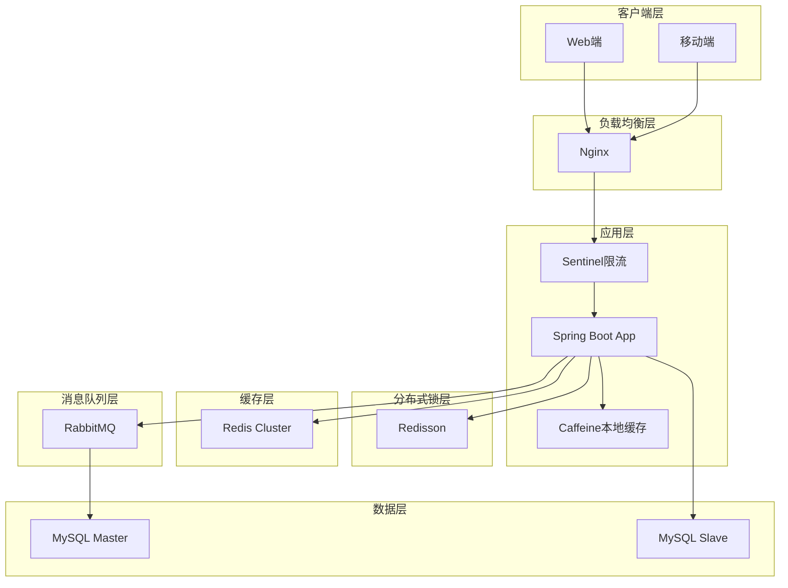
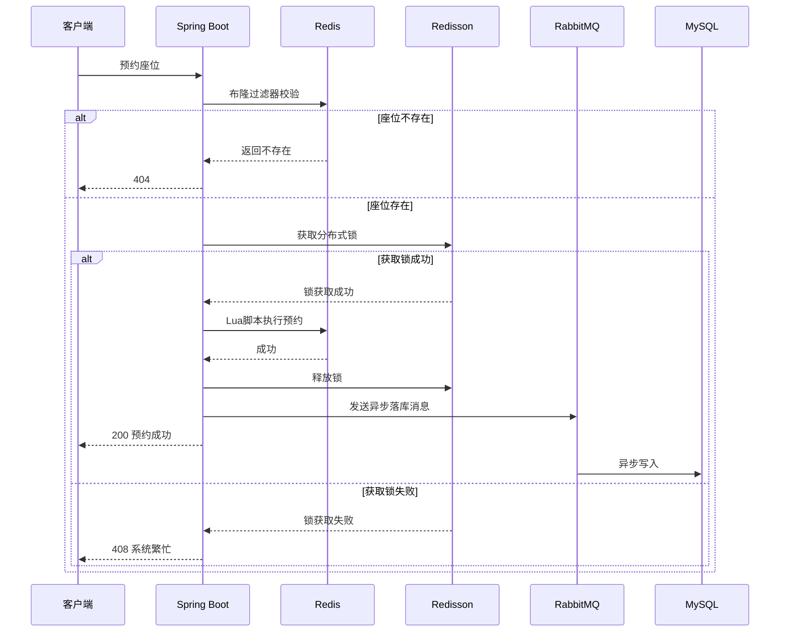
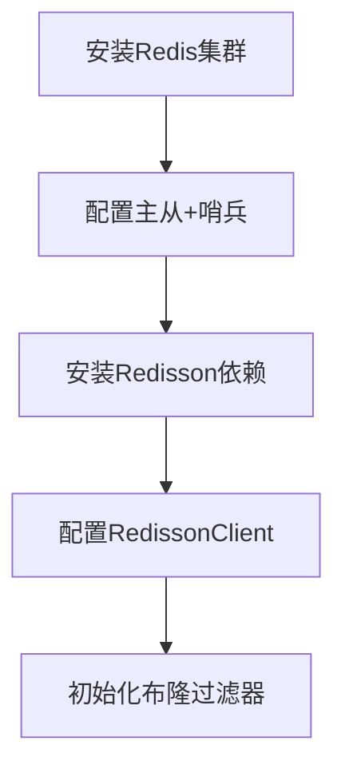
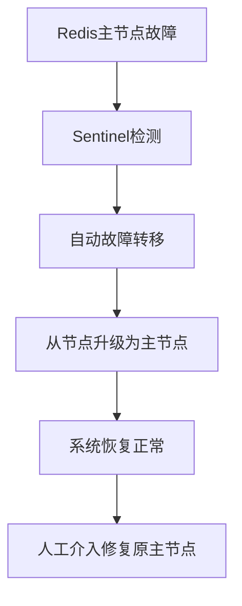

# 智慧校园服务系统 - 系统优化方案

## 文档信息

| 属性 | 值 |
| :--- | :--- |
| **文档名称** | 智慧校园服务系统优化方案 |
| **文档版本** | v1.0.0 |
| **编制日期** | 2026-04-28 |
| **适用模块** | 座位预约模块、选课模块 |

---

## 目录

1. [现状分析与问题识别](#1-现状分析与问题识别)
2. [优化目标与性能指标](#2-优化目标与性能指标)
3. [技术选型与架构设计](#3-技术选型与架构设计)
4. [座位模块优化方案](#4-座位模块优化方案)
5. [选课模块优化方案](#5-选课模块优化方案)
6. [高并发保障机制](#6-高并发保障机制)
7. [实施步骤与优先级](#7-实施步骤与优先级)
8. [测试与验收标准](#8-测试与验收标准)
9. [资源需求评估](#9-资源需求评估)
10. [风险与应急预案](#10-风险与应急预案)

---

## 1. 现状分析与问题识别

### 1.1 现有架构评估

基于对项目代码的深入分析，当前系统存在以下架构特征：

| 维度 | 当前状态 | 评估 |
| :--- | :--- | :--- |
| **框架** | Spring Boot 3.5.13 + Java 17 | 良好 |
| **数据库** | MySQL 8.0 + MyBatis | 良好 |
| **缓存** | Redis 7.x（仅基础配置） | 待优化 |
| **分布式锁** | 未实现 | **严重缺失** |
| **消息队列** | 未实现 | **严重缺失** |
| **限流熔断** | 未实现 | **严重缺失** |
| **布隆过滤器** | 未实现 | **缺失** |

### 1.2 核心代码问题分析

#### 1.2.1 座位预约模块问题

```java
// 当前实现：直接操作数据库，无缓存和分布式锁
@Override
@Transactional(rollbackFor = Exception.class)
public SeatReservationResponseDTO insertSeatReservation(SeatReservationCreateDTO dto) {
    // 问题1：直接查询数据库进行冲突检测
    int conflictCount = seatReservationMapper.checkSeatConflict(...);
    
    // 问题2：无分布式锁保护，高并发下可能出现超预约
    int result = seatReservationMapper.insertSeatReservation(dto);
    ...
}
```

**问题清单**：
| 问题 | 影响 | 严重程度 |
| :--- | :--- | :--- |
| 无分布式锁 | 高并发下座位被重复预约 | **严重** |
| 直接查DB | 性能瓶颈，无法支撑高并发 | **严重** |
| 无缓存层 | 查询性能差，DB压力大 | **高** |
| 无异步落库 | 同步写DB导致响应慢 | **高** |

#### 1.2.2 选课模块问题

当前 `CourseSelectionServiceImpl` 同样存在类似问题：
- 库存扣减直接操作数据库
- 无库存预热到Redis
- 无候补队列机制
- 无限流保护

### 1.3 配置层面问题

| 配置项 | 当前状态 | 问题 |
| :--- | :--- | :--- |
| Redis连接池 | lettuce配置基础 | 无分片、无哨兵 |
| 数据库连接池 | HikariCP | 配置合理 |
| 日志级别 | DEBUG | 生产环境需调整 |

### 1.4 架构缺陷总结

```mermaid
flowchart TD
    A[客户端请求] --> B[Spring Boot]
    B --> C[直接操作MySQL]
    C --> D[返回结果]
    
    style B fill:#f9f,stroke:#333,stroke-width:2px
    style C fill:#f9f,stroke:#333,stroke-width:2px
    note right of B: 无缓存层
    note right of C: 无分布式锁
```

---

## 2. 优化目标与性能指标

### 2.1 优化目标

| 目标类型 | 目标描述 |
| :--- | :--- |
| **性能提升** | 座位预约/选课接口响应时间 < 100ms |
| **并发能力** | 支持 5000 QPS 峰值 |
| **数据一致性** | Redis与MySQL同步延迟 < 5s |
| **系统可用性** | 99.9% |
| **降级能力** | Redis宕机时系统可降级运行 |

### 2.2 性能指标

| 指标 | 优化前 | 优化后目标 | 提升幅度 |
| :--- | :--- | :--- | :--- |
| 座位预约响应时间 | ~500ms | < 100ms | 80% |
| 选课响应时间 | ~600ms | < 100ms | 83% |
| 座位查询响应时间 | ~300ms | < 50ms | 83% |
| 课程查询响应时间 | ~250ms | < 50ms | 80% |
| 数据库QPS | 1000 | < 100 | 90% |

---

## 3. 技术选型与架构设计

### 3.1 技术栈升级

| 组件 | 当前版本 | 升级后 | 理由 |
| :--- | :--- | :--- | :--- |
| **Redis客户端** | Spring Data Redis | **Redisson 3.25.x** | 分布式锁、布隆过滤器 |
| **限流熔断** | 无 | **Sentinel 1.8.x** | 流量控制 |
| **消息队列** | 无 | **RabbitMQ 3.12.x** | 异步落库 |
| **本地缓存** | 无 | **Caffeine 3.1.x** | 多级缓存 |

### 3.2 优化后架构



### 3.3 核心数据流优化



---

## 4. 座位模块优化方案

### 4.1 Redis数据结构设计

| Key Pattern | 类型 | 说明 | 过期策略 |
| :--- | :--- | :--- | :--- |
| `seat:info:{seatId}` | Hash | 座位基本信息 | 永不过期 |
| `seat:available:{date}` | Set | 当日空闲座位ID | 次日凌晨 |
| `seat:reserved:{date}` | Set | 当日已预约座位ID | 次日凌晨 |
| `seat:schedule:{seatId}:{date}` | ZSet | 时间片（score=分钟数） | 次日凌晨 |
| `user:reservation:{userId}` | ZSet | 用户预约记录 | 30天 |

### 4.2 核心代码优化

#### 4.2.1 新增 RedisSeatService

```java
@Service
@Slf4j
@RequiredArgsConstructor
public class RedisSeatService {
    
    private final RedissonClient redissonClient;
    private final StringRedisTemplate redisTemplate;
    
    // 布隆过滤器
    private RBloomFilter<String> seatFilter;
    
    @PostConstruct
    public void init() {
        seatFilter = redissonClient.getBloomFilter("bf:seats");
        seatFilter.tryInit(100000L, 0.03);
        // 从数据库加载座位ID到布隆过滤器
        loadSeatsToBloomFilter();
    }
    
    /**
     * 检查座位是否存在
     */
    public boolean checkSeatExists(Long seatId) {
        return seatFilter.contains("seat:" + seatId);
    }
    
    /**
     * 获取座位预约锁
     */
    public RLock getSeatLock(Long seatId, LocalDate date) {
        String lockKey = "lock:seat:" + seatId + ":" + date.toString();
        return redissonClient.getLock(lockKey);
    }
    
    /**
     * Lua脚本：检测时间冲突并预约座位
     */
    public Long executeReservation(Long seatId, LocalDate date, 
                                   LocalTime startTime, LocalTime endTime,
                                   Long userId) {
        String script = """
            local seat_key = KEYS[1]
            local available_key = KEYS[2]
            local reserved_key = KEYS[3]
            local user_key = KEYS[4]
            local start_score = ARGV[1]
            local end_score = ARGV[2]
            local member = ARGV[3]
            local date_score = ARGV[4]
            local reservation_info = ARGV[5]
            
            local existing = redis.call('ZRANGEBYSCORE', seat_key, start_score, end_score)
            if #existing > 0 then
                return 0
            end
            
            redis.call('ZADD', seat_key, start_score, member)
            redis.call('SREM', available_key, member)
            redis.call('SADD', reserved_key, member)
            redis.call('ZADD', user_key, date_score, reservation_info)
            return 1
            """;
        
        String seatKey = "seat:schedule:" + seatId + ":" + date;
        String availableKey = "seat:available:" + date;
        String reservedKey = "seat:reserved:" + date;
        String userKey = "user:reservation:" + userId;
        
        int startScore = startTime.getHour() * 60 + startTime.getMinute();
        int endScore = endTime.getHour() * 60 + endTime.getMinute();
        String member = seatId.toString();
        long dateScore = Long.parseLong(date.toString().replace("-", ""));
        String reservationInfo = String.format("%d_%s_%s", seatId, startTime, endTime);
        
        return redisTemplate.execute(new DefaultRedisScript<>(script, Long.class),
            List.of(seatKey, availableKey, reservedKey, userKey),
            String.valueOf(startScore), String.valueOf(endScore),
            member, String.valueOf(dateScore), reservationInfo);
    }
}
```

#### 4.2.2 优化后的 SeatReservationServiceImpl

```java
@Service
@Slf4j
@RequiredArgsConstructor
public class SeatReservationServiceImpl implements SeatReservationService {
    
    private final SeatReservationMapper seatReservationMapper;
    private final RedisSeatService redisSeatService;
    private final RabbitTemplate rabbitTemplate;
    
    @Override
    public SeatReservationResponseDTO insertSeatReservation(SeatReservationCreateDTO dto) {
        log.info("新增座位预约，参数：{}", dto);
        validateReservationDTO(dto);
        
        // 布隆过滤器校验
        if (!redisSeatService.checkSeatExists(dto.getSeatId())) {
            throw new BusinessException("座位不存在");
        }
        
        // 获取分布式锁
        RLock lock = redisSeatService.getSeatLock(dto.getSeatId(), dto.getDate());
        try {
            if (lock.tryLock(3, 10, TimeUnit.SECONDS)) {
                // Lua脚本原子执行预约
                Long result = redisSeatService.executeReservation(
                    dto.getSeatId(), dto.getDate(), 
                    dto.getStartTime(), dto.getEndTime(),
                    getCurrentUserId());
                
                if (result == 0) {
                    throw new BusinessException("该座位在该时间段已被预约");
                }
                
                // 异步落库
                sendReservationMessage(dto);
                
                return buildResponseDTO(dto);
            } else {
                throw new BusinessException("系统繁忙，请稍后重试");
            }
        } catch (InterruptedException e) {
            Thread.currentThread().interrupt();
            throw new BusinessException("操作被中断");
        } finally {
            if (lock.isHeldByCurrentThread()) {
                lock.unlock();
            }
        }
    }
    
    private void sendReservationMessage(SeatReservationCreateDTO dto) {
        Map<String, Object> message = new HashMap<>();
        message.put("seatId", dto.getSeatId());
        message.put("date", dto.getDate().toString());
        message.put("startTime", dto.getStartTime().toString());
        message.put("endTime", dto.getEndTime().toString());
        message.put("userId", getCurrentUserId());
        rabbitTemplate.convertAndSend("seat-reservation-exchange", "reservation.create", message);
    }
}
```

### 4.3 MQ消费者实现

```java
@Component
@Slf4j
public class SeatReservationConsumer {
    
    private final SeatReservationMapper seatReservationMapper;
    
    @RabbitListener(queues = "seat-reservation-queue")
    public void handleReservation(Map<String, Object> message, Channel channel, 
                                  @Header(AmqpHeaders.DELIVERY_TAG) long deliveryTag) {
        try {
            Long seatId = ((Number) message.get("seatId")).longValue();
            LocalDate date = LocalDate.parse((String) message.get("date"));
            LocalTime startTime = LocalTime.parse((String) message.get("startTime"));
            LocalTime endTime = LocalTime.parse((String) message.get("endTime"));
            Long userId = ((Number) message.get("userId")).longValue();
            
            SeatReservationCreateDTO dto = new SeatReservationCreateDTO();
            dto.setSeatId(seatId);
            dto.setDate(date);
            dto.setStartTime(startTime);
            dto.setEndTime(endTime);
            
            // 幂等性检查
            if (seatReservationMapper.existsByUserIdAndSeatIdAndDate(userId, seatId, date)) {
                log.warn("重复消息已处理");
                channel.basicAck(deliveryTag, false);
                return;
            }
            
            seatReservationMapper.insertSeatReservation(dto);
            channel.basicAck(deliveryTag, false);
            log.info("座位预约异步落库成功");
            
        } catch (Exception e) {
            log.error("座位预约落库失败", e);
            // 重试3次后进入死信队列
            try {
                channel.basicNack(deliveryTag, false, false);
            } catch (IOException ex) {
                log.error("消息确认失败", ex);
            }
        }
    }
}
```

---

## 5. 选课模块优化方案

### 5.1 Redis数据结构设计

| Key Pattern | 类型 | 说明 | 过期策略 |
| :--- | :--- | :--- | :--- |
| `course:info:{courseId}` | Hash | 课程基本信息 | 永不过期 |
| `course:stock:{courseId}` | String | 剩余名额 | 选课期结束 |
| `course:selected:{userId}` | Set | 用户已选课程 | 学期结束 |
| `course:waiting:{courseId}` | ZSet | 候补队列 | 选课期结束 |
| `seckill:order:queue` | ZSet | 选课排队队列 | 动态清理 |

### 5.2 核心代码优化

#### 5.2.1 新增 RedisCourseService

```java
@Service
@Slf4j
@RequiredArgsConstructor
public class RedisCourseService {
    
    private final RedissonClient redissonClient;
    private final StringRedisTemplate redisTemplate;
    
    private RBloomFilter<String> courseFilter;
    
    @PostConstruct
    public void init() {
        courseFilter = redissonClient.getBloomFilter("bf:courses");
        courseFilter.tryInit(5000L, 0.03);
        loadCoursesToBloomFilter();
    }
    
    /**
     * 检查课程是否存在
     */
    public boolean checkCourseExists(Long courseId) {
        return courseFilter.contains("course:" + courseId);
    }
    
    /**
     * 初始化课程库存
     */
    public void initStock(Long courseId, Integer capacity) {
        String stockKey = "course:stock:" + courseId;
        redisTemplate.opsForValue().set(stockKey, String.valueOf(capacity));
    }
    
    /**
     * Lua脚本：选课操作
     */
    public Integer executeSelection(Long courseId, Long userId) {
        String script = """
            local stock_key = KEYS[1]
            local selected_key = KEYS[2]
            local waiting_key = KEYS[3]
            local course_id = ARGV[1]
            local user_id = ARGV[2]
            local timestamp = ARGV[3]
            
            local selected = redis.call('SISMEMBER', selected_key, course_id)
            if selected == 1 then
                return -2
            end
            
            local stock = tonumber(redis.call('GET', stock_key) or "0")
            if stock <= 0 then
                redis.call('ZADD', waiting_key, timestamp, user_id)
                return -1
            end
            
            redis.call('DECR', stock_key)
            redis.call('SADD', selected_key, course_id)
            return 1
            """;
        
        String stockKey = "course:stock:" + courseId;
        String selectedKey = "course:selected:" + userId;
        String waitingKey = "course:waiting:" + courseId;
        
        return redisTemplate.execute(new DefaultRedisScript<>(script, Integer.class),
            List.of(stockKey, selectedKey, waitingKey),
            String.valueOf(courseId), String.valueOf(userId),
            String.valueOf(System.currentTimeMillis()));
    }
    
    /**
     * Lua脚本：退课操作
     */
    public String executeDrop(Long courseId, Long userId) {
        String script = """
            local stock_key = KEYS[1]
            local selected_key = KEYS[2]
            local waiting_key = KEYS[3]
            local course_id = ARGV[1]
            
            local selected = redis.call('SISMEMBER', selected_key, course_id)
            if selected ~= 1 then
                return "0"
            end
            
            redis.call('SREM', selected_key, course_id)
            redis.call('INCR', stock_key)
            
            local waiters = redis.call('ZRANGE', waiting_key, 0, 0)
            if #waiters > 0 then
                local waiter = waiters[1]
                redis.call('DECR', stock_key)
                redis.call('SADD', selected_key, course_id)
                redis.call('ZREM', waiting_key, waiter)
                return waiter
            end
            return "1"
            """;
        
        String stockKey = "course:stock:" + courseId;
        String selectedKey = "course:selected:" + userId;
        String waitingKey = "course:waiting:" + courseId;
        
        return redisTemplate.execute(new DefaultRedisScript<>(script, String.class),
            List.of(stockKey, selectedKey, waitingKey),
            String.valueOf(courseId));
    }
}
```

#### 5.2.2 优化后的 CourseSelectionServiceImpl

```java
@Service
@Slf4j
@RequiredArgsConstructor
public class CourseSelectionServiceImpl implements CourseSelectionService {
    
    private final CourseSelectionMapper courseSelectionMapper;
    private final RedisCourseService redisCourseService;
    private final RabbitTemplate rabbitTemplate;
    
    @Override
    public CourseSelectionResponseDTO selectCourse(CourseSelectionCreateDTO dto) {
        log.info("学生选课，参数：{}", dto);
        validateSelectionDTO(dto);
        
        // 布隆过滤器校验
        if (!redisCourseService.checkCourseExists(dto.getCourseId())) {
            throw new BusinessException("课程不存在");
        }
        
        // 执行选课Lua脚本
        Integer result = redisCourseService.executeSelection(dto.getCourseId(), dto.getStudentId());
        
        if (result == -2) {
            throw new BusinessException("已选该课程");
        } else if (result == -1) {
            // 加入候补队列
            log.info("课程已满，加入候补队列");
            return buildWaitingResponseDTO(dto);
        } else if (result == 1) {
            // 选课成功，异步落库
            sendSelectionMessage(dto);
            return buildSuccessResponseDTO(dto);
        }
        
        throw new BusinessException("选课失败");
    }
    
    private void sendSelectionMessage(CourseSelectionCreateDTO dto) {
        Map<String, Object> message = new HashMap<>();
        message.put("studentId", dto.getStudentId());
        message.put("courseId", dto.getCourseId());
        message.put("semesterId", dto.getSemesterId());
        rabbitTemplate.convertAndSend("course-selection-exchange", "selection.create", message);
    }
}
```

---

## 6. 高并发保障机制

### 6.1 限流策略

#### 6.1.1 Sentinel配置

```java
@Configuration
public class SentinelConfig {
    
    @Bean
    public SentinelResourceAspect sentinelResourceAspect() {
        return new SentinelResourceAspect();
    }
    
    @PostConstruct
    public void initRules() {
        // 座位预约限流规则
        FlowRule seatReservationRule = new FlowRule();
        seatReservationRule.setResource("seatReservation");
        seatReservationRule.setCount(1000);
        seatReservationRule.setGrade(RuleConstant.FLOW_GRADE_QPS);
        seatReservationRule.setControlBehavior(RuleConstant.CONTROL_BEHAVIOR_WARM_UP);
        FlowRuleManager.loadRules(List.of(seatReservationRule));
        
        // 选课限流规则
        FlowRule courseSelectionRule = new FlowRule();
        courseSelectionRule.setResource("courseSelection");
        courseSelectionRule.setCount(5000);
        courseSelectionRule.setGrade(RuleConstant.FLOW_GRADE_QPS);
        courseSelectionRule.setControlBehavior(RuleConstant.CONTROL_BEHAVIOR_RATE_LIMITER);
        courseSelectionRule.setMaxQueueingTimeMs(500);
        FlowRuleManager.loadRules(List.of(courseSelectionRule));
        
        // 降级规则
        DegradeRule degradeRule = new DegradeRule();
        degradeRule.setResource("seatReservation");
        degradeRule.setCount(0.5);
        degradeRule.setGrade(RuleConstant.DEGRADE_GRADE_EXCEPTION_RATIO);
        degradeRule.setTimeWindow(30);
        DegradeRuleManager.loadRules(List.of(degradeRule));
    }
}
```

#### 6.1.2 Controller层限流注解

```java
@RestController
@RequestMapping("/api/seat-reservations")
public class SeatReservationController {
    
    @Autowired
    private SeatReservationService seatReservationService;
    
    @PostMapping
    @SentinelResource(value = "seatReservation", 
        blockHandler = "handleBlock", 
        fallback = "handleFallback")
    public Result<SeatReservationResponseDTO> createReservation(
            @RequestBody SeatReservationCreateDTO dto) {
        SeatReservationResponseDTO response = seatReservationService.insertSeatReservation(dto);
        return Result.success(response);
    }
    
    public Result<String> handleBlock(SeatReservationCreateDTO dto, BlockException e) {
        return Result.error("系统繁忙，请稍后重试");
    }
    
    public Result<String> handleFallback(SeatReservationCreateDTO dto, Throwable e) {
        return Result.error("服务异常，请稍后重试");
    }
}
```

### 6.2 多级缓存架构

```java
@Service
public class SeatCacheService {
    
    private final Cache<String, SeatInfo> caffeineCache;
    private final StringRedisTemplate redisTemplate;
    
    public SeatCacheService() {
        this.caffeineCache = Caffeine.newBuilder()
            .maximumSize(1000)
            .expireAfterWrite(5, TimeUnit.MINUTES)
            .build();
    }
    
    public SeatInfo getSeatInfo(Long seatId) {
        String key = "seat:info:" + seatId;
        
        // 先查本地缓存
        SeatInfo localCache = caffeineCache.getIfPresent(key);
        if (localCache != null) {
            return localCache;
        }
        
        // 再查Redis
        String json = redisTemplate.opsForValue().get(key);
        if (json != null) {
            SeatInfo seatInfo = JSON.parseObject(json, SeatInfo.class);
            caffeineCache.put(key, seatInfo);
            return seatInfo;
        }
        
        // 最后查DB
        SeatInfo seatInfo = loadFromDB(seatId);
        redisTemplate.opsForValue().set(key, JSON.toJSONString(seatInfo));
        caffeineCache.put(key, seatInfo);
        return seatInfo;
    }
}
```

### 6.3 请求排队机制

```java
@Component
public class CourseSelectionQueueService {
    
    private final StringRedisTemplate redisTemplate;
    private final ScheduledExecutorService executorService;
    
    public CourseSelectionQueueService(StringRedisTemplate redisTemplate) {
        this.redisTemplate = redisTemplate;
        this.executorService = Executors.newSingleThreadScheduledExecutor();
        startProcessing();
    }
    
    /**
     * 添加到排队队列
     */
    public void addToQueue(Long userId, Long courseId) {
        String key = "seckill:order:queue";
        String member = userId + ":" + courseId;
        redisTemplate.opsForZSet().add(key, member, System.nanoTime());
    }
    
    /**
     * 后台线程处理队列
     */
    private void startProcessing() {
        executorService.scheduleAtFixedRate(() -> {
            String key = "seckill:order:queue";
            Set<String> members = redisTemplate.opsForZSet().range(key, 0, 100);
            
            if (members != null && !members.isEmpty()) {
                for (String member : members) {
                    String[] parts = member.split(":");
                    Long userId = Long.parseLong(parts[0]);
                    Long courseId = Long.parseLong(parts[1]);
                    
                    try {
                        // 执行选课逻辑
                        processSelection(userId, courseId);
                        redisTemplate.opsForZSet().remove(key, member);
                    } catch (Exception e) {
                        log.error("处理排队请求失败", e);
                    }
                }
            }
        }, 0, 100, TimeUnit.MILLISECONDS);
    }
}
```

---

## 7. 实施步骤与优先级

### 7.1 实施路线图

| 阶段 | 时间 | 任务 | 优先级 |
| :--- | :--- | :--- | :--- |
| **Phase 1** | 第1-2周 | Redis基础设施搭建 + Redisson集成 | **P0** |
| **Phase 2** | 第3-4周 | 座位模块Redis改造 | **P0** |
| **Phase 3** | 第5-6周 | 选课模块Redis改造 | **P0** |
| **Phase 4** | 第7-8周 | RabbitMQ集成 + 异步落库 | **P1** |
| **Phase 5** | 第9-10周 | Sentinel限流熔断 | **P1** |
| **Phase 6** | 第11-12周 | 性能测试与调优 | **P2** |

### 7.2 详细实施步骤

#### Phase 1：Redis基础设施搭建



**步骤详情**：
1. 部署Redis 7.2.x集群（主从+哨兵模式）
2. 在pom.xml中添加Redisson依赖
3. 创建Redisson配置类
4. 初始化座位和课程布隆过滤器

#### Phase 2：座位模块改造

| 任务 | 描述 | 依赖 |
| :--- | :--- | :--- |
| 创建RedisSeatService | Redis操作封装 | Phase 1 |
| 修改SeatReservationServiceImpl | 引入Redis和分布式锁 | RedisSeatService |
| 创建MQ消费者 | 异步落库 | RabbitMQ |
| 更新Controller | 添加限流注解 | Sentinel |

#### Phase 3：选课模块改造

| 任务 | 描述 | 依赖 |
| :--- | :--- | :--- |
| 创建RedisCourseService | Redis操作封装 | Phase 1 |
| 修改CourseSelectionServiceImpl | 引入Redis库存扣减 | RedisCourseService |
| 实现候补队列逻辑 | ZSet排序 | RedisCourseService |
| 创建MQ消费者 | 异步落库 | RabbitMQ |

#### Phase 4：异步落库机制

| 任务 | 描述 | 依赖 |
| :--- | :--- | :--- |
| 安装RabbitMQ | 消息队列部署 | - |
| 配置Exchange和Queue | 声明队列和路由 | RabbitMQ |
| 实现生产者 | 发送落库消息 | Redis改造完成 |
| 实现消费者 | 接收消息并写入DB | 生产者 |

#### Phase 5：限流熔断

| 任务 | 描述 | 依赖 |
| :--- | :--- | :--- |
| 安装Sentinel Dashboard | 限流监控平台 | - |
| 配置限流规则 | QPS阈值、降级策略 | Sentinel |
| 添加限流注解 | Controller层限流 | Sentinel配置 |
| 实现降级逻辑 | 优雅降级处理 | 限流注解 |

#### Phase 6：测试与调优

| 任务 | 描述 | 依赖 |
| :--- | :--- | :--- |
| 单元测试 | Redis操作、Lua脚本 | 代码完成 |
| 集成测试 | 完整流程测试 | 所有模块 |
| 性能测试 | JMeter压测 | 环境搭建 |
| 性能调优 | 根据测试结果优化 | 测试完成 |

---

## 8. 测试与验收标准

### 8.1 测试方案

#### 8.1.1 单元测试

| 测试用例 | 预期结果 |
| :--- | :--- |
| 布隆过滤器存在检测 | 存在返回true |
| 布隆过滤器不存在检测 | 不存在返回false |
| 分布式锁获取成功 | 返回锁对象 |
| 分布式锁获取超时 | 抛出异常 |
| Lua脚本时间冲突检测 | 冲突返回0 |
| Lua脚本无冲突预约 | 返回1 |

#### 8.1.2 集成测试

| 测试场景 | 并发数 | 持续时间 | 预期指标 |
| :--- | :--- | :--- | :--- |
| 座位预约峰值 | 1000 | 30s | P99 < 200ms |
| 选课峰值 | 5000 | 30s | P99 < 300ms |
| 混合场景 | 3000 | 120s | P99 < 250ms |

#### 8.1.3 故障注入测试

| 测试场景 | 操作 | 预期结果 |
| :--- | :--- | :--- |
| Redis宕机 | 停止Redis服务 | 系统降级，使用本地缓存 |
| 限流触发 | JMeter压测 | 返回限流提示，服务不崩溃 |
| 消息丢失 | 手动删除消息 | 消息重发或进入死信队列 |

### 8.2 验收标准

| 指标 | 验收标准 | 验证方法 |
| :--- | :--- | :--- |
| **响应时间** | P99 < 100ms | JMeter统计 |
| **QPS** | ≥ 5000 | JMeter压测 |
| **错误率** | < 0.1% | 日志分析 |
| **数据一致性** | Redis与MySQL差异 < 0.1% | 定时对账 |
| **可用性** | 99.9% | 监控平台 |
| **降级能力** | Redis宕机后仍可服务 | 故障注入测试 |

---

## 9. 资源需求评估

### 9.1 服务器资源

| 服务 | CPU | 内存 | 数量 |
| :--- | :--- | :--- | :--- |
| **应用服务器** | 8核 | 16GB | 4台 |
| **Redis集群** | 4核 | 8GB | 3台（1主2从） |
| **RabbitMQ** | 4核 | 8GB | 3台（集群） |
| **MySQL** | 8核 | 16GB | 2台（主从） |
| **Sentinel** | 2核 | 4GB | 1台 |

### 9.2 网络带宽

| 场景 | 峰值带宽 |
| :--- | :--- |
| 选课开放 | 1Gbps |
| 日常访问 | 100Mbps |

### 9.3 存储需求

| 数据类型 | 存储量 | 增长趋势 |
| :--- | :--- | :--- |
| Redis缓存 | 50GB | 每月5% |
| MySQL数据 | 100GB | 每月10% |
| 日志 | 200GB | 每日轮换 |

---

## 10. 风险与应急预案

### 10.1 风险识别

| 风险 | 概率 | 影响 | 应对策略 |
| :--- | :--- | :--- | :--- |
| Redis集群故障 | 低 | 高 | 哨兵自动故障转移 |
| 消息队列积压 | 中 | 中 | 增加消费者数量 |
| 限流策略过严 | 中 | 低 | 动态调整阈值 |
| 数据一致性问题 | 低 | 高 | 定时对账 + 人工修复 |
| 热点课程问题 | 高 | 中 | 热点缓存 + 排队机制 |

### 10.2 应急预案

#### 10.2.1 Redis故障



#### 10.2.2 服务降级

```java
@Component
public class FallbackService {
    
    @Autowired
    private SeatMapper seatMapper;
    
    /**
     * Redis不可用时的降级策略
     */
    public SeatInfo getSeatInfoFallback(Long seatId) {
        // 使用本地缓存或直接查DB
        log.warn("Redis不可用，使用降级策略");
        return seatMapper.selectById(seatId);
    }
}
```

#### 10.2.3 数据对账

```java
@Component
public class DataReconciliationTask {
    
    @Scheduled(fixedRate = 300000) // 每5分钟执行一次
    public void reconcileSeatReservations() {
        // 对比Redis和MySQL的预约数量
        long redisCount = countRedisReservations();
        long dbCount = countDBReservations();
        
        if (Math.abs(redisCount - dbCount) > 0) {
            log.error("数据不一致，Redis: {}, DB: {}", redisCount, dbCount);
            // 触发告警通知
            sendAlert("座位预约数据不一致");
        }
    }
}
```

---

## 附录：配置清单

### pom.xml依赖新增

```xml
<!-- Redisson -->
<dependency>
    <groupId>org.redisson</groupId>
    <artifactId>redisson-spring-boot-starter</artifactId>
    <version>3.25.0</version>
</dependency>

<!-- Sentinel -->
<dependency>
    <groupId>com.alibaba.csp</groupId>
    <artifactId>sentinel-core</artifactId>
    <version>1.8.6</version>
</dependency>
<dependency>
    <groupId>com.alibaba.csp</groupId>
    <artifactId>sentinel-spring-webmvc-adapter</artifactId>
    <version>1.8.6</version>
</dependency>

<!-- RabbitMQ -->
<dependency>
    <groupId>org.springframework.boot</groupId>
    <artifactId>spring-boot-starter-amqp</artifactId>
</dependency>

<!-- Caffeine -->
<dependency>
    <groupId>com.github.ben-manes.caffeine</groupId>
    <artifactId>caffeine</artifactId>
    <version>3.1.8</version>
</dependency>
```

### application.yaml新增配置

```yaml
# Redisson配置
redisson:
  config: |
    singleServerConfig:
      address: "redis://localhost:6379"
      database: 0
      connectionPoolSize: 64
      connectionMinimumIdleSize: 16

# RabbitMQ配置
spring:
  rabbitmq:
    host: localhost
    port: 5672
    username: guest
    password: guest
    listener:
      simple:
        acknowledge-mode: manual
        concurrency: 10
        max-concurrency: 50

# Sentinel配置
spring:
  cloud:
    sentinel:
      transport:
        dashboard: localhost:8080
```

---

**文档版本**：v1.0.0  
**最后更新**：2026-04-28  
**编制单位**：智慧校园项目组