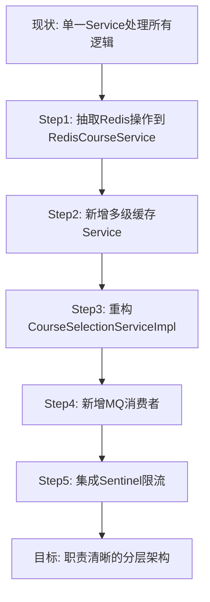
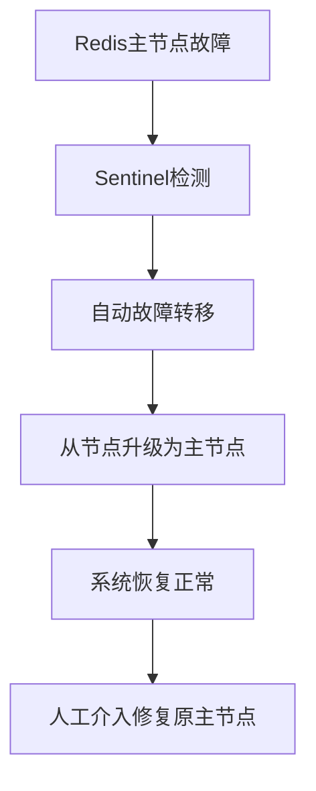

# 选课模块代码优化实现方案

## 文档信息

| 属性 | 值 |
| :--- | :--- |
| **文档名称** | 选课模块代码优化实现方案 |
| **文档版本** | v1.0.0 |
| **编制日期** | 2026-04-29 |
| **适用模块** | 选课管理模块 |
| **依赖文档** | 选课管理模块需求文档、系统优化方案、高并发解决方案 |

---

## 目录

1. [优化目标与具体指标](#1-优化目标与具体指标)
2. [技术实现步骤](#2-技术实现步骤)
3. [代码重构方法](#3-代码重构方法)
4. [性能优化策略](#4-性能优化策略)
5. [兼容性处理方案](#5-兼容性处理方案)
6. [测试计划与验收标准](#6-测试计划与验收标准)
7. [风险评估与应对措施](#7-风险评估与应对措施)

---

## 1. 优化目标与具体指标

### 1.1 优化目标

| 目标类型 | 目标描述 | 来源 |
| :--- | :--- | :--- |
| **性能提升** | 选课接口响应时间 < 100ms | 系统优化方案 2.1 |
| **并发能力** | 支持 5000 QPS 峰值 | 高并发解决方案 1.3 |
| **数据一致性** | Redis与MySQL同步延迟 < 5s | 系统优化方案 2.1 |
| **系统可用性** | 99.9% | 系统优化方案 2.1 |
| **降级能力** | Redis宕机时系统可降级运行 | 系统优化方案 2.1 |

### 1.2 具体指标

| 指标 | 当前状态 | 优化目标 | 提升幅度 |
| :--- | :--- | :--- | :--- |
| 选课响应时间 | ~600ms | < 100ms | 83% |
| 课程查询响应时间 | ~250ms | < 50ms | 80% |
| 数据库QPS | 1000 | < 100 | 90% |
| 缓存命中率 | - | > 95% | - |
| 错误率 | - | < 0.1% | - |

---

## 2. 技术实现步骤

### 2.1 Phase 1：基础设施准备（第1-2周）

#### 2.1.1 依赖集成

**pom.xml 新增依赖：**

```xml
<!-- Redisson -->
<dependency>
    <groupId>org.redisson</groupId>
    <artifactId>redisson-spring-boot-starter</artifactId>
    <version>3.25.0</version>
</dependency>

<!-- RabbitMQ -->
<dependency>
    <groupId>org.springframework.boot</groupId>
    <artifactId>spring-boot-starter-amqp</artifactId>
</dependency>

<!-- Sentinel -->
<dependency>
    <groupId>com.alibaba.csp</groupId>
    <artifactId>sentinel-core</artifactId>
    <version>1.8.6</version>
</dependency>
<dependency>
    <groupId>com.alibaba.csp</groupId>
    <artifactId>sentinel-spring-webmvc-adapter</artifactId>
    <version>1.8.6</version>
</dependency>

<!-- Caffeine -->
<dependency>
    <groupId>com.github.ben-manes.caffeine</groupId>
    <artifactId>caffeine</artifactId>
    <version>3.1.8</version>
</dependency>
```

#### 2.1.2 配置文件更新

**application.yml 新增配置：**

```yaml
# Redisson配置
redisson:
  config: |
    singleServerConfig:
      address: "redis://localhost:6379"
      database: 0
      connectionPoolSize: 64
      connectionMinimumIdleSize: 16
      idleConnectionTimeout: 10000
      connectTimeout: 10000
      timeout: 3000
      retryAttempts: 3
      retryInterval: 1000
    lock:
      leaseTime: 30000
      waitTime: 3000

# RabbitMQ配置
spring:
  rabbitmq:
    host: localhost
    port: 5672
    username: guest
    password: guest
    listener:
      simple:
        acknowledge-mode: manual
        concurrency: 10
        max-concurrency: 50

# Sentinel配置
spring:
  cloud:
    sentinel:
      transport:
        dashboard: localhost:8080
```

#### 2.1.3 配置类创建

**RedissonConfig.java：**

```java
@Configuration
public class RedissonConfig {
    
    @Bean
    public RedissonClient redissonClient() {
        Config config = new Config();
        config.useSingleServer()
            .setAddress("redis://localhost:6379")
            .setDatabase(0)
            .setConnectionPoolSize(64)
            .setConnectionMinimumIdleSize(16);
        return Redisson.create(config);
    }
}
```

**RabbitMQConfig.java：**

```java
@Configuration
public class RabbitMQConfig {
    
    public static final String EXCHANGE_NAME = "course-selection-exchange";
    public static final String QUEUE_NAME = "course-selection-queue";
    public static final String ROUTING_KEY = "selection.create";
    
    @Bean
    public TopicExchange exchange() {
        return new TopicExchange(EXCHANGE_NAME, true, false);
    }
    
    @Bean
    public Queue queue() {
        return QueueBuilder.durable(QUEUE_NAME)
            .withArgument("x-dead-letter-exchange", EXCHANGE_NAME + "-dlx")
            .build();
    }
    
    @Bean
    public Binding binding(Queue queue, TopicExchange exchange) {
        return BindingBuilder.bind(queue).to(exchange).with(ROUTING_KEY);
    }
}
```

### 2.2 Phase 2：Redis服务层开发（第3-4周）

#### 2.2.1 新增 RedisCourseService

**RedisCourseService.java：**

```java
@Service
@Slf4j
@RequiredArgsConstructor
public class RedisCourseService {
    
    private final RedissonClient redissonClient;
    private final StringRedisTemplate redisTemplate;
    
    private RBloomFilter<String> courseFilter;
    
    @PostConstruct
    public void init() {
        courseFilter = redissonClient.getBloomFilter("bf:courses");
        courseFilter.tryInit(5000L, 0.03);
        loadCoursesToBloomFilter();
    }
    
    private void loadCoursesToBloomFilter() {
        // 从数据库加载所有课程ID到布隆过滤器
        List<Long> courseIds = loadAllCourseIds();
        courseIds.forEach(id -> courseFilter.add("course:" + id));
        log.info("课程布隆过滤器初始化完成，共加载 {} 个课程ID", courseIds.size());
    }
    
    public boolean checkCourseExists(Long courseId) {
        return courseFilter.contains("course:" + courseId);
    }
    
    public void initStock(Long courseId, Integer capacity) {
        String stockKey = "course:stock:" + courseId;
        redisTemplate.opsForValue().set(stockKey, String.valueOf(capacity));
    }
    
    public Integer executeSelection(Long courseId, Long userId) {
        String script = """
            local stock_key = KEYS[1]
            local selected_key = KEYS[2]
            local waiting_key = KEYS[3]
            local course_id = ARGV[1]
            local user_id = ARGV[2]
            local timestamp = ARGV[3]
            
            local selected = redis.call('SISMEMBER', selected_key, course_id)
            if selected == 1 then
                return -2
            end
            
            local stock = tonumber(redis.call('GET', stock_key) or "0")
            if stock <= 0 then
                redis.call('ZADD', waiting_key, timestamp, user_id)
                return -1
            end
            
            redis.call('DECR', stock_key)
            redis.call('SADD', selected_key, course_id)
            return 1
            """;
        
        String stockKey = "course:stock:" + courseId;
        String selectedKey = "course:selected:" + userId;
        String waitingKey = "course:waiting:" + courseId;
        
        return redisTemplate.execute(new DefaultRedisScript<>(script, Integer.class),
            List.of(stockKey, selectedKey, waitingKey),
            String.valueOf(courseId), String.valueOf(userId),
            String.valueOf(System.currentTimeMillis()));
    }
    
    public String executeDrop(Long courseId, Long userId) {
        String script = """
            local stock_key = KEYS[1]
            local selected_key = KEYS[2]
            local waiting_key = KEYS[3]
            local course_id = ARGV[1]
            local user_id = ARGV[2]
            
            local selected = redis.call('SISMEMBER', selected_key, course_id)
            if selected ~= 1 then
                return "0"
            end
            
            redis.call('SREM', selected_key, course_id)
            redis.call('INCR', stock_key)
            
            local waiters = redis.call('ZRANGE', waiting_key, 0, 0)
            if #waiters > 0 then
                local waiter = waiters[1]
                redis.call('DECR', stock_key)
                redis.call('SADD', selected_key, course_id)
                redis.call('ZREM', waiting_key, waiter)
                return waiter
            end
            return "1"
            """;
        
        String stockKey = "course:stock:" + courseId;
        String selectedKey = "course:selected:" + userId;
        String waitingKey = "course:waiting:" + courseId;
        
        return redisTemplate.execute(new DefaultRedisScript<>(script, String.class),
            List.of(stockKey, selectedKey, waitingKey),
            String.valueOf(courseId), String.valueOf(userId));
    }
    
    public boolean isCourseSelected(Long userId, Long courseId) {
        String selectedKey = "course:selected:" + userId;
        return Boolean.TRUE.equals(redisTemplate.opsForSet().isMember(selectedKey, String.valueOf(courseId)));
    }
    
    public Integer getStock(Long courseId) {
        String stockKey = "course:stock:" + courseId;
        String stock = redisTemplate.opsForValue().get(stockKey);
        return stock != null ? Integer.parseInt(stock) : 0;
    }
    
    private List<Long> loadAllCourseIds() {
        // TODO: 调用CourseMapper查询所有课程ID
        return List.of();
    }
}
```

#### 2.2.2 新增 CourseCacheService（多级缓存）

**CourseCacheService.java：**

```java
@Service
public class CourseCacheService {
    
    private final Cache<String, CourseDetailVO> caffeineCache;
    private final StringRedisTemplate redisTemplate;
    private final CourseService courseService;
    
    public CourseCacheService(StringRedisTemplate redisTemplate, CourseService courseService) {
        this.redisTemplate = redisTemplate;
        this.courseService = courseService;
        this.caffeineCache = Caffeine.newBuilder()
            .maximumSize(1000)
            .expireAfterWrite(5, TimeUnit.MINUTES)
            .build();
    }
    
    public CourseDetailVO getCourseDetail(Long courseId) {
        String key = "course:info:" + courseId;
        
        // 先查本地缓存
        CourseDetailVO localCache = caffeineCache.getIfPresent(key);
        if (localCache != null) {
            return localCache;
        }
        
        // 再查Redis
        String json = redisTemplate.opsForValue().get(key);
        if (json != null) {
            CourseDetailVO courseDetailVO = JSON.parseObject(json, CourseDetailVO.class);
            caffeineCache.put(key, courseDetailVO);
            return courseDetailVO;
        }
        
        // 最后查DB
        return loadFromDBAndCache(courseId);
    }
    
    private CourseDetailVO loadFromDBAndCache(Long courseId) {
        CourseDetailVO courseDetailVO = courseService.getCourseDetail(courseId);
        if (courseDetailVO != null) {
            String key = "course:info:" + courseId;
            String json = JSON.toJSONString(courseDetailVO);
            redisTemplate.opsForValue().set(key, json, 1, TimeUnit.DAYS);
            caffeineCache.put(key, courseDetailVO);
        }
        return courseDetailVO;
    }
    
    public void invalidateCache(Long courseId) {
        String key = "course:info:" + courseId;
        caffeineCache.invalidate(key);
        redisTemplate.delete(key);
    }
}
```

### 2.3 Phase 3：Service层重构（第5-6周）

#### 2.3.1 重构 CourseSelectionServiceImpl

**CourseSelectionServiceImpl.java：**

```java
@Service
@Slf4j
@RequiredArgsConstructor
public class CourseSelectionServiceImpl implements CourseSelectionService {
    
    private final CourseSelectionMapper courseSelectionMapper;
    private final CourseSelectionPeriodService courseSelectionPeriodService;
    private final CourseService courseService;
    private final RedisCourseService redisCourseService;
    private final CourseCacheService courseCacheService;
    private final RabbitTemplate rabbitTemplate;
    private final RedissonClient redissonClient;
    
    @Override
    public CourseSelectionResponseDTO insertCourseSelection(CourseSelectionCreateDTO dto) {
        log.info("学生选课，参数：{}", dto);
        validateSelectionDTO(dto);
        
        // 布隆过滤器校验课程是否存在
        if (!redisCourseService.checkCourseExists(dto.getCourseId())) {
            throw CourseSelectionException.courseNotExist("课程不存在");
        }
        
        // 获取分布式锁
        RLock lock = redissonClient.getLock("lock:course:" + dto.getCourseId());
        try {
            if (lock.tryLock(3, 10, TimeUnit.SECONDS)) {
                // Lua脚本原子执行选课
                Integer result = redisCourseService.executeSelection(
                    dto.getCourseId(), dto.getStudentId());
                
                if (result == -2) {
                    throw CourseSelectionException.courseSelectionExist("已选该课程");
                } else if (result == -1) {
                    log.info("课程已满，学生 {} 加入候补队列", dto.getStudentId());
                    return buildWaitingResponseDTO(dto);
                } else if (result == 1) {
                    // 选课成功，异步落库
                    sendSelectionMessage(dto);
                    return buildSuccessResponseDTO(dto);
                }
                
                throw CourseSelectionException.insertCourseSelectionFailed("选课失败");
            } else {
                throw CourseSelectionException.insertCourseSelectionFailed("系统繁忙，请稍后重试");
            }
        } catch (InterruptedException e) {
            Thread.currentThread().interrupt();
            throw CourseSelectionException.insertCourseSelectionFailed("操作被中断");
        } finally {
            if (lock.isHeldByCurrentThread()) {
                lock.unlock();
            }
        }
    }
    
    @Override
    public boolean deleteCourseSelection(Long id) {
        // 查询选课记录
        CourseSelectionListVO selection = courseSelectionMapper.getCourseSelectionListVO(id);
        if (selection == null) {
            throw CourseSelectionException.courseSelectionNotExist("选课记录不存在");
        }
        
        // 获取分布式锁
        RLock lock = redissonClient.getLock("lock:course:" + selection.getCourseId());
        try {
            if (lock.tryLock(3, 10, TimeUnit.SECONDS)) {
                // 执行退课Lua脚本
                String result = redisCourseService.executeDrop(
                    selection.getCourseId(), selection.getStudentId());
                
                if ("0".equals(result)) {
                    throw CourseSelectionException.courseSelectionNotExist("未选该课程");
                }
                
                // 更新数据库
                int updateResult = courseSelectionMapper.updateStatus(id, "DROPPED");
                if (updateResult <= 0) {
                    throw CourseSelectionException.deleteCourseSelectionFailed("退课失败");
                }
                
                // 如果有候补用户，发送通知
                if (!"1".equals(result)) {
                    sendWaitingNotification(selection.getCourseId(), Long.parseLong(result));
                }
                
                return true;
            } else {
                throw CourseSelectionException.deleteCourseSelectionFailed("系统繁忙，请稍后重试");
            }
        } catch (InterruptedException e) {
            Thread.currentThread().interrupt();
            throw CourseSelectionException.deleteCourseSelectionFailed("操作被中断");
        } finally {
            if (lock.isHeldByCurrentThread()) {
                lock.unlock();
            }
        }
    }
    
    @Override
    public List<MyCourseSelectionVO> getMyCourseSelectionList(Long semesterId, String status) {
        Long studentId = SecurityUtils.getCurrentUserId();
        if (studentId == null) {
            throw new IllegalArgumentException("用户信息不能为空");
        }
        
        // 先从本地缓存获取
        List<MyCourseSelectionVO> localResult = getFromLocalCache(studentId, semesterId, status);
        if (localResult != null && !localResult.isEmpty()) {
            return localResult;
        }
        
        // 再从Redis获取
        String redisKey = "my:course:selection:" + studentId + ":" + semesterId + ":" + status;
        String json = redisTemplate.opsForValue().get(redisKey);
        if (json != null) {
            List<MyCourseSelectionVO> result = JSON.parseArray(json, MyCourseSelectionVO.class);
            putToLocalCache(studentId, semesterId, status, result);
            return result;
        }
        
        // 最后从数据库获取
        List<MyCourseSelectionVO> result = courseSelectionMapper.getMyCourseSelectionList(studentId, semesterId, status);
        
        // 缓存到Redis和本地
        redisTemplate.opsForValue().set(redisKey, JSON.toJSONString(result), 1, TimeUnit.HOURS);
        putToLocalCache(studentId, semesterId, status, result);
        
        return result;
    }
    
    private void validateSelectionDTO(CourseSelectionCreateDTO dto) {
        if (dto.getStudentId() == null) {
            throw new IllegalArgumentException("学生ID不能为空");
        }
        if (dto.getCourseId() == null) {
            throw new IllegalArgumentException("课程ID不能为空");
        }
        if (dto.getSemesterId() == null) {
            throw new IllegalArgumentException("学期ID不能为空");
        }
    }
    
    private void sendSelectionMessage(CourseSelectionCreateDTO dto) {
        Map<String, Object> message = new HashMap<>();
        message.put("studentId", dto.getStudentId());
        message.put("courseId", dto.getCourseId());
        message.put("semesterId", dto.getSemesterId());
        message.put("timestamp", System.currentTimeMillis());
        rabbitTemplate.convertAndSend(RabbitMQConfig.EXCHANGE_NAME, RabbitMQConfig.ROUTING_KEY, message);
    }
    
    private void sendWaitingNotification(Long courseId, Long userId) {
        // TODO: 发送候补成功通知（短信、消息推送等）
        log.info("候补用户 {} 成功选课课程 {}", userId, courseId);
    }
    
    private CourseSelectionResponseDTO buildSuccessResponseDTO(CourseSelectionCreateDTO dto) {
        CourseDetailVO course = courseCacheService.getCourseDetail(dto.getCourseId());
        CourseSelectionResponseDTO response = new CourseSelectionResponseDTO();
        response.setStudentId(dto.getStudentId());
        response.setCourseId(dto.getCourseId());
        response.setCourseName(course != null ? course.getCourseName() : "");
        response.setSemesterId(dto.getSemesterId());
        response.setStatus("SELECTED");
        response.setCreateTime(LocalDateTime.now());
        return response;
    }
    
    private CourseSelectionResponseDTO buildWaitingResponseDTO(CourseSelectionCreateDTO dto) {
        CourseSelectionResponseDTO response = new CourseSelectionResponseDTO();
        response.setStudentId(dto.getStudentId());
        response.setCourseId(dto.getCourseId());
        response.setSemesterId(dto.getSemesterId());
        response.setStatus("WAITING");
        response.setCreateTime(LocalDateTime.now());
        return response;
    }
    
    // 本地缓存相关方法
    private final Cache<String, List<MyCourseSelectionVO>> mySelectionCache = Caffeine.newBuilder()
        .maximumSize(500)
        .expireAfterWrite(10, TimeUnit.MINUTES)
        .build();
    
    private List<MyCourseSelectionVO> getFromLocalCache(Long studentId, Long semesterId, String status) {
        String key = buildCacheKey(studentId, semesterId, status);
        return mySelectionCache.getIfPresent(key);
    }
    
    private void putToLocalCache(Long studentId, Long semesterId, String status, List<MyCourseSelectionVO> data) {
        String key = buildCacheKey(studentId, semesterId, status);
        mySelectionCache.put(key, data);
    }
    
    private String buildCacheKey(Long studentId, Long semesterId, String status) {
        return "my:selection:" + studentId + ":" + semesterId + ":" + status;
    }
}
```

### 2.4 Phase 4：MQ消费者实现（第7-8周）

**CourseSelectionConsumer.java：**

```java
@Component
@Slf4j
@RequiredArgsConstructor
public class CourseSelectionConsumer {
    
    private final CourseSelectionMapper courseSelectionMapper;
    
    @RabbitListener(queues = RabbitMQConfig.QUEUE_NAME)
    public void handleSelection(Map<String, Object> message, Channel channel,
                                @Header(AmqpHeaders.DELIVERY_TAG) long deliveryTag) {
        try {
            Long studentId = ((Number) message.get("studentId")).longValue();
            Long courseId = ((Number) message.get("courseId")).longValue();
            Long semesterId = ((Number) message.get("semesterId")).longValue();
            
            // 幂等性检查
            if (courseSelectionMapper.existsByStudentIdAndCourseId(studentId, courseId)) {
                log.warn("重复消息已处理，studentId={}, courseId={}", studentId, courseId);
                channel.basicAck(deliveryTag, false);
                return;
            }
            
            // 构建选课DTO并插入数据库
            CourseSelectionCreateDTO dto = new CourseSelectionCreateDTO();
            dto.setStudentId(studentId);
            dto.setCourseId(courseId);
            dto.setSemesterId(semesterId);
            
            int result = courseSelectionMapper.insertCourseSelection(dto);
            if (result > 0) {
                channel.basicAck(deliveryTag, false);
                log.info("选课异步落库成功，studentId={}, courseId={}", studentId, courseId);
            } else {
                // 插入失败，重新入队（最多重试3次）
                channel.basicNack(deliveryTag, false, true);
                log.warn("选课落库失败，将重新入队，studentId={}, courseId={}", studentId, courseId);
            }
            
        } catch (Exception e) {
            log.error("选课落库异常", e);
            try {
                // 重试3次后进入死信队列
                channel.basicNack(deliveryTag, false, false);
            } catch (IOException ex) {
                log.error("消息确认失败", ex);
            }
        }
    }
}
```

### 2.5 Phase 5：限流熔断集成（第9-10周）

#### 2.5.1 Sentinel配置

**SentinelConfig.java：**

```java
@Configuration
public class SentinelConfig {
    
    @Bean
    public SentinelResourceAspect sentinelResourceAspect() {
        return new SentinelResourceAspect();
    }
    
    @PostConstruct
    public void initRules() {
        // 选课限流规则
        FlowRule courseSelectionRule = new FlowRule();
        courseSelectionRule.setResource("courseSelection");
        courseSelectionRule.setCount(5000);
        courseSelectionRule.setGrade(RuleConstant.FLOW_GRADE_QPS);
        courseSelectionRule.setControlBehavior(RuleConstant.CONTROL_BEHAVIOR_RATE_LIMITER);
        courseSelectionRule.setMaxQueueingTimeMs(500);
        
        // 退课限流规则
        FlowRule courseDropRule = new FlowRule();
        courseDropRule.setResource("courseDrop");
        courseDropRule.setCount(1000);
        courseDropRule.setGrade(RuleConstant.FLOW_GRADE_QPS);
        
        // 降级规则
        DegradeRule degradeRule = new DegradeRule();
        degradeRule.setResource("courseSelection");
        degradeRule.setCount(0.5);
        degradeRule.setGrade(RuleConstant.DEGRADE_GRADE_EXCEPTION_RATIO);
        degradeRule.setTimeWindow(30);
        
        FlowRuleManager.loadRules(List.of(courseSelectionRule, courseDropRule));
        DegradeRuleManager.loadRules(List.of(degradeRule));
    }
}
```

#### 2.5.2 Controller层限流

**CourseSelectionController.java：**

```java
@RestController
@RequestMapping("/api/course-selections")
@RequiredArgsConstructor
public class CourseSelectionController {
    
    private final CourseSelectionService courseSelectionService;
    
    @PostMapping
    @SentinelResource(value = "courseSelection", 
        blockHandler = "handleSelectionBlock", 
        fallback = "handleSelectionFallback")
    public Result<CourseSelectionResponseDTO> createSelection(
            @RequestBody CourseSelectionCreateDTO dto) {
        CourseSelectionResponseDTO response = courseSelectionService.insertCourseSelection(dto);
        return Result.success(response);
    }
    
    @DeleteMapping("/{id}")
    @SentinelResource(value = "courseDrop",
        blockHandler = "handleDropBlock",
        fallback = "handleDropFallback")
    public Result<Boolean> dropSelection(@PathVariable Long id) {
        boolean result = courseSelectionService.deleteCourseSelection(id);
        return Result.success(result);
    }
    
    // 限流处理
    public Result<String> handleSelectionBlock(CourseSelectionCreateDTO dto, BlockException e) {
        return Result.error("系统繁忙，请稍后重试");
    }
    
    public Result<String> handleSelectionFallback(CourseSelectionCreateDTO dto, Throwable e) {
        return Result.error("服务异常，请稍后重试");
    }
    
    public Result<String> handleDropBlock(Long id, BlockException e) {
        return Result.error("系统繁忙，请稍后重试");
    }
    
    public Result<String> handleDropFallback(Long id, Throwable e) {
        return Result.error("服务异常，请稍后重试");
    }
}
```

---

## 3. 代码重构方法

### 3.1 重构策略

| 策略 | 说明 | 实施位置 |
| :--- | :--- | :--- |
| **分层解耦** | 将Redis操作抽取到独立服务层 | CourseSelectionServiceImpl → RedisCourseService |
| **职责单一** | 每个类只负责一个功能 | 新增CourseCacheService |
| **依赖注入** | 使用构造器注入替代字段注入 | 所有Service类 |
| **接口抽象** | 定义清晰的接口契约 | CourseSelectionService接口 |

### 3.2 重构步骤



### 3.3 关键重构点

| 重构点 | 原实现 | 新实现 | 收益 |
| :--- | :--- | :--- | :--- |
| **库存扣减** | 直接DB操作 | Redis Lua脚本 | 原子性、高性能 |
| **缓存管理** | 单一Redis | Caffeine+Redis多级缓存 | 低延迟、高可用 |
| **并发控制** | 无锁 | Redisson分布式锁 | 数据一致性 |
| **写库方式** | 同步写DB | RabbitMQ异步落库 | 高吞吐 |
| **流量控制** | 无 | Sentinel限流熔断 | 系统稳定性 |

---

## 4. 性能优化策略

### 4.1 缓存优化

| 策略 | 实现方式 | 预期收益 |
| :--- | :--- | :--- |
| **多级缓存** | Caffeine本地缓存 + Redis远程缓存 | 减少网络开销，提升读取性能 |
| **布隆过滤器** | Redisson BloomFilter | 防止缓存穿透，保护数据库 |
| **逻辑过期** | 缓存标记过期时间，异步更新 | 避免缓存击穿 |
| **随机过期** | 过期时间增加随机偏移 | 避免缓存雪崩 |

### 4.2 数据库优化

| 策略 | 实现方式 | 预期收益 |
| :--- | :--- | :--- |
| **读写分离** | MySQL主从复制 | 分担读压力 |
| **索引优化** | 为常用查询字段创建索引 | 提升查询速度 |
| **异步落库** | RabbitMQ消息队列 | 降低写延迟 |
| **批量操作** | 合并多个DB操作 | 减少连接开销 |

### 4.3 并发优化

| 策略 | 实现方式 | 预期收益 |
| :--- | :--- | :--- |
| **分布式锁** | Redisson可重入锁 | 保证数据一致性 |
| **Lua脚本** | Redis原子操作 | 减少网络往返，保证原子性 |
| **请求排队** | Redis ZSet队列 | 削峰填谷 |
| **限流熔断** | Sentinel | 保护系统稳定性 |

---

## 5. 兼容性处理方案

### 5.1 接口兼容性

| 接口 | 变更类型 | 处理方式 |
| :--- | :--- | :--- |
| POST /api/course-selections | 返回结构新增 | 保持原有字段，新增候补状态 |
| DELETE /api/course-selections/{id} | 逻辑变更 | 支持候补队列处理 |
| GET /api/course-selections/my | 缓存策略 | 透明升级，无接口变更 |

### 5.2 数据兼容性

| 数据类型 | 变更内容 | 处理方式 |
| :--- | :--- | :--- |
| 选课状态 | 新增WAITING状态 | 数据库ALTER TABLE添加枚举值 |
| 课程库存 | Redis预加载 | 初始化脚本同步MySQL数据 |
| 用户选课记录 | Redis Set存储 | 迁移脚本同步历史数据 |

### 5.3 降级方案

```java
@Component
public class CourseSelectionFallbackService {
    
    @Autowired
    private CourseSelectionMapper courseSelectionMapper;
    
    /**
     * Redis不可用时的降级策略
     */
    public CourseSelectionResponseDTO selectCourseFallback(CourseSelectionCreateDTO dto) {
        log.warn("Redis不可用，使用降级策略");
        
        // 直接操作数据库（性能较低，但保证可用性）
        int result = courseSelectionMapper.insertCourseSelection(dto);
        if (result <= 0) {
            throw CourseSelectionException.insertCourseSelectionFailed("选课失败");
        }
        
        Long selectionId = courseSelectionMapper.getLastInsertId();
        CourseSelectionListVO vo = courseSelectionMapper.getCourseSelectionListVO(selectionId);
        return convertToResponseDTO(vo);
    }
}
```

---

## 6. 测试计划与验收标准

### 6.1 测试阶段

| 阶段 | 时间 | 任务 | 依赖 |
| :--- | :--- | :--- | :--- |
| **单元测试** | 第2-3周 | Redis操作、Lua脚本测试 | RedisCourseService完成 |
| **集成测试** | 第6-7周 | 完整选课流程测试 | Service层重构完成 |
| **性能测试** | 第10-11周 | JMeter压测 | 所有模块完成 |
| **故障注入测试** | 第11-12周 | Redis宕机、限流触发 | 降级方案完成 |

### 6.2 测试用例

#### 6.2.1 单元测试

| 测试用例 | 预期结果 |
| :--- | :--- |
| 布隆过滤器存在检测 | 存在返回true |
| 布隆过滤器不存在检测 | 不存在返回false |
| Lua脚本选课成功 | 返回1 |
| Lua脚本已选检测 | 返回-2 |
| Lua脚本库存不足 | 返回-1 |

#### 6.2.2 集成测试

| 测试场景 | 并发数 | 持续时间 | 预期指标 |
| :--- | :--- | :--- | :--- |
| 选课峰值 | 5000 | 30s | P99 < 300ms |
| 退课峰值 | 1000 | 30s | P99 < 200ms |
| 混合场景 | 3000 | 120s | P99 < 250ms |

#### 6.2.3 故障注入测试

| 测试场景 | 操作 | 预期结果 |
| :--- | :--- | :--- |
| Redis宕机 | 停止Redis服务 | 系统降级，使用本地缓存/DB |
| 限流触发 | JMeter压测 | 返回限流提示，服务不崩溃 |
| 消息丢失 | 手动删除消息 | 消息重发或进入死信队列 |

### 6.3 验收标准

| 指标 | 验收标准 | 验证方法 |
| :--- | :--- | :--- |
| **响应时间** | P99 < 100ms | JMeter统计 |
| **QPS** | ≥ 5000 | JMeter压测 |
| **错误率** | < 0.1% | 日志分析 |
| **数据一致性** | Redis与MySQL差异 < 0.1% | 定时对账任务 |
| **可用性** | 99.9% | 监控平台 |
| **降级能力** | Redis宕机后仍可服务 | 故障注入测试 |

---

## 7. 风险评估与应对措施

### 7.1 风险识别

| 风险 | 概率 | 影响 | 应对策略 |
| :--- | :--- | :--- | :--- |
| Redis集群故障 | 低 | 高 | 哨兵自动故障转移 + 降级策略 |
| 消息队列积压 | 中 | 中 | 增加消费者数量 + 监控告警 |
| 限流策略过严 | 中 | 低 | 动态调整阈值 |
| 数据一致性问题 | 低 | 高 | 定时对账 + 人工修复 |
| 热点课程问题 | 高 | 中 | 热点缓存 + 排队机制 |

### 7.2 应急预案

#### 7.2.1 Redis故障



#### 7.2.2 数据对账

```java
@Component
public class DataReconciliationTask {
    
    @Scheduled(fixedRate = 300000) // 每5分钟执行一次
    public void reconcileCourseSelections() {
        long redisCount = countRedisSelections();
        long dbCount = countDBSelections();
        
        if (Math.abs(redisCount - dbCount) > 0) {
            log.error("数据不一致，Redis: {}, DB: {}", redisCount, dbCount);
            sendAlert("选课数据不一致");
        }
    }
}
```

#### 7.2.3 监控告警

| 告警项 | 阈值 | 级别 | 通知方式 |
| :--- | :--- | :--- | :--- |
| CPU使用率 | > 85% | WARNING | 邮件 + 钉钉 |
| 内存使用率 | > 80% | WARNING | 邮件 + 钉钉 |
| Redis连接数 | > 90% | WARNING | 邮件 |
| 服务响应时间 | P99 > 500ms | WARNING | 邮件 |
| 错误率 | > 5% | CRITICAL | 电话 + 短信 |

---

## 附录：代码优化对比

| 优化项 | 优化前 | 优化后 |
| :--- | :--- | :--- |
| **库存扣减** | 直接DB操作 | Redis Lua脚本原子操作 |
| **缓存策略** | 单一Redis | Caffeine + Redis多级缓存 |
| **并发控制** | 无锁 | Redisson分布式锁 |
| **写库方式** | 同步写入 | RabbitMQ异步落库 |
| **穿透防护** | 无 | 布隆过滤器 |
| **流量控制** | 无 | Sentinel限流熔断 |
| **代码结构** | 单一Service | 分层解耦 |

---

**文档版本**：v1.0.0  
**最后更新**：2026-04-29  
**编制单位**：智慧校园项目组
