# 智慧校园服务系统 - 高并发解决方案需求文档

## 文档信息

| 属性 | 值 |
| :--- | :--- |
| **文档名称** | 智慧校园服务系统高并发解决方案 |
| **文档版本** | v1.0.0 |
| **编制日期** | 2026-04-28 |
| **文档状态** | 正式发布 |
| **适用模块** | 座位管理模块、选课管理模块 |

---

## 目录

1. [需求分析](#1-需求分析)
2. [系统架构设计](#2-系统架构设计)
3. [核心技术方案](#3-核心技术方案)
4. [座位模块详细设计](#4-座位模块详细设计)
5. [选课模块详细设计](#5-选课模块详细设计)
6. [高并发保障机制](#6-高并发保障机制)
7. [数据一致性方案](#7-数据一致性方案)
8. [性能测试方案](#8-性能测试方案)
9. [部署与运维指南](#9-部署与运维指南)
10. [附录](#10-附录)

---

## 1. 需求分析

### 1.1 业务背景

根据《智慧校园服务系统需求规格说明书》，座位管理模块和选课管理模块是系统的核心业务模块，面临以下高并发场景：

| 场景 | 峰值QPS | 业务描述 |
| :--- | :--- | :--- |
| 图书馆座位预约 | ≥1000 | 每日早8点开放预约，大量学生同时抢座 |
| 选课系统开放 | ≥5000 | 选课开放瞬间流量峰值 |
| 座位查询 | ≥500 | 日常座位状态查询 |
| 课程查询 | ≥800 | 课程信息浏览 |

### 1.2 功能需求

#### 1.2.1 座位模块功能需求

| 功能点 | 描述 | 来源文档 |
| :--- | :--- | :--- |
| 座位信息管理 | 座位新增、修改、删除、查询 | 需求规格说明书 1.2.3 |
| 座位预约 | 选择日期和时间段进行预约 | 需求规格说明书 1.2.3 |
| 预约取消 | 用户取消已预约的座位 | 需求规格说明书 1.2.3 |
| 签到签退 | 座位使用签到和签退 | 需求规格说明书 1.2.3 |
| 暂离管理 | 临时离开座位保留 | 需求规格说明书 1.2.3 |
| 座位状态查询 | 查询座位实时状态 | 需求规格说明书 1.2.3 |

#### 1.2.2 选课模块功能需求

| 功能点 | 描述 | 来源文档 |
| :--- | :--- | :--- |
| 选课时间段设置 | 配置选课开放时间 | 需求规格说明书 1.2.9 |
| 学生选课 | 选择课程进行报名 | 需求规格说明书 1.2.9 |
| 学生退课 | 取消已选课程 | 需求规格说明书 1.2.9 |
| 课程查询 | 查询可选课程列表 | 需求规格说明书 1.2.9 |
| 选课状态查询 | 查询个人选课记录 | 需求规格说明书 1.2.9 |

### 1.3 非功能需求

| 类别 | 指标 | 说明 |
| :--- | :--- | :--- |
| **性能** | 平均响应时间 < 100ms | 核心预约/选课操作 |
| **可用性** | 99.9% | 全年 downtime < 8.77小时 |
| **并发能力** | 峰值 5000 QPS | 选课开放场景 |
| **数据一致性** | 最终一致性 | Redis与MySQL同步延迟 < 5s |
| **扩展性** | 水平扩展 | 支持动态增加节点 |

### 1.4 高并发挑战分析

| 挑战类型 | 具体问题 | 影响范围 |
| :--- | :--- | :--- |
| **缓存穿透** | 恶意查询不存在的座位/课程ID | 直接冲击数据库 |
| **缓存击穿** | 热点数据缓存过期瞬间大量请求 | 单点热点导致服务雪崩 |
| **缓存雪崩** | 大量缓存同时过期或Redis宕机 | 系统整体不可用 |
| **数据一致性** | 高并发下的库存超卖、重复预约 | 数据错误 |
| **请求过载** | 瞬时流量超出系统处理能力 | 服务降级或崩溃 |

---

## 2. 系统架构设计

### 2.1 总体架构图

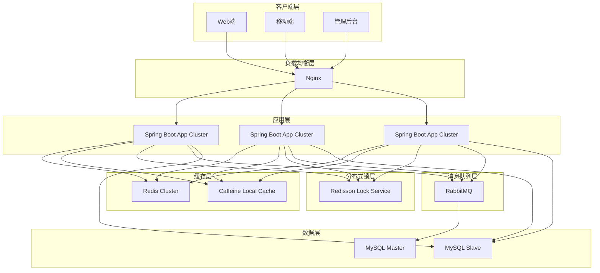

### 2.2 核心数据流

#### 2.2.1 座位预约数据流

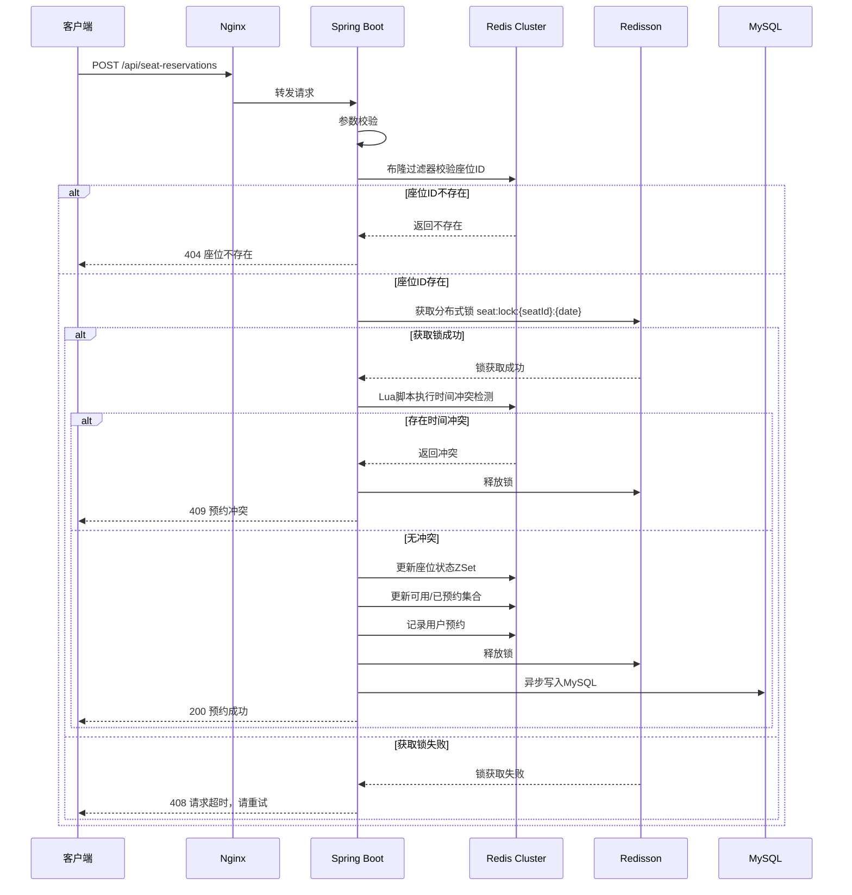

#### 2.2.2 选课数据流

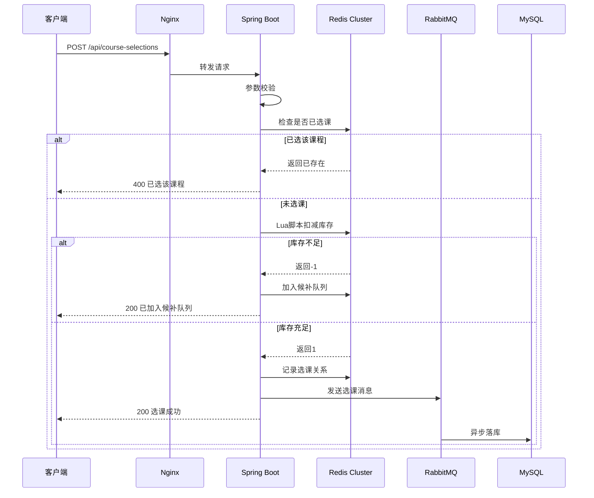

### 2.3 模块划分

| 模块 | 职责 | 核心组件 |
| :--- | :--- | :--- |
| **Controller层** | REST API入口，参数校验 | SeatController, CourseSelectionController |
| **Service层** | 业务逻辑处理 | SeatReservationService, CourseSelectionService |
| **RedisService层** | Redis操作封装 | RedisSeatService, RedisCourseService |
| **LockService层** | 分布式锁管理 | RedissonLockService |
| **MQService层** | 消息队列处理 | MQProducerService, MQConsumerService |
| **Repository层** | 数据库访问 | SeatRepository, CourseSelectionRepository |
| **Config层** | 配置管理 | RedisConfig, RedissonConfig, MQConfig |

---

## 3. 核心技术方案

### 3.1 Redis数据结构设计

#### 3.1.1 座位模块数据结构

| Key Pattern | 类型 | 说明 | 过期策略 |
| :--- | :--- | :--- | :--- |
| `seat:info:{seatId}` | Hash | 座位基本信息（编号、阅览室、状态） | 永不过期 |
| `seat:available:{date}` | Set | 当日空闲座位ID集合 | 次日凌晨过期 |
| `seat:reserved:{date}` | Set | 当日已预约座位ID集合 | 次日凌晨过期 |
| `seat:schedule:{seatId}:{date}` | ZSet | 座位时间片（score=起始分钟数） | 次日凌晨过期 |
| `user:reservation:{userId}` | ZSet | 用户预约记录（score=日期） | 30天过期 |
| `seat:popular:week` | ZSet | 座位热度排行 | 每周一0点过期 |

#### 3.1.2 选课模块数据结构

| Key Pattern | 类型 | 说明 | 过期策略 |
| :--- | :--- | :--- | :--- |
| `course:info:{courseId}` | Hash | 课程基本信息（名称、学分、容量） | 永不过期 |
| `course:stock:{courseId}` | String | 剩余名额（预扣库存） | 选课期结束后过期 |
| `course:selected:{userId}` | Set | 用户已选课程集合 | 学期结束后过期 |
| `course:waiting:{courseId}` | ZSet | 课程候补队列（score=时间戳） | 选课期结束后过期 |
| `seckill:order:queue` | ZSet | 选课请求排队队列 | 动态清理 |

#### 3.1.3 分布式锁数据结构

| Key Pattern | 类型 | 说明 | 过期策略 |
| :--- | :--- | :--- | :--- |
| `lock:seat:{seatId}:{date}` | String | 座位预约互斥锁 | 自动过期（30s） |
| `lock:course:{courseId}` | String | 课程库存操作锁 | 自动过期（30s） |
| `lock:init:stock` | String | 库存初始化锁 | 自动过期（60s） |

### 3.2 布隆过滤器设计

```java
// 座位ID布隆过滤器
RBloomFilter<String> seatFilter = redisson.getBloomFilter("bf:seats");
seatFilter.tryInit(100000L, 0.03); // 预估10万座位，误判率3%

// 课程ID布隆过滤器
RBloomFilter<String> courseFilter = redisson.getBloomFilter("bf:courses");
courseFilter.tryInit(5000L, 0.03); // 预估5000课程，误判率3%
```

**初始化时机**：系统启动时或定时任务触发，从数据库加载所有有效ID。

### 3.3 分布式锁实现

#### 3.3.1 锁配置参数

| 参数 | 值 | 说明 |
| :--- | :--- | :--- |
| 锁等待时间 | 3秒 | 尝试获取锁的最大等待时间 |
| 锁持有时间 | 10秒 | 锁自动释放时间 |
| 重试间隔 | 100毫秒 | 获取锁失败后的重试间隔 |
| 锁类型 | 可重入锁 | 支持同一线程多次获取 |

#### 3.3.2 锁使用模式

```java
// 座位预约锁示例
String lockKey = "lock:seat:" + seatId + ":" + date;
RLock lock = redisson.getLock(lockKey);
try {
    if (lock.tryLock(3, 10, TimeUnit.SECONDS)) {
        // 执行业务逻辑
        executeReservation(seatId, date, startTime, endTime);
    } else {
        throw new BusinessException("系统繁忙，请稍后重试");
    }
} finally {
    if (lock.isHeldByCurrentThread()) {
        lock.unlock();
    }
}
```

#### 3.3.3 锁的应用场景

| 场景 | 锁Key | 使用目的 |
| :--- | :--- | :--- |
| 座位预约 | `lock:seat:{seatId}:{date}` | 防止同一座位同一日期被重复预约 |
| 选课操作 | `lock:course:{courseId}` | 保证库存扣减的原子性 |
| 库存初始化 | `lock:init:stock` | 防止多实例重复加载库存 |
| 课程信息修改 | `lock:course:{courseId}` | 避免读写不一致 |

### 3.4 Lua脚本设计

#### 3.4.1 座位预约冲突检测脚本

```lua
-- seat_reservation.lua
-- KEYS[1]: seat:schedule:{seatId}:{date}
-- KEYS[2]: seat:available:{date}
-- KEYS[3]: seat:reserved:{date}
-- KEYS[4]: user:reservation:{userId}
-- ARGV[1]: startScore (起始分钟数)
-- ARGV[2]: endScore (结束分钟数)
-- ARGV[3]: member (预约标识)
-- ARGV[4]: userId
-- ARGV[5]: dateScore (日期分数)
-- ARGV[6]: reservationInfo (预约信息)

-- 检测时间冲突
local existing = redis.call('ZRANGEBYSCORE', KEYS[1], ARGV[1], ARGV[2])
if #existing > 0 then
    return 0  -- 存在冲突
end

-- 插入时间片
redis.call('ZADD', KEYS[1], ARGV[1], ARGV[3])

-- 更新可用/已预约集合
redis.call('SREM', KEYS[2], ARGV[3])
redis.call('SADD', KEYS[3], ARGV[3])

-- 记录用户预约
redis.call('ZADD', KEYS[4], ARGV[5], ARGV[6])

return 1  -- 成功
```

#### 3.4.2 选课库存扣减脚本

```lua
-- course_selection.lua
-- KEYS[1]: course:stock:{courseId}
-- KEYS[2]: course:selected:{userId}
-- KEYS[3]: course:waiting:{courseId}
-- ARGV[1]: courseId
-- ARGV[2]: userId
-- ARGV[3]: timestamp (请求时间戳)

-- 检查是否已选
local selected = redis.call('SISMEMBER', KEYS[2], ARGV[1])
if selected == 1 then
    return -2  -- 已选该课程
end

-- 获取库存
local stock = tonumber(redis.call('GET', KEYS[1]) or "0")
if stock <= 0 then
    -- 加入候补队列
    redis.call('ZADD', KEYS[3], ARGV[3], ARGV[2])
    return -1  -- 已满，已加入候补
end

-- 扣减库存
redis.call('DECR', KEYS[1])

-- 记录选课关系
redis.call('SADD', KEYS[2], ARGV[1])

return 1  -- 成功
```

#### 3.4.3 退课并通知候补脚本

```lua
-- course_drop.lua
-- KEYS[1]: course:stock:{courseId}
-- KEYS[2]: course:selected:{userId}
-- KEYS[3]: course:waiting:{courseId}
-- ARGV[1]: courseId
-- ARGV[2]: userId

-- 检查是否已选
local selected = redis.call('SISMEMBER', KEYS[2], ARGV[1])
if selected ~= 1 then
    return 0  -- 未选该课程
end

-- 删除选课记录
redis.call('SREM', KEYS[2], ARGV[1])

-- 增加库存
redis.call('INCR', KEYS[1])

-- 获取候补队列第一个用户
local waiters = redis.call('ZRANGE', KEYS[3], 0, 0)
if #waiters > 0 then
    local waiter = waiters[1]
    -- 将库存分配给候补用户
    redis.call('DECR', KEYS[1])
    redis.call('SADD', KEYS[2], ARGV[1])
    redis.call('ZREM', KEYS[3], waiter)
    return waiter  -- 返回候补成功的用户ID
end

return 1  -- 成功，但无候补用户
```

### 3.5 多级缓存架构

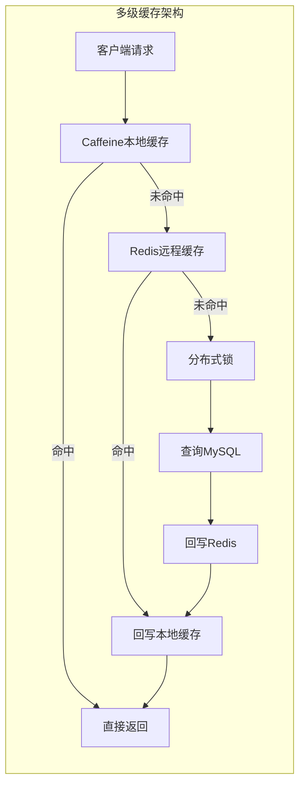

#### 3.5.1 缓存策略对比

| 策略 | 适用场景 | 优点 | 缺点 |
| :--- | :--- | :--- | :--- |
| **永不过期+逻辑过期** | 热点数据（如热门课程、热门座位） | 高可用，始终有数据返回 | 需要异步更新，可能返回旧数据 |
| **定时刷新** | 非实时数据（如座位统计） | 控制更新频率 | 可能存在数据不一致窗口 |
| **过期时间随机化** | 批量缓存数据 | 避免集体过期 | 缓存命中率略有下降 |

#### 3.5.2 缓存更新策略

```java
// 逻辑过期更新示例
public SeatInfo getSeatInfo(Long seatId) {
    String key = "seat:info:" + seatId;
    
    // 先查本地缓存
    SeatInfo localCache = caffeineCache.getIfPresent(key);
    if (localCache != null && !isLogicExpired(localCache)) {
        return localCache;
    }
    
    // 查Redis
    String json = redisTemplate.opsForValue().get(key);
    if (json != null) {
        SeatInfo seatInfo = JSON.parseObject(json, SeatInfo.class);
        if (!isLogicExpired(seatInfo)) {
            caffeineCache.put(key, seatInfo);
            return seatInfo;
        }
        // 逻辑过期，异步更新
        asyncUpdateCache(key, seatId);
        return seatInfo; // 返回旧数据
    }
    
    // 查DB并回写
    return loadFromDBAndCache(seatId);
}
```

---

## 4. 座位模块详细设计

### 4.1 业务流程

#### 4.1.1 座位预约流程

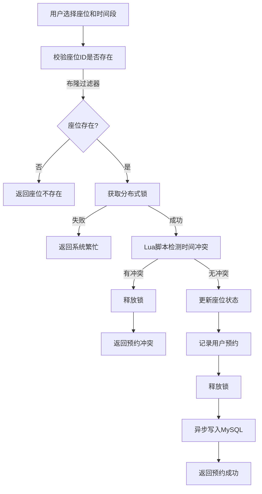

#### 4.1.2 签到签退流程

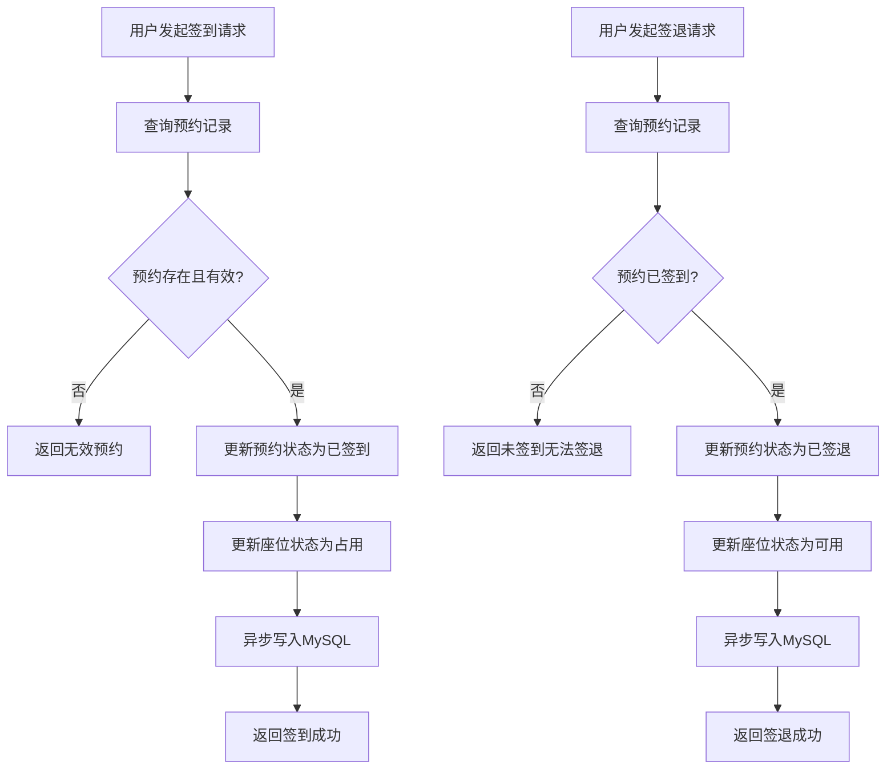

### 4.2 核心类设计

#### 4.2.1 SeatReservationService

| 方法名 | 功能说明 | 参数 | 返回值 | 失败返回 |
| :--- | :--- | :--- | :--- | :--- |
| `reserveSeat` | 预约座位 | seatId, date, startTime, endTime | ReservationDTO | BusinessException |
| `cancelReservation` | 取消预约 | reservationId | Boolean | BusinessException |
| `checkIn` | 签到 | reservationId | Boolean | BusinessException |
| `checkOut` | 签退 | reservationId | Boolean | BusinessException |
| `leaveTemporarily` | 暂离 | reservationId | Boolean | BusinessException |
| `getAvailableSeats` | 查询可用座位 | date, roomId | List\<SeatVO\> | - |
| `getUserReservations` | 查询用户预约 | userId | List\<ReservationVO\> | - |

#### 4.2.2 RedisSeatService

| 方法名 | 功能说明 | 参数 | 返回值 |
| :--- | :--- | :--- | :--- |
| `checkSeatExists` | 检查座位是否存在 | seatId | Boolean |
| `checkTimeConflict` | 检测时间冲突 | seatId, date, start, end | Boolean |
| `updateSeatSchedule` | 更新座位时间片 | seatId, date, start, end | Boolean |
| `updateSeatStatus` | 更新座位状态 | seatId, date, status | Boolean |
| `recordUserReservation` | 记录用户预约 | userId, reservationInfo | Boolean |
| `incrementPopularity` | 增加座位热度 | seatId | Long |
| `getHotSeats` | 获取热门座位 | limit | List\<SeatVO\> |

### 4.3 接口设计

#### 4.3.1 座位管理接口

| API路径 | HTTP方法 | Controller | 功能描述 |
| :--- | :--- | :--- | :--- |
| `/api/seats` | POST | SeatController | 新增座位 |
| `/api/seats/{id}` | PUT | SeatController | 修改座位信息 |
| `/api/seats/{id}` | DELETE | SeatController | 删除座位 |
| `/api/seats` | GET | SeatController | 查询座位列表 |
| `/api/seats/{id}` | GET | SeatController | 查询座位详情 |

#### 4.3.2 座位预约接口

| API路径 | HTTP方法 | Controller | 功能描述 |
| :--- | :--- | :--- | :--- |
| `/api/seat-reservations` | POST | SeatReservationController | 预约座位 |
| `/api/seat-reservations/{id}` | DELETE | SeatReservationController | 取消预约 |
| `/api/seat-reservations/{id}/check-in` | POST | SeatReservationController | 签到 |
| `/api/seat-reservations/{id}/check-out` | POST | SeatReservationController | 签退 |
| `/api/seat-reservations/{id}/leave` | POST | SeatReservationController | 暂离 |
| `/api/seat-reservations` | GET | SeatReservationController | 查询预约列表 |
| `/api/seat-reservations/my` | GET | SeatReservationController | 查询我的预约 |
| `/api/seat-reservations/available` | GET | SeatReservationController | 查询可用座位 |

### 4.4 DTO定义

#### 4.4.1 请求DTO

```java
// 座位预约请求DTO
public class SeatReservationCreateDTO {
    @NotNull(message = "座位ID不能为空")
    private Long seatId;
    
    @NotNull(message = "预约日期不能为空")
    private LocalDate date;
    
    @NotNull(message = "开始时间不能为空")
    private LocalTime startTime;
    
    @NotNull(message = "结束时间不能为空")
    private LocalTime endTime;
}

// 座位查询请求DTO
public class SeatQueryDTO {
    private Long roomId;
    private LocalDate date;
    private String status;
}
```

#### 4.4.2 响应DTO

```java
// 座位预约响应DTO
public class SeatReservationResponseDTO {
    private Long id;
    private Long userId;
    private String userName;
    private Long seatId;
    private String seatNumber;
    private Long roomId;
    private String roomName;
    private LocalDate date;
    private LocalTime startTime;
    private LocalTime endTime;
    private String status;
    private LocalDateTime createTime;
}

// 座位状态DTO
public class SeatStatusDTO {
    private Long seatId;
    private String seatNumber;
    private String status;
    private List<TimeSlot> occupiedSlots;
}

// 时间片DTO
public class TimeSlot {
    private LocalTime startTime;
    private LocalTime endTime;
}
```

---

## 5. 选课模块详细设计

### 5.1 业务流程

#### 5.1.1 选课流程

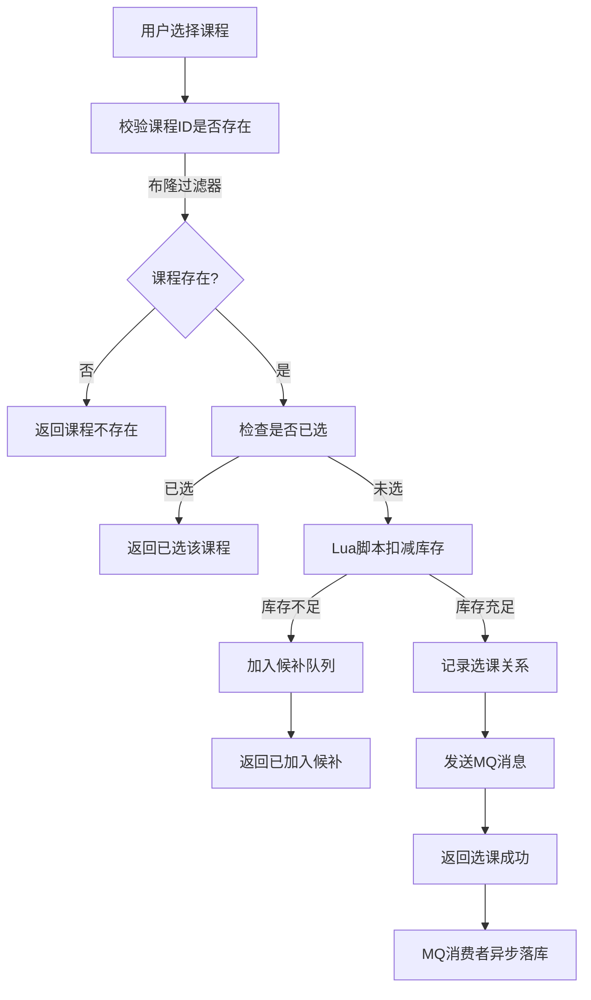

#### 5.1.2 退课流程

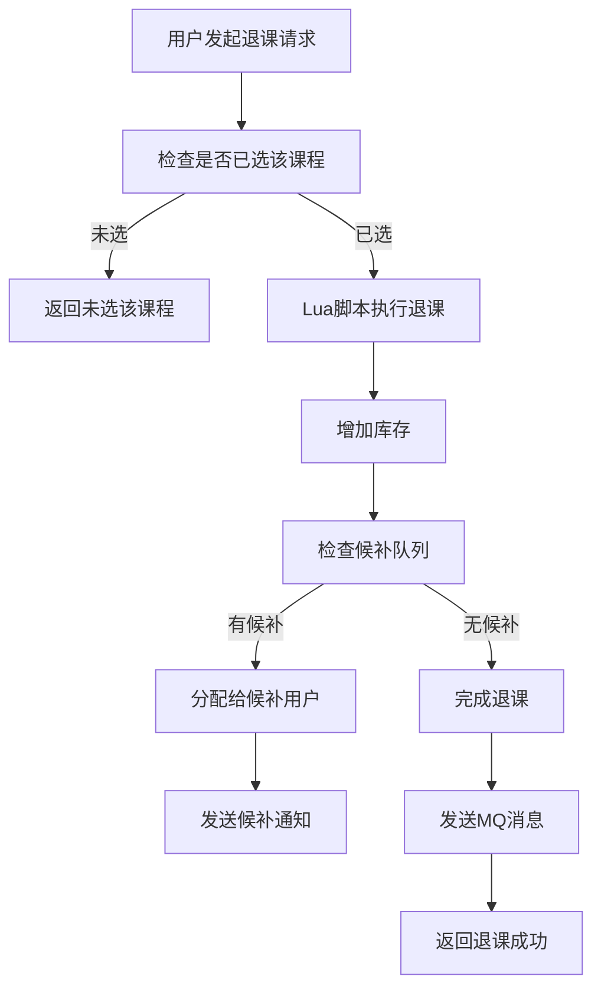

### 5.2 核心类设计

#### 5.2.1 CourseSelectionService

| 方法名 | 功能说明 | 参数 | 返回值 | 失败返回 |
| :--- | :--- | :--- | :--- | :--- |
| `selectCourse` | 选课 | studentId, courseId, semesterId | CourseSelectionDTO | BusinessException |
| `dropCourse` | 退课 | selectionId | Boolean | BusinessException |
| `getAvailableCourses` | 查询可选课程 | semesterId | List\<CourseVO\> | - |
| `getUserSelections` | 查询用户选课 | studentId, semesterId | List\<CourseSelectionVO\> | - |
| `getWaitingQueue` | 查询候补队列 | courseId | List\<WaitingVO\> | - |
| `initStock` | 初始化库存 | semesterId | Boolean | BusinessException |

#### 5.2.2 RedisCourseService

| 方法名 | 功能说明 | 参数 | 返回值 |
| :--- | :--- | :--- | :--- |
| `checkCourseExists` | 检查课程是否存在 | courseId | Boolean |
| `checkSelected` | 检查是否已选 | userId, courseId | Boolean |
| `decreaseStock` | 扣减库存 | courseId, userId | Integer |
| `increaseStock` | 增加库存 | courseId | Long |
| `addToWaitingQueue` | 加入候补队列 | courseId, userId | Boolean |
| `removeFromWaitingQueue` | 移出候补队列 | courseId, userId | Boolean |
| `getFirstWaiter` | 获取第一个候补用户 | courseId | String |

### 5.3 接口设计

#### 5.3.1 选课时间段接口

| API路径 | HTTP方法 | Controller | 功能描述 |
| :--- | :--- | :--- | :--- |
| `/api/course-selection-periods` | POST | CourseSelectionPeriodController | 设置选课时间段 |
| `/api/course-selection-periods/{id}` | PUT | CourseSelectionPeriodController | 修改选课时间段 |
| `/api/course-selection-periods/{id}` | DELETE | CourseSelectionPeriodController | 删除选课时间段 |
| `/api/course-selection-periods` | GET | CourseSelectionPeriodController | 查询时间段列表 |

#### 5.3.2 选课接口

| API路径 | HTTP方法 | Controller | 功能描述 |
| :--- | :--- | :--- | :--- |
| `/api/course-selections` | POST | CourseSelectionController | 学生选课 |
| `/api/course-selections/{id}` | DELETE | CourseSelectionController | 学生退课 |
| `/api/course-selections` | GET | CourseSelectionController | 查询选课列表 |
| `/api/course-selections/my` | GET | CourseSelectionController | 查询我的选课 |
| `/api/course-selections/available` | GET | CourseSelectionController | 查询可选课程 |
| `/api/course-selections/waiting/{courseId}` | GET | CourseSelectionController | 查询候补队列 |

### 5.4 DTO定义

#### 5.4.1 请求DTO

```java
// 选课请求DTO
public class CourseSelectionCreateDTO {
    @NotNull(message = "学生ID不能为空")
    private Long studentId;
    
    @NotNull(message = "课程ID不能为空")
    private Long courseId;
    
    @NotNull(message = "学期ID不能为空")
    private Long semesterId;
}

// 选课时间段请求DTO
public class CourseSelectionPeriodCreateDTO {
    @NotNull(message = "学期ID不能为空")
    private Long semesterId;
    
    @NotNull(message = "开始时间不能为空")
    private LocalDateTime startTime;
    
    @NotNull(message = "结束时间不能为空")
    private LocalDateTime endTime;
}
```

#### 5.4.2 响应DTO

```java
// 选课响应DTO
public class CourseSelectionResponseDTO {
    private Long id;
    private Long studentId;
    private String studentName;
    private Long courseId;
    private String courseName;
    private BigDecimal credit;
    private Long semesterId;
    private String semesterName;
    private String status;
    private LocalDateTime createTime;
}

// 可选课程DTO
public class AvailableCourseDTO {
    private Long id;
    private String courseCode;
    private String courseName;
    private BigDecimal credit;
    private Integer hours;
    private String type;
    private String teacherName;
    private Integer selectedCount;
    private Integer capacity;
    private Integer remainingSlots;
}

// 候补队列DTO
public class WaitingQueueDTO {
    private Long courseId;
    private String courseName;
    private Integer waitingCount;
    private List<WaitingUser> waitingUsers;
}

public class WaitingUser {
    private Long userId;
    private String userName;
    private LocalDateTime requestTime;
    private Integer position;
}
```

---

## 6. 高并发保障机制

### 6.1 限流与降级

#### 6.1.1 限流策略

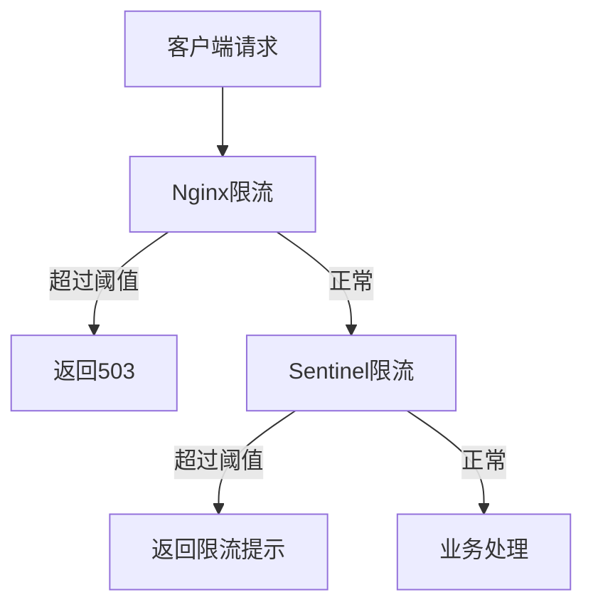

#### 6.1.2 限流配置

| 限流层级 | 限流方式 | 阈值 | 说明 |
| :--- | :--- | :--- | :--- |
| **Nginx层** | 连接数限制 | 10000 | 全局并发连接数 |
| **Sentinel层** | QPS限制 | 5000 | 选课接口峰值 |
| **Sentinel层** | QPS限制 | 1000 | 座位预约接口峰值 |
| **Sentinel层** | QPS限制 | 100 | 单个用户限流 |

#### 6.1.3 降级策略

| 降级场景 | 降级策略 | 触发条件 | 恢复条件 |
| :--- | :--- | :--- | :--- |
| Redis宕机 | 切换本地缓存 | Redis连接失败 > 3次 | Redis恢复正常 |
| MySQL宕机 | 只读模式 | MySQL连接失败 > 3次 | MySQL恢复正常 |
| 服务过载 | 返回排队提示 | CPU > 80% 持续 1分钟 | CPU < 60% |
| 热点课程 | 延迟写入 | 单课程QPS > 1000 | QPS < 500 |

### 6.2 熔断机制

#### 6.2.1 熔断配置

| 参数 | 值 | 说明 |
| :--- | :--- | :--- |
| 熔断阈值 | 50% | 错误率超过50%触发熔断 |
| 熔断时间 | 30秒 | 熔断后等待30秒尝试恢复 |
| 采样窗口 | 10秒 | 统计时间窗口 |
| 最小请求数 | 100 | 窗口内最少请求数 |

#### 6.2.2 熔断状态机

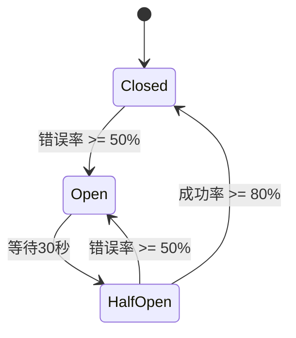

### 6.3 请求排队机制

#### 6.3.1 选课排队流程

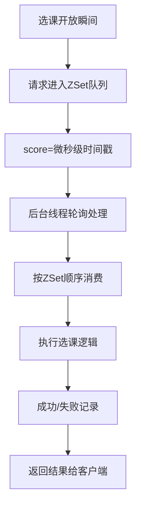

#### 6.3.2 排队队列设计

| 队列Key | 类型 | Score | Member | 说明 |
| :--- | :--- | :--- | :--- | :--- |
| `seckill:order:queue` | ZSet | 微秒时间戳 | userId_courseId | 选课请求排队 |
| `seckill:order:processing` | Set | - | requestId | 正在处理的请求 |

---

## 7. 数据一致性方案

### 7.1 缓存与数据库同步策略

#### 7.1.1 写入策略：Cache-Aside模式

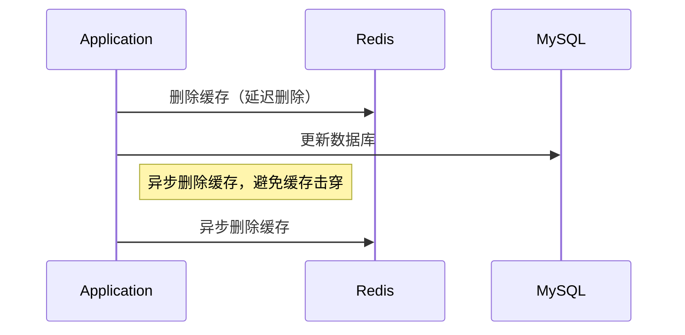

#### 7.1.2 读取策略：三级缓存

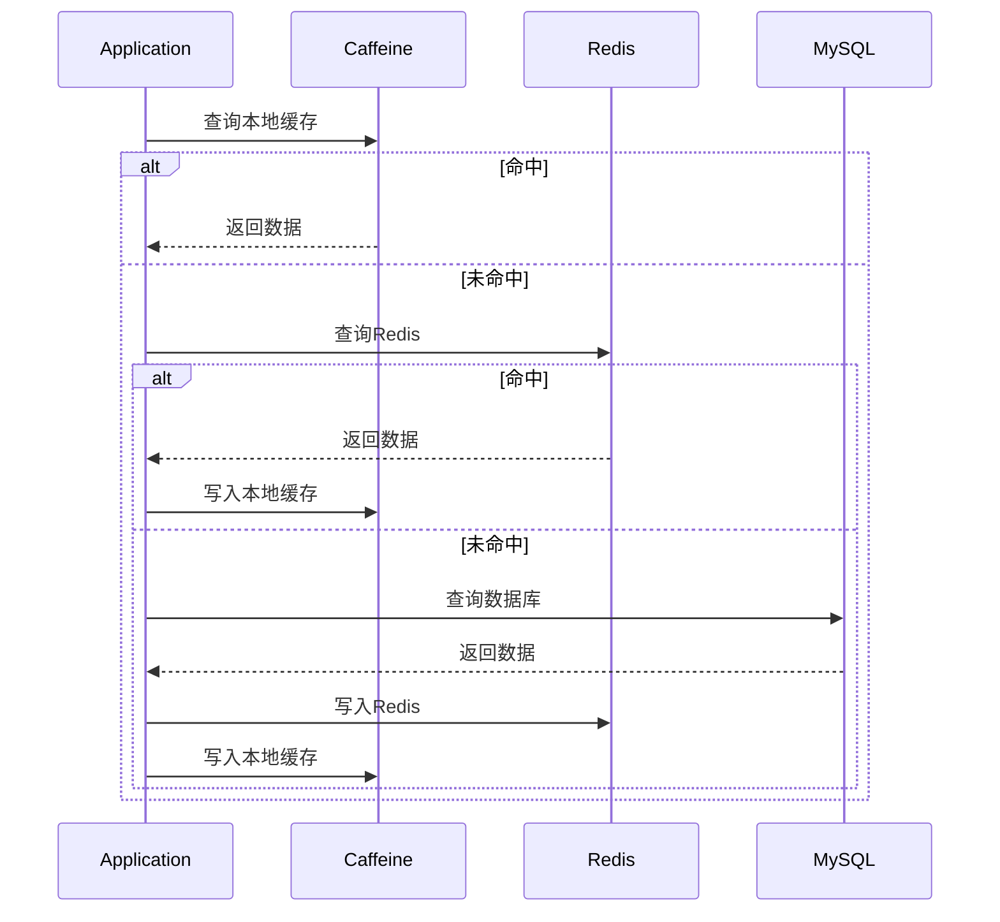

### 7.2 异步落库机制

#### 7.2.1 MQ消息设计

| 消息类型 | 消息体结构 | 处理方式 |
| :--- | :--- | :--- |
| **座位预约** | `{seatId, userId, date, startTime, endTime}` | 写入seat_reservation表 |
| **座位取消** | `{reservationId, userId}` | 更新状态为已取消 |
| **选课成功** | `{studentId, courseId, semesterId}` | 写入course_selection表 |
| **退课成功** | `{selectionId, studentId, courseId}` | 更新状态为已退课 |
| **候补通知** | `{courseId, userId}` | 发送通知并更新状态 |

#### 7.2.2 消息消费保证

```java
// MQ消费者配置
@RabbitListener(queues = "seat-reservation-queue")
public void handleReservationMessage(ReservationMessage message) {
    try {
        // 幂等性校验
        if (reservationRepository.existsById(message.getReservationId())) {
            log.warn("重复消息，已处理: {}", message.getReservationId());
            return;
        }
        
        // 执行业务逻辑
        seatReservationService.saveToDB(message);
        
        // 手动确认
        channel.basicAck(deliveryTag, false);
    } catch (Exception e) {
        log.error("消息处理失败: {}", e.getMessage());
        // 重试3次后死信队列
        channel.basicNack(deliveryTag, false, retryCount < 3);
    }
}
```

### 7.3 数据对账机制

#### 7.3.1 定时对账任务

| 任务 | 执行频率 | 对账内容 |
| :--- | :--- | :--- |
| 座位预约对账 | 每5分钟 | Redis预约数 vs MySQL预约数 |
| 选课库存对账 | 每5分钟 | Redis库存 vs MySQL已选人数 |
| 候补队列对账 | 每10分钟 | Redis候补队列 vs MySQL候补记录 |

#### 7.3.2 一致性修复流程

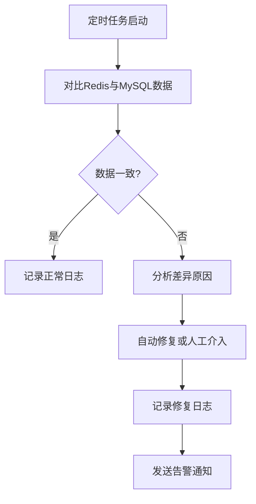

---

## 8. 性能测试方案

### 8.1 测试环境

| 配置项 | 规格 |
| :--- | :--- |
| **服务器数量** | 4台（2应用 + 2Redis） |
| **CPU** | 8核 |
| **内存** | 16GB |
| **网络** | 10Gbps |
| **测试工具** | JMeter / Vegeta |

### 8.2 测试场景

| 场景 | 并发数 | 持续时间 | 预期指标 |
| :--- | :--- | :--- | :--- |
| 座位预约峰值 | 1000 | 30秒 | P99 < 200ms |
| 选课峰值 | 5000 | 30秒 | P99 < 300ms |
| 座位查询 | 500 | 60秒 | P99 < 50ms |
| 课程查询 | 800 | 60秒 | P99 < 50ms |
| 混合场景 | 3000 | 120秒 | P99 < 250ms |

### 8.3 测试指标

| 指标 | 定义 | 采集方式 |
| :--- | :--- | :--- |
| **QPS** | 每秒处理请求数 | JMeter统计 |
| **响应时间** | 请求处理耗时 | JMeter统计 |
| **P99延迟** | 99%请求的最大延迟 | JMeter统计 |
| **错误率** | 失败请求比例 | JMeter统计 |
| **CPU使用率** | 服务器CPU占用 | Prometheus |
| **内存使用率** | 服务器内存占用 | Prometheus |
| **Redis命中率** | 缓存命中比例 | Redis INFO |

### 8.4 测试用例

#### 8.4.1 座位预约测试用例

```java
// JMeter测试脚本逻辑
public class SeatReservationTest {
    // 随机生成seatId (1-10000)
    int seatId = ThreadLocalRandom.current().nextInt(1, 10001);
    
    // 随机选择日期（未来7天）
    LocalDate date = LocalDate.now().plusDays(random.nextInt(7));
    
    // 随机选择时间段（08:00-22:00）
    int startHour = random.nextInt(15) + 8;
    int endHour = startHour + random.nextInt(3) + 1;
    
    // 构造请求
    SeatReservationCreateDTO request = new SeatReservationCreateDTO();
    request.setSeatId((long) seatId);
    request.setDate(date);
    request.setStartTime(LocalTime.of(startHour, 0));
    request.setEndTime(LocalTime.of(Math.min(endHour, 22), 0));
    
    // 发送请求
    sendPostRequest("/api/seat-reservations", request);
}
```

#### 8.4.2 选课测试用例

```java
// JMeter测试脚本逻辑
public class CourseSelectionTest {
    // 随机生成studentId (1-100000)
    long studentId = ThreadLocalRandom.current().nextLong(1, 100001);
    
    // 随机生成courseId (1-500)
    long courseId = ThreadLocalRandom.current().nextLong(1, 501);
    
    // 当前学期ID
    long semesterId = 1;
    
    // 构造请求
    CourseSelectionCreateDTO request = new CourseSelectionCreateDTO();
    request.setStudentId(studentId);
    request.setCourseId(courseId);
    request.setSemesterId(semesterId);
    
    // 发送请求
    sendPostRequest("/api/course-selections", request);
}
```

---

## 9. 部署与运维指南

### 9.1 系统依赖

| 依赖 | 版本 | 说明 |
| :--- | :--- | :--- |
| **Java** | 21 | LTS版本 |
| **Spring Boot** | 3.2.x | 应用框架 |
| **Redis** | 7.2.x | 缓存与分布式锁 |
| **Redisson** | 3.25.x | Redis客户端 |
| **RabbitMQ** | 3.12.x | 消息队列 |
| **MySQL** | 8.0.x | 数据持久化 |
| **Nginx** | 1.25.x | 负载均衡 |
| **Sentinel** | 1.8.x | 限流熔断 |

### 9.2 配置管理

#### 9.2.1 application.yml 关键配置

```yaml
server:
  port: 8080

spring:
  datasource:
    url: jdbc:mysql://${DB_HOST}:3306/smart_campus?useSSL=false&serverTimezone=Asia/Shanghai
    username: ${DB_USERNAME}
    password: ${DB_PASSWORD}
    driver-class-name: com.mysql.cj.jdbc.Driver
  
  data:
    redis:
      host: ${REDIS_HOST}
      port: ${REDIS_PORT}
      password: ${REDIS_PASSWORD}
      timeout: 5000ms
  
  rabbitmq:
    host: ${MQ_HOST}
    port: ${MQ_PORT}
    username: ${MQ_USERNAME}
    password: ${MQ_PASSWORD}

redisson:
  config: classpath:redisson.yml

sentinel:
  transport:
    dashboard: ${SENTINEL_DASHBOARD}:8080

# 限流配置
rate-limit:
  seat-reservation: 1000
  course-selection: 5000
  user-request: 100
```

#### 9.2.2 Redis配置 (redisson.yml)

```yaml
singleServerConfig:
  address: "redis://${REDIS_HOST}:${REDIS_PORT}"
  password: "${REDIS_PASSWORD}"
  database: 0
  connectionPoolSize: 64
  connectionMinimumIdleSize: 16
  idleConnectionTimeout: 10000
  connectTimeout: 10000
  timeout: 3000
  retryAttempts: 3
  retryInterval: 1000

lock:
  leaseTime: 30000
  waitTime: 3000
```

### 9.3 部署架构

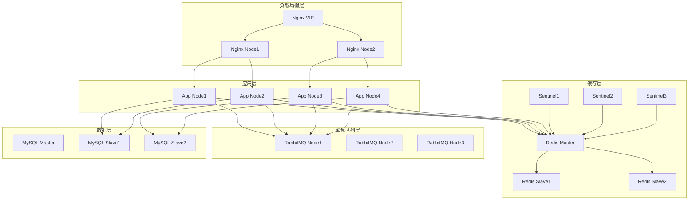

### 9.4 健康检查

#### 9.4.1 健康检查端点

| 端点 | 说明 |
| :--- | :--- |
| `/actuator/health` | 综合健康状态 |
| `/actuator/health/redis` | Redis健康状态 |
| `/actuator/health/datasource` | 数据库健康状态 |
| `/actuator/health/rabbitmq` | 消息队列健康状态 |

#### 9.4.2 告警规则

| 告警项 | 阈值 | 级别 |
| :--- | :--- | :--- |
| CPU使用率 | > 85% 持续5分钟 | WARNING |
| 内存使用率 | > 80% 持续5分钟 | WARNING |
| Redis连接数 | > 90% | WARNING |
| 服务响应时间 | P99 > 500ms | WARNING |
| 错误率 | > 5% | CRITICAL |
| 服务不可用 | 健康检查失败 | CRITICAL |

### 9.5 监控指标

#### 9.5.1 应用指标

| 指标 | 描述 | 单位 |
| :--- | :--- | :--- |
| `seat_reservation_total` | 座位预约总数 | 次 |
| `seat_reservation_success` | 座位预约成功数 | 次 |
| `seat_reservation_conflict` | 座位预约冲突数 | 次 |
| `course_selection_total` | 选课总数 | 次 |
| `course_selection_success` | 选课成功数 | 次 |
| `course_selection_waiting` | 选课候补数 | 次 |
| `cache_hit_rate` | 缓存命中率 | % |
| `lock_acquire_success` | 锁获取成功数 | 次 |
| `lock_acquire_fail` | 锁获取失败数 | 次 |

#### 9.5.2 Redis指标

| 指标 | 描述 | 单位 |
| :--- | :--- | :--- |
| `redis_connected_clients` | 连接客户端数 | 个 |
| `redis_used_memory` | 已使用内存 | MB |
| `redis_keyspace_hits` | Key命中数 | 次 |
| `redis_keyspace_misses` | Key未命中数 | 次 |
| `redis_commands_processed` | 处理命令数 | 次 |

---

## 10. 附录

### 附录A：状态码定义

| 状态码 | 含义 | 说明 |
| :--- | :--- | :--- |
| **200** | 成功 | 请求处理成功 |
| **400** | 请求参数错误 | 参数校验失败 |
| **403** | 权限不足 | 无操作权限 |
| **404** | 资源不存在 | 请求的资源不存在 |
| **408** | 请求超时 | 获取锁超时 |
| **409** | 冲突 | 预约/选课冲突 |
| **500** | 服务器错误 | 系统内部错误 |
| **503** | 服务不可用 | 限流或熔断触发 |

### 附录B：错误码定义

| 错误码 | 错误信息 | 业务含义 |
| :--- | :--- | :--- |
| **SEAT_NOT_FOUND** | 座位不存在 | 座位ID无效 |
| **SEAT_RESERVED** | 座位已被预约 | 时间冲突 |
| **SEAT_LOCKED** | 座位锁定中 | 获取锁失败 |
| **COURSE_NOT_FOUND** | 课程不存在 | 课程ID无效 |
| **COURSE_FULL** | 课程已满 | 库存为0 |
| **COURSE_SELECTED** | 已选该课程 | 重复选课 |
| **SELECTION_NOT_FOUND** | 选课记录不存在 | 无效的选课ID |
| **RESERVATION_NOT_FOUND** | 预约记录不存在 | 无效的预约ID |
| **TIME_OUT_OF_RANGE** | 时间超出允许范围 | 预约时间无效 |
| **SYSTEM_BUSY** | 系统繁忙，请稍后重试 | 服务过载 |

### 附录C：Redis Key命名规范

| 前缀 | 说明 | 示例 |
| :--- | :--- | :--- |
| `seat:` | 座位相关 | `seat:info:1001` |
| `course:` | 课程相关 | `course:stock:2001` |
| `user:` | 用户相关 | `user:reservation:10001` |
| `lock:` | 分布式锁 | `lock:seat:1001:2025-05-01` |
| `bf:` | 布隆过滤器 | `bf:seats` |
| `seckill:` | 秒杀相关 | `seckill:order:queue` |

### 附录D：安全注意事项

1. **禁止硬编码密钥**：所有敏感配置使用环境变量
2. **参数校验**：所有用户输入必须经过校验和净化
3. **敏感数据保护**：密码、身份证号等不存储明文
4. **SQL注入防护**：使用参数化查询或ORM框架
5. **分布式锁安全**：设置合理的锁过期时间，防止死锁
6. **限流熔断**：防止恶意攻击和流量过载

---

**文档版本**：v1.0.0  
**最后更新**：2026-04-28  
**编制单位**：智慧校园项目组